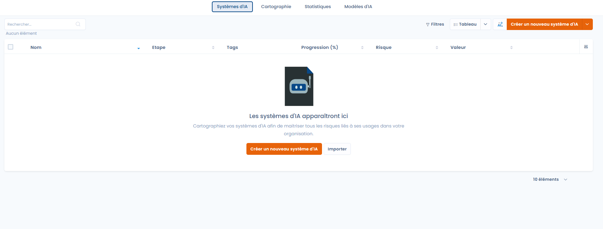

# Introduction à Dastra

## Introduction à Dastra

**Dastra** est une plateforme complète de gestion de la conformité et de la gouvernance des données et de l’intelligence artificielle.\
Elle permet aux équipes de protection des données, juridiques, techniques et métiers de **piloter l’ensemble des obligations du RGPD et de l’AI Act**, dans un environnement collaboratif, ergonomique et guidé.

***

### 🎯 Notre mission

Nous aidons les organisations à :

* **Sensibiliser** toute l’entreprise à la protection des données et à la gouvernance de l’IA,
* **Améliorer l’expérience** de la conformité au RGPD et à l’AI Act,
* **Automatiser** les processus de gouvernance et d’audit,
* **Centraliser** la conformité dans une solution unique et intégrée.

Notre objectif : **rendre la conformité et la gouvernance des données et de l’IA simples, utiles et opérationnelles.**

***

### 💡 Notre approche

* Une **interface intuitive**, adaptée aux DPO, juristes, RSSI, data managers et AI officers.
* Une **collaboration fluide** entre métiers, IT et gouvernance.
* Une **vision unifiée** de la conformité : données, IA, sécurité et risques.
* Une **approche guidée** permettant d’accompagner les non-experts pas à pas.
* Une **plateforme ouverte** (API, connecteurs, webhooks) pour s’intégrer à vos outils existants.

> Chez Dastra, nous pensons que la conformité n’est pas qu’une contrainte réglementaire :\
> c’est un levier de **transparence, de confiance et d’innovation responsable.**

Pour en savoir plus, consultez notre [manifesto](https://www.dastra.eu/fr/mission)\
ou regardez la vidéo de notre CEO :


Notre approche de la protection des données


***

### ⚙️ Avec Dastra, vous pouvez :

#### 🧭 1. **Cartographier vos données personnelles**

Créez et maintenez votre **registre des traitements** à l’aide :

* d’une interface souple et intuitive,
* de référentiels et bibliothèques réutilisables,
* de questionnaires et modèles configurables,
* d’exports automatiques (Excel, JSON, PDF).

<figure><figcaption>
Module du registre des traitements
</figcaption></figure>

***

#### 🧮 2. **Évaluer vos risques et réaliser vos audits**

Identifiez, évaluez et priorisez les risques liés aux traitements de données ou aux systèmes d’IA.\
Menez des audits internes, externes ou automatisés, et suivez les plans d’action associés.

<figure><figcaption>
Module de gestion des risques et audits
</figcaption></figure>

***

#### 🧱 3. **Mettre en œuvre vos processus de conformité RGPD**

Implémentez les processus réglementaires :

* **Exercice des droits (DSR)** : gestion complète du cycle de vie des demandes,
* **Violations de données** : enregistrement, qualification, notification CNIL,
* **Consentement cookies** : bannière configurable, preuve du consentement, conformité TCF.

<figure><figcaption>
Module de gestion des droits des personnes
</figcaption></figure>

***

#### 🤖 4. **Gouverner vos systèmes d’intelligence artificielle**

Dastra intègre un **registre des systèmes d’IA** conforme à l’AI Act européen.\
Ce registre vous permet de :

* **Recenser tous vos systèmes d’IA**, qu’ils soient développés en interne ou intégrés depuis des tiers (fournisseurs, APIs, modèles open source).
* **Qualifier leur niveau de risque** (systèmes à risque minimal, limité, élevé ou prohibé).
* **Documenter les finalités, sources de données, évaluations de risques et mesures de contrôle.**
* **Assurer la conformité continue** des modèles via des audits périodiques et des plans d’action.
* **Relier IA et traitements de données** : cartographie unifiée RGPD / AI Act.

<figure><figcaption></figcaption></figure>

<figure><figcaption>
Module du registre des systèmes d’IA
</figcaption></figure>


Dastra vous aide à anticiper la mise en conformité à l’**AI Act**, en centralisant la documentation exigée (fiches systèmes, logs, évaluations de risques, notices d’utilisation, contrôles de biais, etc.).&#x20;


***

#### 📋 5. **Créer et suivre vos plans d’action**

Créez des plans de mise en conformité, assignez des tâches, fixez des échéances et suivez leur progression.\
Visualisez les dépendances entre traitements, systèmes d’IA, et actions correctives.

<figure><figcaption>
Module de gestion des tâches et plans d’action
</figcaption></figure>

***

#### 🧩 6. **Structurer votre gouvernance**

* Gérez vos **entités**, **départements** et **équipes**.
* Assignez les **rôles et permissions** selon les périmètres (organisation, workspace, unité).
* Suivez la responsabilité des traitements, des systèmes d’IA et des risques associés.

***

#### 📁 7. **Centraliser votre documentation**

Stockez et reliez vos documents de conformité (politiques, contrats, preuves, rapports, évaluations).\
Chaque fichier peut être attaché à un traitement, un risque, une tâche ou un système d’IA.

***

#### 📊 8. **Analyser et piloter la conformité**

Créez des rapports sur mesure : avancement RGPD, gouvernance IA, risques, plans d’action, audits.\
Tableaux de bord dynamiques, filtres et exports (PDF, Excel, CSV).

***

#### ⚙️ 9. **Automatiser et intégrer vos processus**

* **Workflows automatisés** : déclencheurs, rappels, relances, actions en masse.
* **API REST & Webhooks** pour connecter Dastra à vos outils internes.
* **Connecteurs natifs** : Slack, Microsoft Teams, Zapier, etc.
* **IA intégrée** : génération de fiches, suggestion de risques, classification automatique.

***

#### 🔐 10. **Assurer la sécurité et la conformité**

* Authentification forte (2FA), SSO, SCIM
* Gestion fine des rôles et accès
* Journalisation des activités et audit trail complet
* Hébergement 100 % européen (RGPD, ISO 27001)
* Confidentialité “by design” et “by default”

***

### 🧭 Découvrir Dastra

Commencez à explorer Dastra dès maintenant :

***


💡 **Essai gratuit**\
Dastra peut être testé gratuitement pendant 30 jours, sans carte bleue :\
👉 [https://app.dastra.eu/signup](https://app.dastra.eu/signup)


***

### 📚 Aller plus loin
