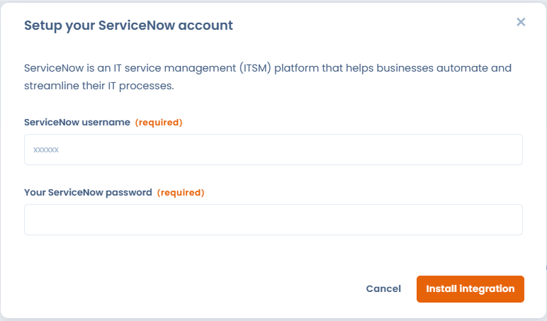
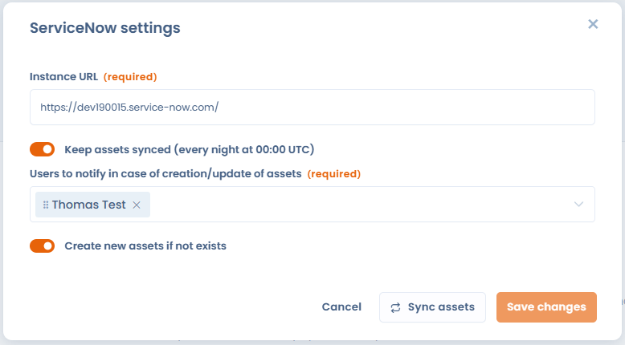

# ServiceNow

### Qu'est ce que c'est ServiceNow ?

L’intégration [ServiceNow](https://www.servicenow.com/) permet de **synchroniser automatiquement les applications métiers** issus du CMDB de ServiceNow directement dans Dastra.

Elle permet :

* d’éviter la double saisie ;
* de centraliser les actifs techniques utilisés dans toute l’organisation;
* d’utiliser ces actifs dans vos **registres de traitement**, **jeux de données**, **analyses d’impact**, **analyses de risques**, **audits**, etc.
* de garantir que les informations issues de ServiceNow restent **à jour** dans Dastra.

### Prérequis

* **Avoir une licence payante Dastra** incluant l’accès au module Intégrations / connecteurs.
* **Avoir un compte ServiceNow** avec :
  * Une instance accessible (ex. `https://votre-instance.service-now.com`)
  * Un **utilisateur API** disposant des droits de lecture sur `cmdb_ci_business_app`.
* Vérifier que votre instance ServiceNow permet l’**appel API REST** depuis l’extérieur.

### Installation

Le processus de mise en place est très simple :

1. Accédez à la page de l’intégration **ServiceNow** dans la marketplace d’intégrations Dastra.\
   Exemple :\
   `https://app.dastra.eu/workspace/0/settings/integrations/servicenow`
2. Cliquez sur le bouton **"Installer"**.
3.  Renseignez les **informations de connexion** à votre compte ServiceNow :

    * Nom d’utilisateur
    * Mot de passe

    Ces informations permettront à Dastra de générer un jeton d’accès sécurisé pour communiquer avec votre instance ServiceNow.
4.

    <figure><figcaption></figcaption></figure>

4. Après validation, une fenêtre de configuration s’affichera. Cette étape est **obligatoire** pour finaliser l’installation.

<figure><figcaption></figcaption></figure>

### Configuration

* Renseignez l’**URL de votre instance** ServiceNow
* Choisissez si vous souhaitez mettre en place la synchronisation des actifs. (Les actifs synchronisés avec ServiceNow seront maintenues à jour toutes les nuit à 00:00 UTC)
* Sélectionnez les personnes à notifier dans le cas de modification/création des actifs. La personne recevra un email de notification contenant les informations sur les actifs qui ont été mis à jour.
* Cochez "Create new assets if not exists" aura pour conséquence de créer un actif s'il n'existe pas dans Dastra en se basant sur la référence externe.&#x20;


Attention : si vous cochez cette case, un grand nombre d’actifs seront automatiquement créés dans votre espace de travail. Veillez à bien renseigner les références externes.


### Comment sont synchronisées les données entre Dastra et ServiceNow ?

Lors de chaque synchronisation, plusieurs champs issus de ServiceNow sont automatiquement mappés dans votre référentiel d’actifs Dastra. Les informations suivantes sont récupérées et mises à jour :

* **Label** de l’actif
* **Description** (Short Description ServiceNow)
* **Type d’application**
* **État / statut d’installation**
* **Type d’actif** (systématiquement importé comme _Software_)
* **Zone / domaine** associé (AreaId)
* **Tags** associés
* **Identifiant externe** ServiceNow (`sys_id`)
* **Source externe** (`ServiceNow`)
* **Date de dernière synchronisation**
* **Propriétaire** de l’actif

Toutes ces données permettent de maintenir un lien fiable et à jour entre votre CMDB ServiceNow et votre référentiel Dastra.

#### Gestion des actifs supprimés côté ServiceNow

Lorsque Dastra détecte qu’un actif précédemment synchronisé **n’existe plus dans ServiceNow**, il **n’est pas supprimé automatiquement** dans Dastra.\
À la place, Dastra ajoute **un tag automatique** sur l’actif indiquant qu’il est _supprimé dans ServiceNow_.

Ce comportement permet :

* de conserver l’historique dans Dastra,
* d’éviter les suppressions involontaires,
* de faciliter la revue manuelle des actifs obsolètes.
