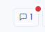
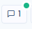
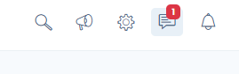

# Interne Diskussionen

## Funktionsweise

Sie können, ähnlich wie in einem Chat, über alle in Dastra vorhandenen Elemente diskutieren: Aufgaben, Verarbeitungen, KI-Systeme, Vorfälle, Assets usw.

### Wie geht das?

* **Rufen Sie ein Verarbeitungs-, Asset- oder anderes Datenblatt auf**
* **Klicken Sie auf diese Schaltfläche:**

<figure><figcaption></figcaption></figure>

* **Geben Sie Ihre Nachricht ein** und fügen Sie gegebenenfalls Anhänge hinzu
* **Klicken Sie auf die Schaltfläche Senden**

Hier ist das Schema der Funktionsweise des Workflows der internen Diskussionen:

## Erwähnungen

Sie können betreffende Nutzer **erwähnen**, indem Sie die Tastenkombination "@" auf Ihrer Tastatur verwenden. Es wird Ihnen dann eine Liste von Nutzern vorgeschlagen. Sie können unter allen Nutzern Ihres Mandanten suchen.

<figure><figcaption></figcaption></figure>

Das Ziel der Erwähnung ist es, automatisch eine E-Mail-Benachrichtigung an den betreffenden Nutzer zu senden.

## Zitate (Antwort auf eine Nachricht)

Sie können **direkt auf eine bestimmte Nachricht** der Konversation antworten, um den Kontext in langen Diskussionsverläufen nachvollziehbar zu halten.

### Wie geht das?

* **Fahren Sie über die Nachricht**, auf die Sie antworten möchten, und klicken Sie auf die Schaltfläche „**Antworten**“. Diese Schaltfläche steht bei Nachrichten anderer Nutzer zur Verfügung.
* Das Eingabeformular öffnet sich und zeigt oberhalb des Textfelds einen **Zitatblock** mit dem Namen des Autors der zitierten Nachricht sowie einer Vorschau ihres Inhalts.
* Wenn Ihr Entwurf leer ist, wird der Autor der zitierten Nachricht **automatisch erwähnt** (siehe Abschnitt Erwähnungen), wodurch seine Benachrichtigung ausgelöst wird.
* **Geben Sie Ihre Nachricht ein**, fügen Sie gegebenenfalls Anhänge hinzu und klicken Sie auf **Senden**.

Um das Zitat zu entfernen und dabei Ihre begonnene Nachricht zu behalten, klicken Sie auf das **Papierkorb-Symbol** rechts im Zitatblock. Sie können auch die automatisch hinzugefügte Erwähnung entfernen, wenn Sie den Autor nicht benachrichtigen möchten.


Eine Nachricht kann **nur eine einzige Nachricht** zitieren. Das Zitat bleibt erhalten, wenn Sie Ihre Nachricht später bearbeiten.


### Anzeige in der Konversation

Nach dem Veröffentlichen wird die zitierte Nachricht in einem Block oberhalb Ihrer Antwort angezeigt, mit dem Namen des Autors und einer Vorschau des Inhalts. Wird die zitierte Nachricht später gelöscht, zeigt der Block den Hinweis „Diese Nachricht wurde gelöscht“ an: Ihre Antwort bleibt sichtbar und der Verlauf des Diskussionsfadens bleibt nachvollziehbar.

## Benachrichtigungen

Nachrichtenbenachrichtigungen werden automatisch gesendet, sobald eine Nachricht zum betreffenden Objekt gepostet wird. Zwei Arten von Benachrichtigungen werden automatisch generiert:

* **Senden einer asynchronen Nachricht** als Benachrichtigung an alle Mitglieder des Mandanten, die Zugriff auf das betreffende Objekt haben.
* **Senden einer sofortigen Nachricht** an alle in der Konversation erwähnten Nutzer.

Weitere Informationen finden Sie auf [unserer Seite zu Benachrichtigungen](../settings/notifications.md).


**Wenn Sie Slack verwenden**, können Sie die automatische Benachrichtigung der Nutzer in Slack über [die Integrationsseite Ihres Mandanten](https://app.dastra.eu/workspace/0/settings/integrations) einrichten


## Öffnen/Schließen der Konversation

Wenn eine Nachricht zu einem Objekt ohne bestehende Konversation gesendet wird, oder wenn die Diskussion zuvor geschlossen wurde, wechselt die Konversation in den Status "Offen". Diese wird dann in der Benutzeroberfläche mit einem kleinen roten Punkt und im allgemeinen Konversations-Hub angezeigt.

<figure><figcaption></figcaption></figure>

Sobald die Konversation beendet ist, können Sie, wenn Sie das Recht zum Schließen von Konversationsthemen besitzen, auf die Schaltfläche "Konversation schließen" klicken. Dadurch wird der Konversationsindikator grün angezeigt.\

### Konversations-Hub

Um alle offenen Konversationen in Dastra zu zentralisieren, können Sie auf [den zentralisierten Konversations-Hub](https://app.dastra.eu/workspace/0/comments) zugreifen. Sie erreichen ihn, indem Sie auf diesen Link in der Navigationsleiste klicken.\

Dieser fasst alle Konversationen Ihres Mandanten zusammen. So können Sie alle Fragen Ihrer Nutzer beantworten und gleichzeitig auf die Datenblätter der betreffenden Elemente zugreifen.
