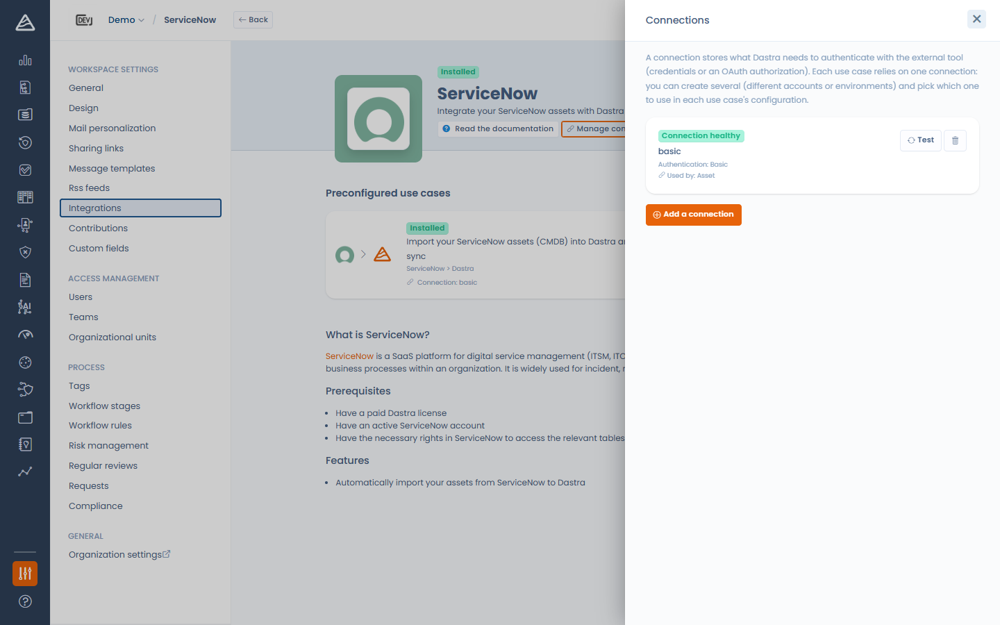
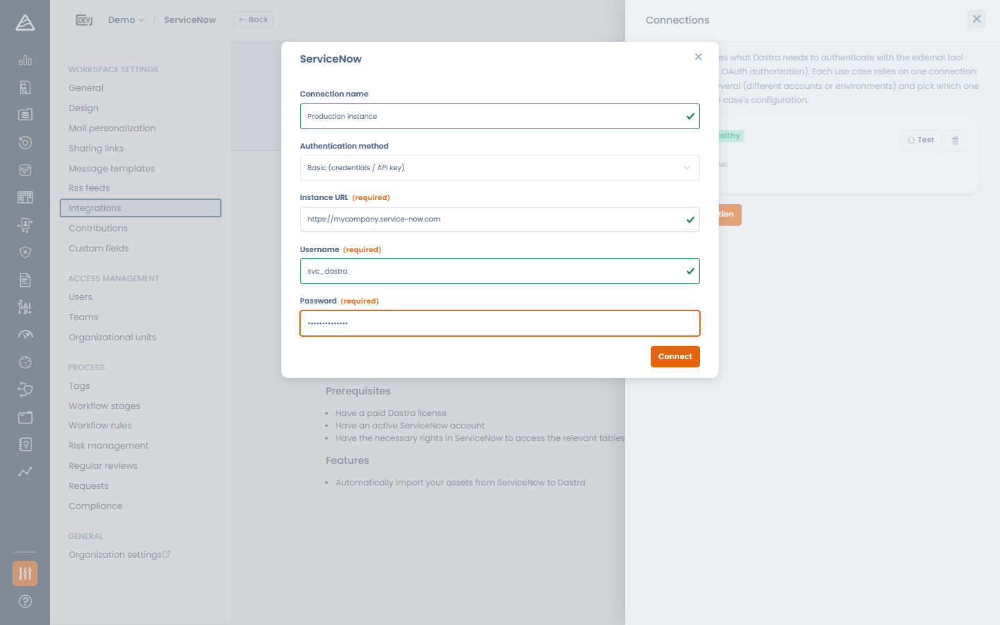
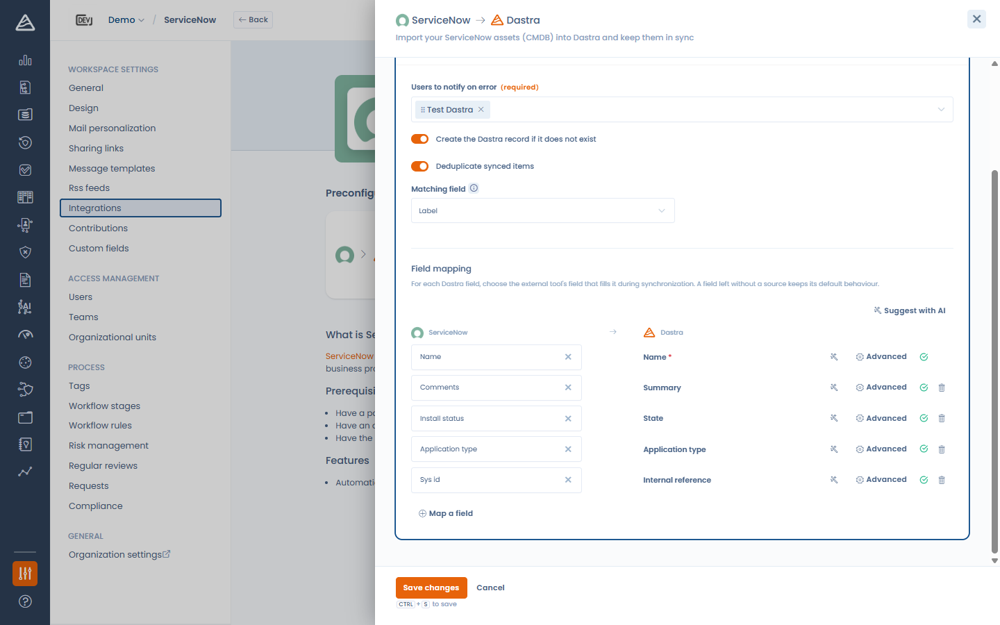
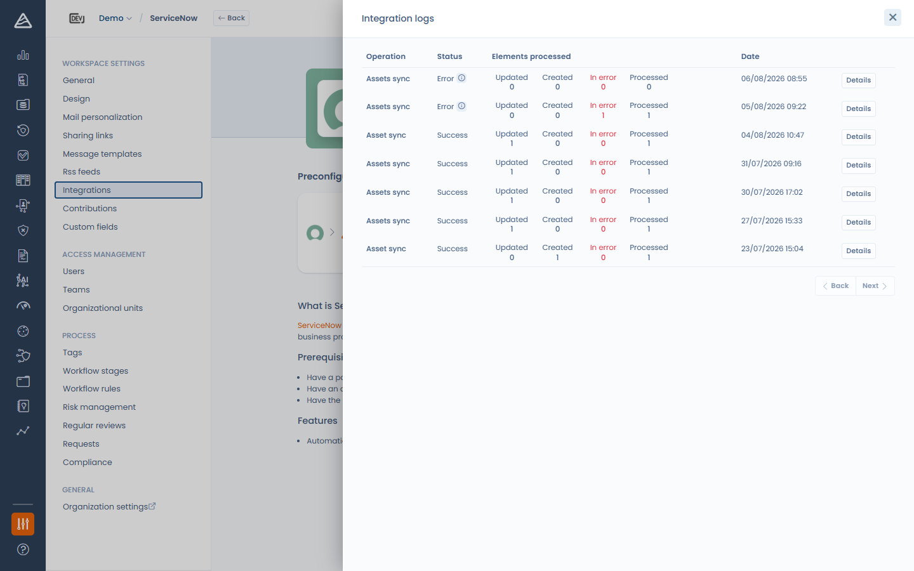

# Connections, use cases and field mapping

This page describes the concepts shared by all native integrations. For connector-specific instructions, see the dedicated pages (ServiceNow, SAP LeanIX, Jira, Microsoft Teams…).

### The integration store

Open **Settings > Integrations** in your workspace. The catalog lists every available integration, filterable by category and by the Dastra object it targets, with an **All / Installed** tab switch.

<!-- 📸 Screenshot: the integrations catalog with the sidebar filters and the All/Installed tabs -->

<figure><figcaption>
The integration store
</figcaption></figure>

Click an integration to open its page: it presents the available **use cases** (each with its data-flow direction, e.g. *ServiceNow > Dastra*), the description, and — for connectors that authenticate against an external tool — a **Manage connections** button.

### Connections

A connection stores what Dastra needs to authenticate against the external tool: either credentials (username/password or API key, stored encrypted by Dastra), or a delegated **OAuth** authorization (no password stored by Dastra).

You can create **several connections to the same tool** — for example a production and a sandbox instance — and choose which one each use case relies on.

Click **Manage connections** to open the connections panel. For each connection you can see:

* its health: **Connection healthy**, **Awaiting authorization** (OAuth started but not completed) or **Connection in error** (with the last error message and the error count),
* the authentication method,
* the use cases that rely on it.

From this panel you can **Test** a connection (a successful test also clears its error state) or **remove** it.

<!-- 📸 Screenshot: the "Connections" push-menu with one healthy connection and the Add a connection button -->

<figure><figcaption>
The connections panel
</figcaption></figure>

To create a connection, click **Add a connection**:

1. Give it a **Connection name** (e.g. *Production instance*) — optional, but useful when you have several.
2. Pick the **Authentication method** when the connector supports more than one: **Basic (credentials / API key)** or **OAuth**.
3. Fill in the fields requested by the connector (instance URL, API token…).
4. Click **Connect** — or **Save and connect** for OAuth, which redirects you to the external tool to authorize Dastra.

<!-- 📸 Screenshot: the connection creation modal (e.g. for SAP LeanIX or ServiceNow) showing name, method and credential fields -->

<figure><figcaption>
Creating a connection
</figcaption></figure>

### Installing a use case

Click **Add integration** on a use case card. The setup panel walks you through up to three steps:

1. **Connection** — select an existing connection or create one from the dropdown.
2. **Configuration** — the connector-specific settings (synchronization options, field mapping…). This step unlocks once a valid connection is selected.
3. **Webhook** — only for connectors that receive events from the external tool (e.g. Jira). This step unlocks after the configuration has been saved.

Once installed, the use case card gives you:

* an **Enable** switch,
* a **Project configuration** entry to reopen the configuration,
* **Run synchronization now** (import connectors only) to trigger an immediate sync,
* **View logs** to inspect past executions,
* **Uninstall**.

<!-- 📸 Screenshot: an installed use case card with the Enable switch and the "..." dropdown open -->

<figure><figcaption>
An installed use case and its actions
</figcaption></figure>


Uninstalling a use case erases the associated credentials. Assets, requests and other records created by the integration are kept — they belong to your workspace.


### Field mapping

Import use cases include a **Field mapping** section: for each Dastra field, choose the external tool's field that fills it during synchronization. A field left without a source keeps its **default behaviour**.

* Required Dastra fields are marked with a red asterisk; the configuration cannot be saved while a required field has neither a source nor a default value.
* **Map a field** adds a row for any other Dastra field, including your custom fields.
* The source list is fetched live from the external tool whenever possible, so your custom attributes on the source side appear too.

<!-- 📸 Screenshot: the field mapping editor with a few mapped rows, one "Default behaviour" row and the "Map a field" button -->

<figure><figcaption>
The field mapping editor
</figcaption></figure>

#### Advanced options

Each row has an **Advanced** panel with two options:

* **Default value** — written when there is no source field, or as a fallback for source values that aren't transcoded. For date fields you can pick **Today** or a relative date (e.g. *in 30 days*), resolved when the record is created.
* **Value transcoding** — for closed lists (statuses, lifecycle stages…): map each source value to a Dastra value. Values you don't map fall back to the default value.

<!-- 📸 Screenshot: the Advanced push-menu of a mapped field showing Default value and Value transcoding -->

<figure><figcaption>
Default value and value transcoding
</figcaption></figure>

#### AI suggestions

If the AI assistant is enabled on your account, the **Suggest with AI** button proposes a full mapping (and each row has its own suggestion button). Suggestions never overwrite fields you already mapped, and are always submitted for your review before saving.

### Synchronization and logs

* Import connectors (ServiceNow, SAP LeanIX, Filerskeepers) synchronize **daily**; you can also trigger a sync at any time with **Run synchronization now**.
* **View logs** shows each execution with its outcome and counters: created, updated, flagged and in-error items, with the error details when something went wrong.

<!-- 📸 Screenshot: the Integration logs panel with a few executions and their counters -->

<figure><figcaption>
Integration logs
</figcaption></figure>
