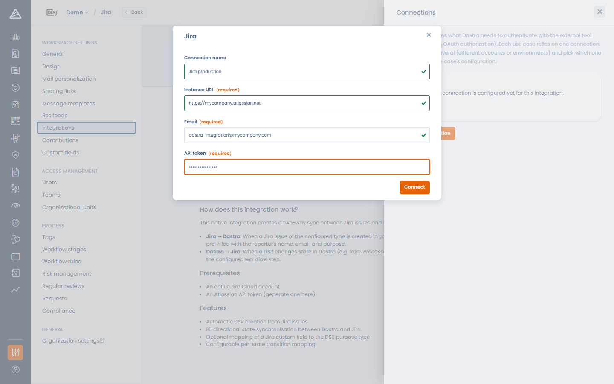
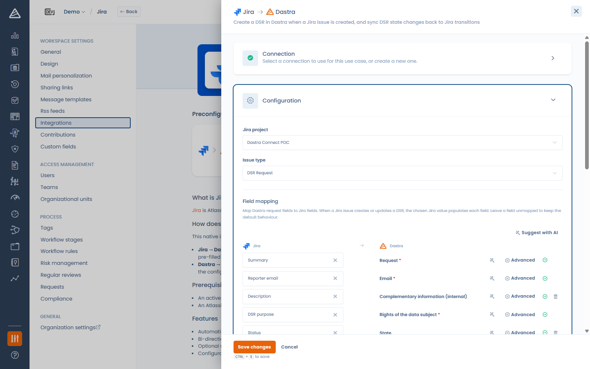
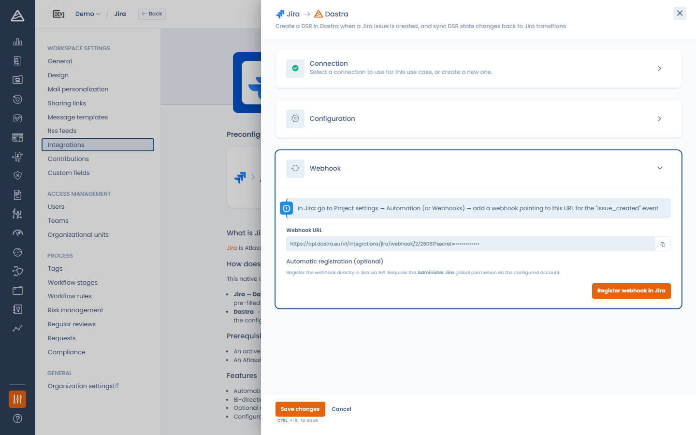

# Jira

### What does the integration do?

The Jira integration synchronizes **Jira issues with Dastra data subject requests (DSR)**, in both directions:

* **Jira → Dastra**: when an issue is created or updated in the configured Jira project, Dastra creates or updates the corresponding data subject request, filling its fields according to your field mapping.
* **Dastra → Jira**: when a request reaches a workflow step, Dastra automatically transitions the linked Jira issue to the status you associated with that step.

### Prerequisites

* A Jira Cloud instance (e.g. `https://your-company.atlassian.net`) and a project to synchronize.
* Depending on the authentication method:
  * **Basic** — the e-mail address of a Jira account and an [API token](https://id.atlassian.com/manage-profile/security/api-tokens) for that account.
  * **OAuth** — no token to create: you sign in with your Atlassian account and authorize Dastra.


The OAuth method appears in the **Authentication method** list when it is available on your Dastra environment. Otherwise, use an API token.


### Installation

1. Open **Settings > Integrations** and select **Jira**.
2. On the DSR use case, click **Add integration**.
3. Add a connection:
   * **Basic**: enter the **Instance URL**, the **Email** and the **API token**, then click **Connect**.
   * **OAuth**: enter the **Instance URL**, then click **Save and connect** — you are redirected to Atlassian to authorize Dastra.

<!-- 📸 Screenshot: the Jira connection modal showing the Authentication method select with Basic and OAuth -->

<figure><figcaption>
Connecting Dastra to Jira
</figcaption></figure>

### Configuration

* **Jira project** — the project to synchronize.
* **Issue type** — the issue type that represents a data subject request.
* **Field mapping** — map Dastra request fields to Jira fields. When a Jira issue creates or updates a DSR, the chosen Jira value populates each field. The sources include the standard Jira fields (summary, reporter e-mail, description, status) **and your Jira custom fields**; closed fields (statuses, select lists) can be transcoded to Dastra values in the **Advanced** panel.
* **Map DSR states to Jira transitions** — associate each DSR workflow step with a Jira status. When a request reaches that step, Dastra transitions the linked issue accordingly. Leave a step on **No transition** to skip it.
* **Default organisational unit** (required) — the unit assigned to requests created by the integration.

<!-- 📸 Screenshot: the Jira configuration panel with project, issue type and the field mapping -->

<figure><figcaption>
Configuring the Jira use case
</figcaption></figure>


The **Email** field of the request must be mapped (or given a default value): it identifies the data subject. The configuration cannot be saved without it.


<!-- 📸 Screenshot: the "Map DSR states to Jira transitions" section with a few steps mapped to Jira statuses -->

<figure><figcaption>
Mapping DSR workflow steps to Jira statuses
</figcaption></figure>

### Webhook (Jira → Dastra)

Save the configuration first — the inbound webhook URL becomes available once the integration is configured. Then, in the **Webhook** step, two options:

* **Manual registration** — copy the **Webhook URL** and, in Jira, go to **Project settings > Automation** (or **Webhooks**) and add a webhook pointing to this URL for the *issue created* and *issue updated* events.
* **Automatic registration** — click **Register webhook in Jira** and Dastra registers it for you through the Jira API. This requires the **Administer Jira** global permission on the configured account. You can remove it later with **Delete webhook**.

<!-- 📸 Screenshot: the Webhook step with the copyable URL and the "Register webhook in Jira" button -->

<figure><figcaption>
Registering the Jira webhook
</figcaption></figure>

### Uninstalling

Uninstalling the integration erases the stored credentials and removes the webhook registered in Jira (when it was registered automatically). The data subject requests created by the integration are kept.
