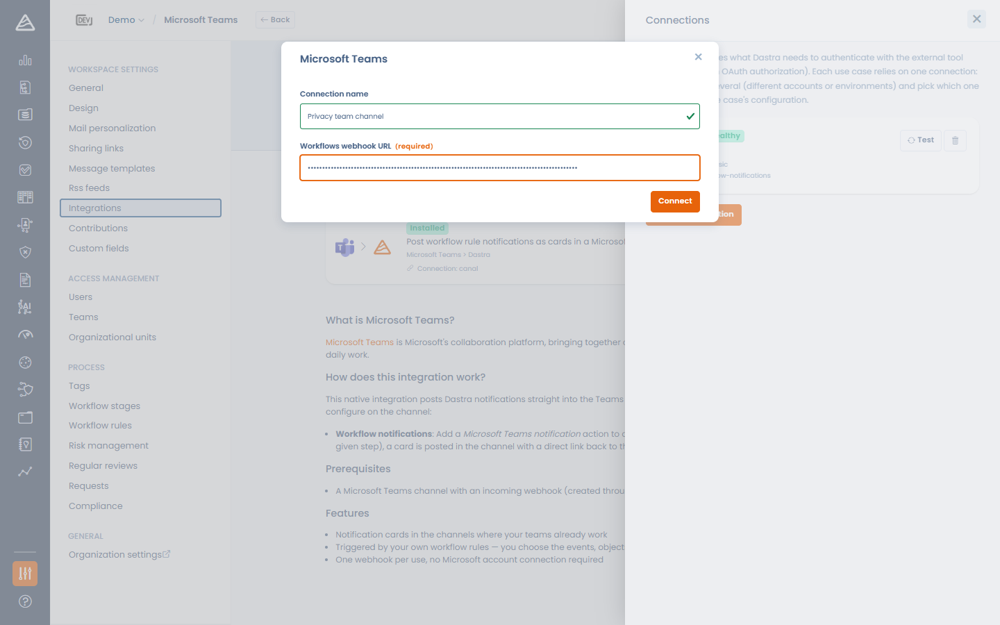
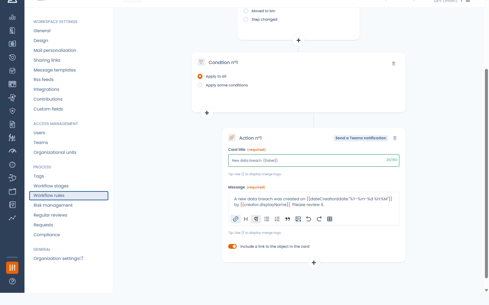

# Microsoft Teams

### What does the integration do?

The Microsoft Teams integration posts **Dastra workflow notifications as cards in a Microsoft Teams channel**: when a workflow rule fires (a data breach is created, a request changes step…), Dastra sends an Adaptive Card with a title, a message and an optional link back to the record in Dastra.

<!-- 📸 Screenshot: a Dastra notification card rendered in a Teams channel, with the "View in Dastra" button -->

<figure><figcaption>
A Dastra workflow notification in Teams
</figcaption></figure>

### Prerequisites

You need a Microsoft Teams channel with an **incoming webhook created through the Workflows app** (Power Automate):

1. In Teams, open the channel, click **⋯ > Workflows** (or open the Workflows app).
2. Choose the template **"Post to a channel when a webhook request is received"**.
3. Select the team and the channel, then create the flow.
4. Copy the webhook URL provided at the last step (it looks like `https://prod-XX.westeurope.logic.azure.com/workflows/...`).

<!-- 📸 Screenshot: the Teams Workflows template "Post to a channel when a webhook request is received" with the resulting webhook URL -->

<figure><figcaption>
Creating the webhook with the Workflows app
</figcaption></figure>


Microsoft retired the classic Office 365 incoming webhooks (channel connectors) in April 2026. The Workflows app is Microsoft's replacement, and it is what this integration relies on.


### Installation

1. In Dastra, open **Settings > Integrations** and select **Microsoft Teams**.
2. On the use case **Post workflow rule notifications as cards in a Microsoft Teams channel**, click **Add integration**.
3. Add a connection and paste the **Workflows webhook URL**.
4. Click **Connect**. Dastra immediately posts a test card ("*Dastra test notification*") into the channel to validate the URL.

<!-- 📸 Screenshot: the Microsoft Teams connection modal with the "Workflows webhook URL" field -->

<figure><figcaption>
Installing the Microsoft Teams integration
</figcaption></figure>


The webhook URL must be an HTTPS Power Automate endpoint (`*.logic.azure.com`, `*.azure-api.net` or `*.api.powerplatform.com`). Other hosts are rejected.


To notify **several channels**, create one connection per channel (each Workflows webhook targets a single channel).

### Sending notifications from a workflow rule

Once the integration is installed and enabled, the workflow rule designer offers a new action: **Send a Teams notification**.

Configure it like the e-mail notification action:

* **Card title** — supports merge variables (e.g. the record's name).
* **Message** — rich text with merge variables.
* **Include a link to the object in the card** — adds a **View in Dastra** button to the card.

There is no recipient to pick: the card is delivered to the channel behind the webhook.

<!-- 📸 Screenshot: the workflow rule designer with the "Send a Teams notification" action form (Card title, Message, link switch) -->

<figure><figcaption>
The "Send a Teams notification" workflow action
</figcaption></figure>


The Teams action only appears in the action picker when the integration is installed and enabled on the workspace.


### Uninstalling

When you uninstall the Microsoft Teams integration, the webhook URL is erased and every workflow rule that uses the Teams action is **automatically disabled** (not deleted), so your rules don't start failing. Re-enable them after reinstalling the integration.
