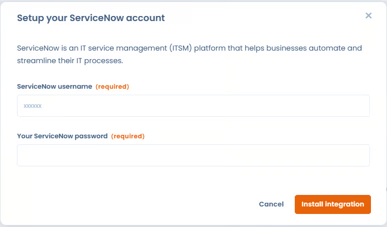
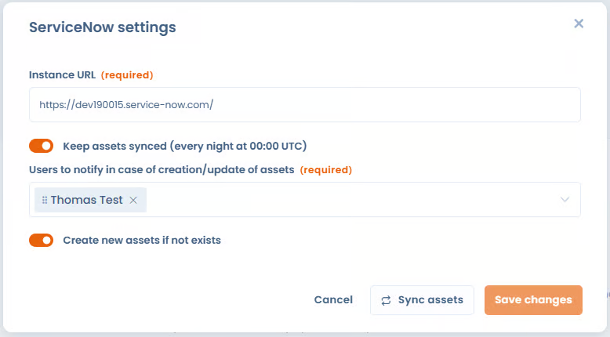

# ServiceNow

**What is ServiceNow?**\
\
The [**ServiceNow**](https://www.servicenow.com/) integration allows you to automatically synchronize business applications from the ServiceNow CMDB directly into Dastra.

It allows you to:

* avoid duplicate data entry;
* centralize technical assets used across the organization;
* use these assets in your processing records, datasets, impact assessments, risk analyses, audits, etc.;
* ensure that information from ServiceNow remains up to date in Dastra.

**Prerequisites**

* Have a paid Dastra license including access to the Integrations / Connectors module.
* Have a ServiceNow instance (e.g. `https://your-instance.service-now.com`) that allows REST API calls from external sources, and depending on the authentication method:
  * **OAuth 2.0 (recommended)** — the ability to register an OAuth application in your instance,
  * **Basic** — a service account with read access to `cmdb_ci_business_app`.

**Installation**\
\
The setup process follows the common integration flow (see [Connections, use cases and field mapping](connections-and-field-mapping.md)):

1. Go to the ServiceNow integration page in the Dastra integrations marketplace.\
   Example:\
   [https://app.dastra.eu/workspace/0/settings/integrations/servicenow](https://app.dastra.eu/workspace/0/settings/integrations/servicenow)
2. On the asset import use case, click **Add integration**.
3. Add a connection and pick the **Authentication method** (see below).
4. Complete the **Configuration** step. It is mandatory to finalize the installation.

<!-- 📸 Screenshot to retake: the ServiceNow connection modal with the Authentication method select (Basic / OAuth) -->

<figure><figcaption></figcaption></figure>

**Authentication methods**

**OAuth 2.0 (recommended)** — Dastra never stores a password; ServiceNow issues short-lived tokens that Dastra refreshes automatically.

1. In ServiceNow, create an OAuth app for Dastra: **All > Application Registry** (on recent releases: *Inbound integrations > Authorization code grant*), type *OAuth API endpoint for external clients*.
2. Set the redirect URL to: `https://api.dastra.eu/v1/integrationaccounts/callback/servicenow`
3. Make sure the app's scope restriction is **Broadly scoped** (or declare the `useraccount` scope): a *securely scoped* app without scopes will reject the token exchange.
4. In Dastra, create the connection with the method **OAuth**, enter the **Instance URL**, the **OAuth client ID** and the **OAuth client secret**, then click **Save and connect** and authorize Dastra in ServiceNow.

**Basic authentication** — username/password of a ServiceNow account, stored encrypted by Dastra.


Recent ServiceNow instances restrict Basic authentication on the REST API at the account level. If you use Basic authentication, create a **dedicated service account with "Web service access only" checked** — never a named user or an admin account. Symptom of the restriction: a `401 User is not authenticated` response even with valid credentials.


**Configuration**

* Select the **users to notify on error** (required). They will receive an email notification when a synchronization fails, containing information about the updated assets.
* **Create the Dastra record if it does not exist** — when enabled, an asset is created if it does not exist in Dastra, based on the external reference.
* **Deduplicate synced items** — match incoming applications against existing assets on a **Matching field** (**Label** or **Reference**) to update them instead of creating duplicates.
* **Field mapping** — choose which ServiceNow field (from `cmdb_ci_business_app`) fills each Dastra field. The choice lists are read live from your instance's data dictionary, so choice values can be transcoded to Dastra values. See [Connections, use cases and field mapping](connections-and-field-mapping.md).


Warning: if you enable the creation option, a large number of assets may be automatically created in your workspace. Make sure to properly configure external references.


<!-- 📸 Screenshot to retake: the ServiceNow configuration panel with the options and the field mapping editor -->

<figure><figcaption></figcaption></figure>

**How is data synchronized between Dastra and ServiceNow?**\
\
The synchronization runs automatically **once a day**, and can be triggered at any time with **Run synchronization now** on the use case card. During each synchronization, fields from ServiceNow are mapped into your Dastra asset repository. By default, the following information is retrieved and updated:

* Asset **label**
* **Description** (ServiceNow Short Description)
* **Application type**
* **Installation state / status**
* **Asset type** (systematically imported as _Software_)
* **Associated area / domain** (AreaId)
* Associated **tags**
* ServiceNow **external identifier** (`sys_id`)
* **External source** (`ServiceNow`)
* **Last synchronization date**
* Asset **owner**

Each of these default behaviours can be overridden per field in the **Field mapping** editor. All this data ensures a reliable and up-to-date link between your ServiceNow CMDB and your Dastra repository.

**Management of assets deleted in ServiceNow**\
\
When Dastra detects that an asset previously synchronized no longer exists in ServiceNow, it is not automatically deleted in Dastra.

Instead, Dastra adds an automatic tag (`To-delete-servicenow`) to the asset indicating that it has been deleted in ServiceNow. If the application reappears in ServiceNow later, the tag is removed automatically.

This behavior allows:

* keeping history in Dastra,
* avoiding unintentional deletions,
* facilitating manual review of obsolete assets.

When deduplication finds **several** matching assets for one incoming application, the candidates are tagged `To-merge-servicenow` for a manual merge decision.
