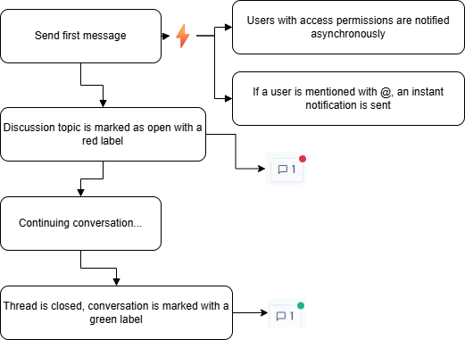
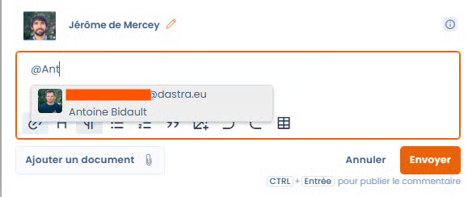
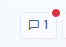
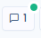
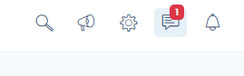

# Internal discussions

### How it Works

You can chat about any items in Dastra: tasks, processing activities, AI systems, incidents, assets, and more.

#### How to Use It

1. Go to a processing activity, asset, or any other record.
2. Click this button:
3. Enter your message, and optionally attach any files.
4. Click the “Send” button.

Below is a diagram explaining the workflow of internal discussions:

<figure><figcaption></figcaption></figure>

***

### Mentions

You can **mention** relevant users by using the “@” shortcut on your keyboard. A list of users will be suggested. You can search all users within your workspace.

<figure><figcaption></figcaption></figure>

The purpose of a mention is to automatically send an email notification to the mentioned user.

***

### Quotes (replying to a message)

You can **reply directly to a specific message** in the conversation, which keeps the context readable in long discussion threads.

#### How to Use It

1. Hover over the message you want to reply to and click the “**Reply**” button. This button is available on messages posted by other users.
2. The message form opens and displays a **quote block** above the text area, titled “Replying to {author name}”, with a preview of the quoted message.
3. If your draft is empty, the author of the quoted message is **automatically mentioned** in your reply (see the Mentions section), which triggers their notification.
4. **Enter your message**, attach any files, then click **Send**.

To remove the quote while keeping the message you are writing, click the **trash icon** on the right-hand side of the quote block. You can also remove the automatically added mention if you do not want to notify the author.


A message can quote **only one message** at a time. The quote is kept if you later edit your message.


#### Display in the conversation

Once the message is posted, the quoted message appears in a block above your reply, showing its author’s name and a preview of its content. If the quoted message is later deleted, the block displays “This message has been deleted”: your reply remains visible and the thread history is not broken.

***

### Notifications

Message notifications are automatically sent whenever a message is posted on the relevant item. There are two types of notifications sent automatically:

* **Asynchronous notification:** A message is sent to all workspace members who have access to the item.
* **Instant notification:** A message is sent to all users mentioned in the conversation.

For more information, please refer to our notifications page. 


If you use Slack, you can enable automatic user notifications in Slack via the [integration page in your workspace](https://app.dastra.eu/workspace/0/settings/integrations).


***

### Opening/Closing a Conversation

When a message is sent to an item that does not have an existing conversation, or if the discussion was previously closed, the conversation status changes to “Open.” It will then appear in the interface with a small red dot, as well as in the general conversation hub.

<figure><figcaption></figcaption></figure>

Once the conversation is finished, if you have the rights to close conversation topics, you can click the “Close Conversation” button. This will display the conversation indicator in green.

<figure><figcaption></figcaption></figure>

***

### Conversation Hub

To centralize all open conversations in Dastra, you can access the central conversation hub.\
You can find it by clicking this link in the navigation bar.

<figure><figcaption></figcaption></figure>

This hub brings together all conversations within your workspace. You can answer all your users’ questions while accessing the records of the relevant items.
