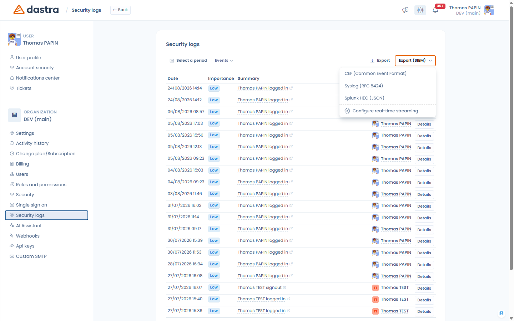

# SIEM streaming

### What is it?

SIEM streaming forwards your Dastra account's **security audit events to your SIEM in real time**: logins, permission changes, API keys, MFA and SSO changes, user and workspace deletions… Every audit event of the account is streamed, so your security team gets the complete trail in the tool they already monitor (Splunk, Sentinel, Sumo Logic, QRadar…).

Independently of streaming, the audit logs can also be **exported manually** in SIEM formats — see [Manual export](#manual-export-from-the-audit-logs) below.

### Prerequisites

* The **Enterprise plan** (Advanced security feature).
* You must be an **owner** of the account: the configuration lives in the **Security center**, at the bottom of the **Security** page (**SIEM event streaming** section).
* On the SIEM side: an HTTP event collector endpoint reachable over HTTPS (e.g. a Splunk HEC endpoint) and its token or API key.

<!-- 📸 Screenshot: the Security center > Security page scrolled to the SIEM event streaming section -->

<figure><figcaption>
The SIEM event streaming section, in Security center > Security
</figcaption></figure>

### Configuration

Fill in the form and click **Save**:

* **Collector endpoint** (required) — the HTTP(S) URL of your SIEM collector, e.g. `https://collector.example.com/services/collector/event` for Splunk HEC.
* **Authentication** — how the token is sent with each event:
  * **Bearer** — `Authorization: Bearer <token>` (default),
  * **API Key** — `Authorization: ApiKey <token>`,
  * **Custom header** — the token is sent in the header you name in **Header name** (e.g. `X-API-Key`),
  * **None** — no authentication header (e.g. when the token is part of the URL).
* **Token / API key** — the collector token. It is stored encrypted and never displayed again; leave the field empty later to keep the current one.
* **Custom headers (optional)** — extra HTTP headers sent with every event, as key/value pairs.
* **Event format**:
  * **Splunk HEC (JSON)** — the native Splunk HTTP Event Collector envelope. Two extra optional fields appear: **Source type** (default `dastra:audit`) and **Index**.
  * **CEF (Common Event Format)** — for ArcSight, Sumo Logic, and most SIEMs that ingest CEF.
  * **Syslog (RFC 5424)** — structured syslog lines.
* **Verify TLS certificate** — keep it enabled; disable it only for a self-signed development collector.

Then switch on **Enable real-time streaming**.

<!-- 📸 Screenshot: the SIEM form filled with a Splunk HEC endpoint, Bearer auth and the format select open -->

<figure><figcaption>
Configuring SIEM streaming
</figcaption></figure>

### Testing the connection

**Test connection** sends a synthetic test event to your collector with the current form values and reports the outcome ("Test event delivered successfully", or the HTTP error returned by the collector). Use it after any change — the test does not require streaming to be enabled.


The streaming applies to the whole account (all workspaces). One SIEM configuration exists per account.


### What is sent to the SIEM?

Each audit event is delivered individually, as it happens, with the following content:

| Field | Content |
| --- | --- |
| `id` | Unique identifier of the audit event |
| `time` / `timestamp` | Event date (UTC) |
| `action` | Event type, e.g. `UserLogin`, `PermissionChange`, `ApiKeyAdded` |
| `message` | Human-readable description |
| `objectType` / `objectId` | The record involved, when applicable |
| `severity` | Syslog-style severity (see below) |
| `outcome` | `success` or `failure` |
| `actorId` / `actorName` / `actorEmail` | Who performed the action |
| `tenantId` / `workspaceId` / `workspaceName` / `areaId` | Where it happened |
| `url` | Deep link back to the record in Dastra |

Security-sensitive events are elevated in severity regardless of their display priority in Dastra: repeated failed logins are sent as **Error** (with `outcome: failure`); permission changes, API key creation/removal, MFA and SSO changes, user revocations and deletions, and workspace deletions are sent as **Warning**.


Events contain the actor's name and e-mail address — the information already shown in the Dastra audit log. No record content (personal data of data subjects, document contents…) is streamed.


### Manual export from the audit logs

You can export the security audit trail on demand, in the same formats, without configuring streaming:

1. Open **Security center > Security logs**.
2. Set the filters (period, workspace…) as needed.
3. Open the **Export (SIEM)** dropdown next to the regular Export button and pick **CEF (Common Event Format)**, **Syslog (RFC 5424)** or **Splunk HEC (JSON)**.

The file (`dastra-security-logs-<date>`) contains the matching audit events, up to 100 000, ready to be ingested by your SIEM.

The same dropdown also offers **Configure real-time streaming**, a shortcut to the streaming configuration described above.

<!-- 📸 Screenshot: the Security logs page with the "Export (SIEM)" dropdown open showing the three formats -->

<figure><figcaption>
One-off SIEM export from the security logs
</figcaption></figure>

### Troubleshooting

* **Test failed: HTTP 401/403** — check the token and the authentication scheme expected by your collector (Splunk HEC expects the token as configured on the HEC input; some collectors expect a custom header).
* **Test failed: certificate errors** — your collector uses a certificate Dastra cannot verify. Fix the certificate chain; only disable **Verify TLS certificate** for a development collector.
* **No events arriving** — make sure **Enable real-time streaming** is on, and check your collector's ingestion logs. Use **Test connection** to isolate connectivity from configuration.
