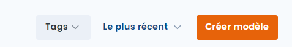
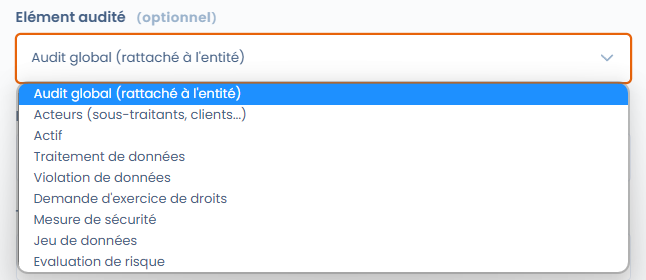
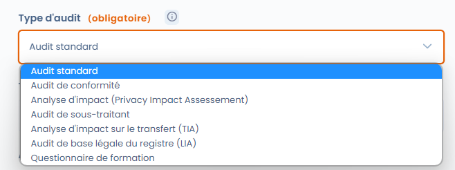

# Créer ou modifier un modèle de questionnaire

## Introduction

La création ou la modification d'un modèle de questionnaire dans Dastra est un jeu d'enfant. Pour ce faire, accédez à la fonctionnalité "Questionnaires".

## Créer ou modifier un modèle de questionnaire



Pour créer un modèle de questionnaire, cliquez sur le bouton "Créer un modèle" dans l'onglet "Questionnaires". Ensuite vous pouvez sélectionner un des types de modèles disponibles dans Dastra : questionnaire automatisé, personnalisé ou importé depuis un fichier.

<figure><figcaption></figcaption></figure>

Vous arrivez sur l'interface de sélection des types de modèles :

* En cliquant sur l'onglet "**Questionnaire automatisé**", vous choisirez un modèle de questionnaire prédéfini existant en piochant dans la bibliothèque de Dastra.
* En cliquant sur "**Questionnaire personnalisé**", vous pouvez construire votre propre modèle de questionnaire.


Contrairement aux questionnaires automatisés, les questionnaires personnalisés sont entièrement personnalisables. En fonction des réponses sélectionnées par les répondants, vous serez en mesure de générer automatiquement un plan d'actions ou de cartographier les risques associés au modèle.


## Les modèles de questionnaires automatisés

Dastra propose de nombreux modèles de questionnaires automatisés permettant de documenter la conformité et de piloter les processus. Ces modèles incluent notamment des AIPD/PIA, des TIA, des LIA, des questionnaires sous-traitants, et bien d'autres.

Une fois le modèle sélectionné, vous accédez à l'écran de planification où vous pouvez :

* soit **modifier le modèle** en cliquant sur le bouton "Modifier le modèle"
* soit planifier un questionnaire en cliquant sur le bouton "Planifier un questionnaire"


Certains types de questionnaires (AIPD, TIA, LIA) peuvent également être lancés directement depuis un traitement — par exemple depuis les onglets "Analyse d'impact", "Destinataires" ou "Finalités". Consultez les pages dédiées ci-dessous pour plus de détails.


## Les modèles de questionnaires personnalisés

Dans Dastra, il vous est possible de créer votre propre modèle de questionnaire personnalisé. Pour cela, cliquez sur l'option "Questionnaire personnalisé". Vous accéderez ainsi à l'interface d'édition de modèle de questionnaire.

Construisez le modèle de questionnaire que vous souhaitez et cliquez sur "Enregistrer et continuer".

### Éléments évalués

Vous pouvez lier des questionnaires à des éléments dans Dastra. En choisissant le type d'élément évalué, vous forcez toutes les réponses basées sur ce modèle à être liées à un objet du type choisi. Par exemple, vous pouvez choisir que ce modèle de questionnaire sera toujours lié à un traitement.

<figure><figcaption></figcaption></figure>

Vous pouvez choisir de ne pas lier un questionnaire à un objet particulier. Dans ce cas, la réponse sera toujours liée à une unité organisationnelle. Cela peut être le cas pour des questionnaires de conformité globaux par exemple.

### Les types de modèles

Lors de la création d'un modèle personnalisé, vous devrez choisir un type de modèle.

<figure><figcaption></figcaption></figure>

Ces types permettent une certaine personnalisation des modèles de questionnaires.

* **Questionnaire standard** : il s'agit d'un questionnaire classique
* **Questionnaire de conformité** : à l'heure actuelle, il s'agit d'un questionnaire classique
* **Analyse d'impact** : ce modèle permet d'afficher une matrice des risques (avec la configuration requise) et d'être appelé lors de l'étape AIPD d'un traitement
* **Questionnaire de sous-traitant** : ce modèle est appelé lors de l'étape destinataires sous-traitants d'un traitement
* **Analyse d'impact sur le transfert (TIA)** : questionnaire permettant l'analyse des risques relatifs à un transfert de données hors UE
* **Analyse de la base légale (LIA)** : questionnaire de la base légale des intérêts légitimes pour s'assurer que les intérêts n'outrepassent pas les droits et libertés des personnes
* **Questionnaire de formation** : questionnaire permettant de réaliser des quiz de formation. Ce type de questionnaire permet de sélectionner une bonne réponse parmi les réponses et d'afficher les bonnes réponses en fin de questionnaire.

## Charger un modèle de questionnaire que vous possédez

Il est enfin possible d'importer un de vos modèles de questionnaires, au format json. Pour cela, à la création du questionnaire, sélectionnez l'option "Charger un modèle".

## Les blocs d'analyse



## Pour aller plus loin


[planifier-un-audit.md](../planifier-un-audit.md)



[rapport-daudit.md](../rapport-daudit.md)



[pia-aipd.md](../pia-aipd.md)



[tia.md](../tia.md)



[lia.md](../lia.md)

