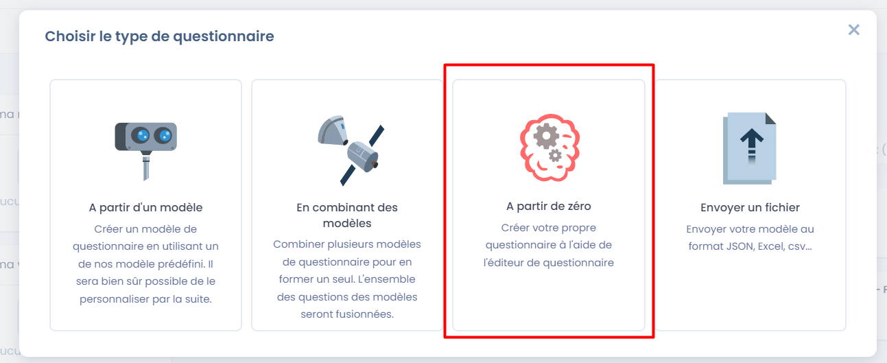
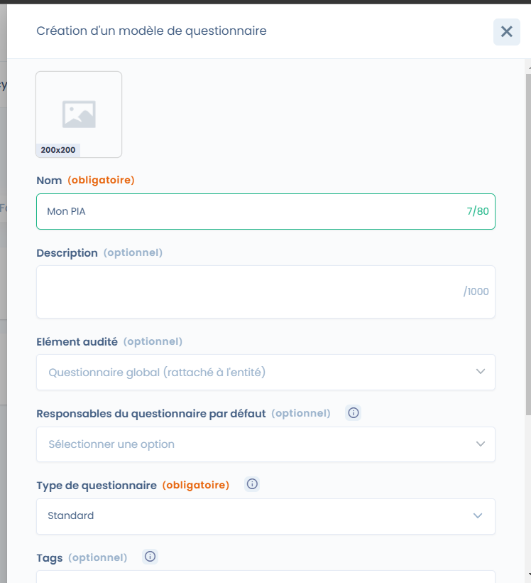
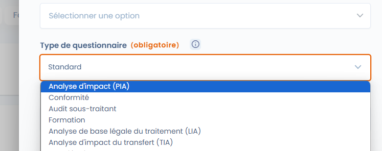
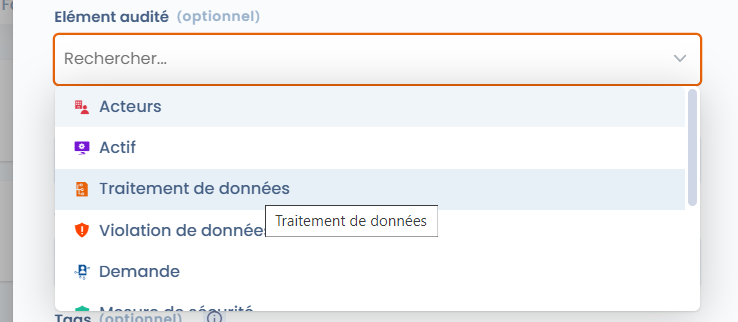

# Créer ou modifier un modèle de PIA

Dastra dispose de plusieurs modèles d'analyses d'impact relatives à la protection des données (AIPD ou PIA). Cependant, vous pouvez tout à fait créer le vôtre très simplement.


Ne partez pas de zéro ! Utilisez un modèle existant pour le personnaliser. Cela vous donne une base de départ.


Etape 1 : Créer le modèle

Se rendre dans le module Questionnaire et cliquer sur "A partir de zero"

<figure><figcaption></figcaption></figure>

Etape 2 : configurer le modèle

<figure><figcaption></figcaption></figure>

Vous devez choisir les options suivantes pour profiter pleinement des fonctionnalités du PIA :

* choisir le type de questionnaire : il est nécessaire d'indiquer "Analyse d'impact (PIA)"

<figure><figcaption></figcaption></figure>


Le type de questionnaire PIA permet d'afficher les éléments spécifiques au PIA, en particulier, la carte de chaleur dans le tableau de bord du questionnaire mais également, l'intégration des données du traitement lors de la génération du PIA. Il permet également de reprendre des PIA au format JSON depuis l'outil PIA CNIL.


* Dans la partie Element audité, vous pouvez associer "traitement de données" : cela permet d'associer votre questionnaire de PIA à un traitement et de retrouver le PIA depuis le traitement. De plus, cela vous permettra de mettre à jour la date du dernier PIA lors de la validation de celui ci.

<figure><figcaption></figcaption></figure>

Les modèles de type PIA permettent de remonter 2 types d'éléments :&#x20;

* Des analyses de risques (impact/probabilité initiale / impact/probabiité résiduelle)
* Des tâches des remédiations.

Afin de faire en sorte que le rapport de résultat du PIA s'affiche, vous devez mettre en place un certain nombre de noms de variable sur les sections et questions du questionnaire

<figure><figcaption></figcaption></figure>

Voici le plan des sections / questions à mettre en place dans le modèle :&#x20;

* Displarition des données (risque 1) ⇒ nom de variable : pia\_32
  * pia\_todo\_324 ⇒ Todo list (tasks to remediate the risk), multistring
  *   pia\_325 ⇒ Impact initial (échelle avec score de 0 à 5)

      pia\_326 ⇒ Probabilité initial (échelle avec score de 0 à 5)\
      pia\_todo\_325 ⇒ Impact résiduel (échelle avec score de 0 à 5)

      pia\_todo\_326 ⇒ Probabilité résiduel  (échelle avec score de 0 à 5)
* Divulgation des données (risque 2) ⇒  nom de variable : pia\_33
  *   pia\_todo\_334 ⇒ Todo list (tasks to remediate the risk), multistring\
      pia\_335 ⇒ Impact initial (échelle avec score de 0 à 5)

      pia\_336 ⇒ Probabilité initial (échelle avec score de 0 à 5)\
      pia\_todo\_335 ⇒ Impact résiduel (échelle avec score de 0 à 5)

      pia\_todo\_336 ⇒ Probabilité résiduel  (échelle avec score de 0 à 5)
* Accès non autorisé aux données (risque 3) ⇒  nom de variable : pia\_34
  * ...
* Autre risque (risque x) ⇒ nom de variable : pia\_3x
  * ...

