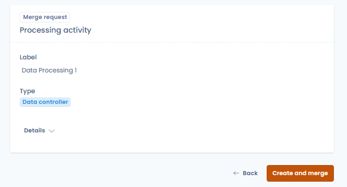
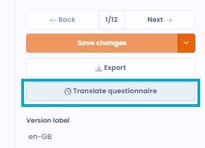
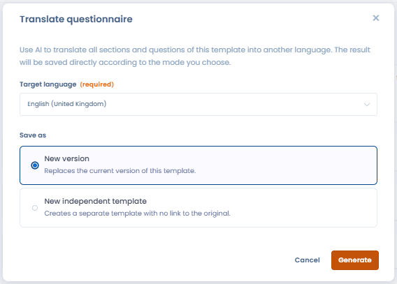

# Piloter les questionnaires

## Tableau de bord des réponses

Depuis l'onglet **"Voir les questionnaires"**, sélectionnez un modèle pour accéder à son tableau de bord de réponses. Il propose quatre vues :

* **Réponses** : liste de toutes les réponses avec leur statut (en attente, validé, en retard), leur score et l'objet lié
* **Tableau détaillé** : comparaison côte à côte de toutes les réponses par catégorie et score — utile pour benchmarker plusieurs entités ou traitements
* **Stats** : statistiques agrégées sur l'ensemble des réponses du modèle
* **Détails** : configuration et métadonnées du questionnaire

## Reporting d'une réponse individuelle

En ouvrant une réponse, vous accédez à une vue de reporting détaillée :

* **Statut** : progression de "En attente de répondants" → "Démarré" → "En attente de validation" → "Validé"
* **Score** : score total sur le maximum de points
* **Complétion** : nombre de questions répondues sur le total
* **Temps de réponse** : durée de complétion du questionnaire
* **Signalements** : réponses automatiquement marquées comme nécessitant attention selon la configuration du modèle
* **Analyse des résultats** : blocs d'analyse générés automatiquement (niveau de conformité, évaluation des risques, etc.)
* **Score par catégories** : visualisé sous forme de radar ou de graphique en barres

## Analyse IA (bêta)

Depuis la vue de reporting d'une réponse, déclenchez une **analyse IA** pour obtenir :

* Un score global de conformité ou de risque
* Un résumé écrit des principaux constats
* Une analyse par critères (complétude, base légale, mesures de sécurité, etc.)
* Des tâches suggérées pour combler les lacunes identifiées


L'analyse IA est une fonctionnalité bêta. Les résultats doivent être interprétés avec prudence et revus par un professionnel qualifié.


## Valider une réponse

Une fois la réponse examinée, cliquez sur **"Revoir et valider le questionnaire"** pour la passer au statut "Validé". Cette action est disponible pour les responsables du questionnaire.


Si vous ne pouvez pas valider une réponse, vérifiez que le répondant a bien cliqué sur le bouton **"Finaliser"**. Sans cette étape, la réponse reste en "En attente de validation".


## Fusionner les réponses avec l'objet attaché

Après avoir complété un questionnaire lié à un objet Dastra (traitement, actif, acteur, etc.), il est possible de **fusionner les réponses collectées avec les données de cet objet**.

Cette action met à jour directement les champs correspondants de l'objet à partir des informations saisies dans le formulaire, sans nouvelle saisie manuelle.

Pour lancer la fusion, ouvrez la réponse complétée et cliquez sur **"Fusionner la demande (Traitement)"** — une fenêtre de confirmation liste les champs qui seront mis à jour dans l'objet cible.

<figure><figcaption>
Le bouton "Fusionner la demande" permet de répercuter les réponses dans l'objet Dastra lié
</figcaption></figure>

<figure><figcaption>
Confirmation de la fusion et création du traitement depuis les réponses collectées
</figcaption></figure>

Cette fonctionnalité est particulièrement utile dans les scénarios de collecte externe via les Privacy hubs, où des tiers (fournisseurs, sous-traitants) renseignent des informations qui doivent ensuite être reflétées dans vos registres internes.

## Traduire un modèle de questionnaire avec l'IA

Dastra permet de traduire automatiquement toutes les sections et questions d'un modèle de questionnaire dans une autre langue, grâce à l'assistant IA.

Pour lancer la traduction, ouvrez un modèle de questionnaire et cliquez sur **"Traduire le questionnaire"**.

<figure><figcaption>
Le bouton "Traduire le questionnaire" est disponible depuis l'éditeur de modèle
</figcaption></figure>

Choisissez la langue cible et le mode d'enregistrement :

* **Nouvelle version** — remplace la version actuelle du modèle par la traduction
* **Nouveau modèle indépendant** — crée un modèle séparé, sans lien avec l'original

<figure><figcaption>
Sélection de la langue cible et du mode d'enregistrement de la traduction
</figcaption></figure>

## Générer un plan d'actions

Depuis la vue de reporting d'une réponse, cliquez sur **"Générer un plan d'actions"** pour créer automatiquement des tâches basées sur les réponses fournies. Les tâches sont suggérées selon la configuration du modèle et ajoutées directement au module de gestion des tâches de Dastra.
