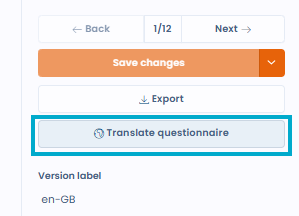
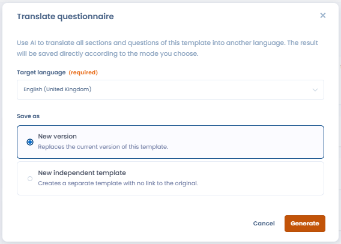

# Traduire un formulaire avec l'IA

Depuis l'éditeur de formulaire, il est possible de **traduire automatiquement un formulaire** dans la langue de votre choix grâce à l'assistant IA.

Pour lancer une traduction :

1. Ouvrez le formulaire à traduire dans l'éditeur.
2. Cliquez sur **"Traduire le formulaire"** dans le menu de l'éditeur.
3. Sélectionnez la langue cible.
4. Choisissez l'une des deux options :
   1. **Créer un nouveau modèle** à partir du formulaire courant dans la langue cible
   2. **Créer une nouvelle version** du formulaire courant directement dans la langue cible

<figure><figcaption></figcaption></figure>

La traduction couvre les questions, sections, réponses et textes d'accompagnement. La disponibilité des langues dépend du modèle de LLM configuré dans votre espace de travail.

<figure><figcaption></figcaption></figure>

