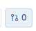
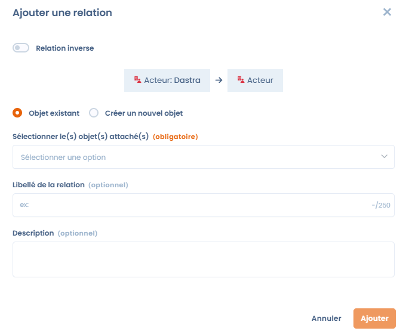
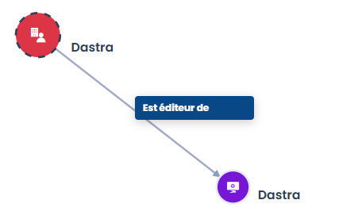

# Relations génériques

## Qu'est-ce qu'une relation générique ?

Une **relation générique** est un lien simple et étiqueté entre deux éléments dans Dastra. Elle permet de documenter des connexions entre objets qui ne sont pas automatiquement inférées par la plateforme — par exemple, lier un actif à un acteur, ou un risque à une violation de données.

Une relation se caractérise par :

* un **objet source** et un **objet cible**,
* un **libellé de relation** (optionnel, ex. "Responsable", "Géré par"),
* un **résumé** (optionnel, pour apporter du contexte),
* une **direction** — qui peut être inversée si nécessaire.


Un élément peut être lié à plusieurs autres éléments de types différents.


## Où les relations génériques sont-elles disponibles ?

Des relations génériques peuvent être créées depuis les éléments suivants :

* **Actifs**
* **Acteurs**
* **Mesures de sécurité**
* **Violations de données**
* **Jeux de données**
* **Risques**

Elles sont principalement utilisées dans le module **Actifs** et les **référentiels** (cartographie), où le graphe de relations est visualisé.

## Comment ajouter une relation générique

1. Ouvrez un élément (ex. un actif).
2. Cliquez sur l'icône **"Éléments liés"** dans la barre d'outils — elle affiche le nombre de liens existants.

<figure><figcaption></figcaption></figure>

3. Cliquez sur **"Ajouter une relation"** et sélectionnez le type d'objet à lier (Acteur, Mesure de sécurité, Violation de données, Actif, Jeu de données ou Risque).
4. Dans la fenêtre de dialogue :
   * Activez **"Relation inverse"** si la direction doit être inversée.
   * Choisissez **"Élément existant"** pour lier à un élément déjà dans Dastra, ou **"Créer un élément"** pour en créer un à la volée.
   * Sélectionnez l'objet cible dans le menu déroulant.
   * Ajoutez optionnellement un **Libellé de relation** et un **Résumé**.
5. Cliquez sur **"Ajouter"** pour enregistrer la relation.

<figure><figcaption></figcaption></figure>

## Visualiser les relations

Une fois les relations créées, elles apparaissent dans :

* Le panneau **"Éléments liés"** de chaque élément, affichant tous les liens directs.
* Le **graphe de nœuds** dans la vue cartographie, où toutes les relations sont représentées sous forme de réseau connecté.

<figure><figcaption>
Exemple de visualisation graphique d'une relation générique dans la cartographie
</figcaption></figure>

## Pour aller plus loin


[cartography](../cartography/README.md)

