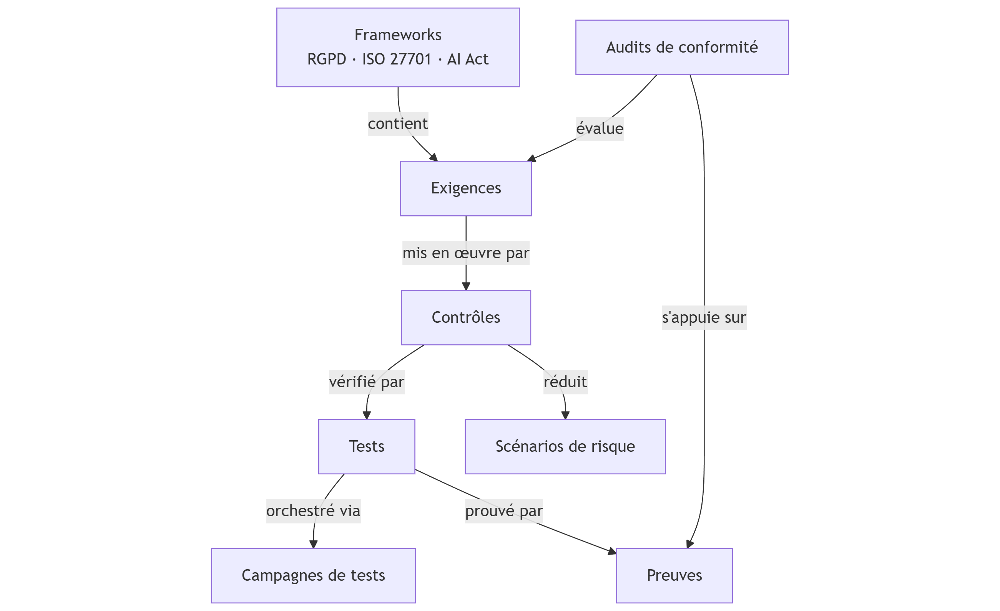

# Conformité

Le module **Conformité** ou **Compliance** de Dastra permet de gérer la conformité réglementaire de manière structurée, traçable et auditable, en s’appuyant sur une architecture modulaire alignée avec les référentiels de conformité.

***

### Architecture du module Compliance

Le module repose sur une chaîne logique d’objets, depuis les référentiels réglementaires jusqu’aux preuves de conformité.

<figure><figcaption></figcaption></figure>

#### Frameworks (Référentiels)

Exemples : RGPD, ISO 27701, ISO 27001, AI Act.

Un framework :

* définit le cadre réglementaire ou normatif,
* contient un ensemble d’exigences applicables.

***

#### Exigences (Requirements)

Les exigences représentent les obligations issues d’un framework.\
Exemples : contrôle des accès, gestion des habilitations, journalisation.

Chaque exigence :

* est rattachée à un framework,
* est évaluée lors des audits de conformité,
* est mise en œuvre via un ou plusieurs contrôles.

***

#### Contrôles (Controls)

Les contrôles décrivent **comment** une exigence est appliquée concrètement.\
Exemples : revue périodique des accès, procédure d’habilitation.

Un contrôle :

* met en œuvre une exigence,
* est lié à un ou plusieurs scénarios de risque,
* est vérifié à l’aide de tests.

***

#### Scénarios de risque (Risk scenarios)

Les scénarios de risque décrivent les événements redoutés.\
Exemple : accès non autorisé à des données sensibles.

Les contrôles permettent :

* de prévenir ou réduire ces risques,
* de démontrer les mesures de remédiation mises en place.

***

#### Tests

Les tests servent à vérifier l’efficacité des contrôles.\
Exemples : revue récurrente des accès, délégation de validation.

Un test :

* contrôle un ou plusieurs contrôles,
* produit des résultats mesurables,
* est appuyé par des preuves.

***

#### Campagnes de tests (Test campaigns)

Les campagnes permettent d’orchestrer les tests à grande échelle :

* envoi de campagnes aux équipes ou aux clients,
* collecte centralisée des réponses,
* suivi de l’avancement et des statuts.

***

#### Preuves (Evidences)

Les preuves démontrent la conformité.\
Exemples : politiques, procédures, rapports de revue d’accès.

Une preuve :

* est associée à un test,
* est utilisée lors des audits,
* garantit la traçabilité des contrôles.

***

#### Audits de conformité (Compliance audits)

Les audits permettent d’évaluer le niveau de conformité :

* audits internes,
* auto-évaluations,
* préparation aux audits externes.

Ils s’appuient sur :

* les exigences,
* les contrôles,
* les tests et preuves associées.

***

### Vision d’ensemble

Le module Compliance de Dastra permet ainsi de :

* structurer les exigences réglementaires,
* relier les obligations aux risques,
* prouver la conformité par des contrôles testés et documentés,
* préparer efficacement les audits et certifications.

### Principe multi-framework dans Dastra

Le module Compliance de Dastra est **nativement multi-framework**.

Cela signifie que :

* un même **framework** (RGPD, ISO, AI Act…) contient ses propres exigences,
* une **exigence** appartient à **un framework**,
* un **contrôle peut répondre à plusieurs exigences**, y compris issues de **frameworks différents**,
* les **tests et preuves** sont mutualisés et réutilisables.

Objectif : **éviter les doublons** et piloter la conformité de manière transverse.

***

### Relations clés entre les objets

* **Framework → Exigences** : 1 → N
* **Exigences ↔ Contrôles** : N ↔ N
* **Contrôles ↔ Tests** : N ↔ N
* **Tests → Preuves** : 1 → N
* **Contrôles → Scénarios de risque** : N ↔ N

Un même contrôle (ex. revue des accès) peut ainsi :

* satisfaire une exigence RGPD,
* satisfaire une exigence ISO 27001,
* réduire plusieurs scénarios de risque.

**Schéma explicatif**

<figure><figcaption></figcaption></figure>

