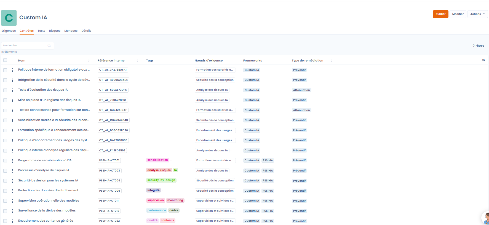
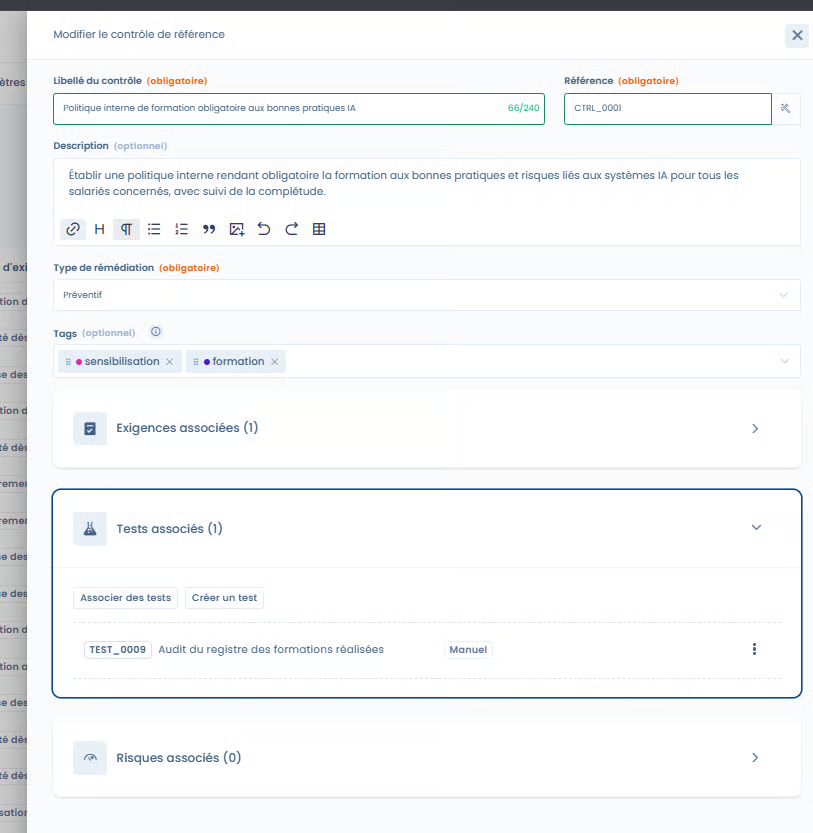
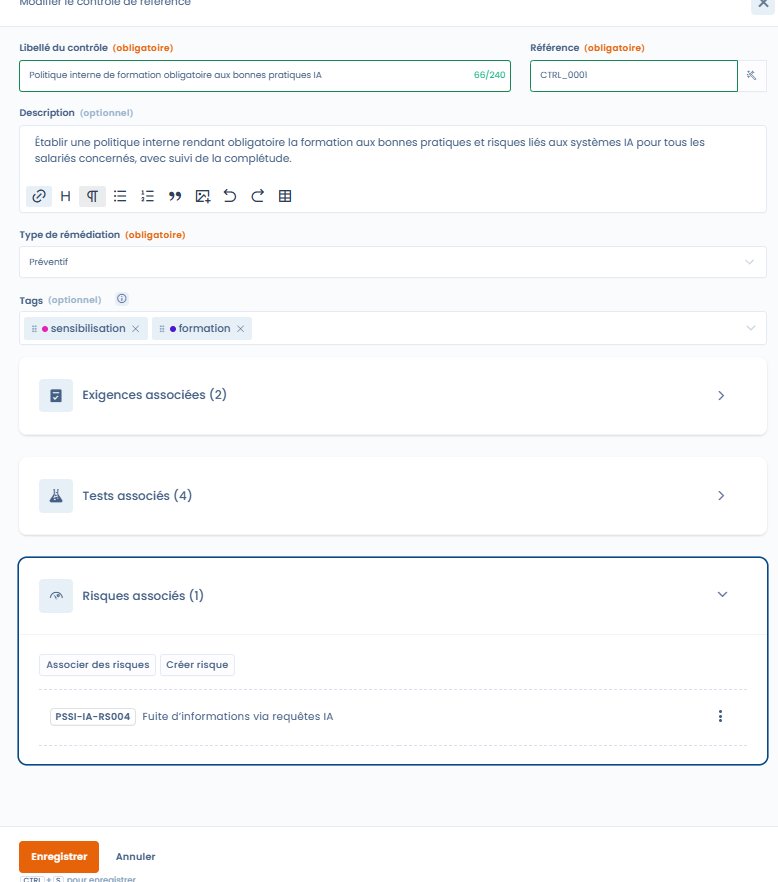
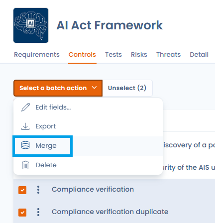

# Contrôles

Ils traduisent les exigences du framework en **mesures concrètes**, mesurables et auditables, permettant de démontrer l’efficacité de la conformité dans le temps.

Un contrôle peut :

* couvrir **une ou plusieurs exigences**
* être partagé entre **plusieurs frameworks**
* être associé à des **tests** et des **risques**

***

### Suivi et gestion des contrôles

<figure><figcaption></figcaption></figure>

Les contrôles peuvent être suivis depuis deux points d’entrée complémentaires.

***

#### 1. Depuis le framework

Dans l’onglet **Contrôles** d’un framework, l’utilisateur visualise :

* les contrôles rattachés aux exigences du framework
* leur type de remédiation
* les exigences couvertes
* les tests et risques associés

👉 Cette vue est idéale pour :

* comprendre la couverture d’un framework
* identifier les contrôles clés
* piloter la conformité par référentiel

***

#### 2. Depuis la bibliothèque de contrôles

<figure><figcaption></figcaption></figure>

La **bibliothèque de contrôles** centralise l’ensemble des contrôles de l’organisation, tous frameworks confondus.

Cette vue permet de :

* bénéficier de **statistiques globales** (contrôles avec tests, risques, associations multiples, orphelins)
* identifier les contrôles réutilisés dans plusieurs frameworks
* améliorer la **qualité et la cohérence** de la bibliothèque de contrôles

👉 C’est un outil clé pour la gouvernance et l’industrialisation de la conformité.

***

### Fenêtre d’édition d’un contrôle



La fenêtre d’édition permet de définir précisément le rôle du contrôle et ses liens avec le reste du référentiel.



<figure><figcaption></figcaption></figure>



***

#### Libellé et référence du contrôle

* **Libellé du contrôle**\
  Décrit de manière claire l’action ou la mesure mise en œuvre.
* **Référence du contrôle**\
  Identifiant unique du contrôle dans la bibliothèque.



📌 Un **générateur de référence** est disponible pour proposer automatiquement une référence cohérente avec :

* le contexte du contrôle
* les conventions de nommage
* les frameworks associés

L’utilisateur peut ajuster librement la référence proposée.



<figure><figcaption></figcaption></figure>



***

#### Type de remédiation

Chaque contrôle doit être associé à un **type de remédiation**, qui précise sa nature :

* **Préventif**\
  Le contrôle vise à **éviter** la survenue d’un risque\
  &#xNAN;_(ex. formation, règles d’accès, validation avant mise en production)_
* **Atténuation**\
  Le contrôle vise à **réduire l’impact ou la probabilité** d’un risque déjà existant\
  &#xNAN;_(ex. supervision, détection, plan de mitigation)_

👉 Cette distinction est essentielle pour :

* analyser la stratégie de maîtrise des risques
* équilibrer prévention et détection
* piloter la maturité de la conformité

***

#### Tags

Les tags permettent de :

* catégoriser les contrôles (ex. formation, IA, sécurité, monitoring)
* faciliter la recherche et le filtrage
* analyser les thématiques dominantes de la bibliothèque

***

### Association des tests

Les [**tests**](tests.md) permettent de vérifier l’existence, l’application et l’efficacité d’un contrôle.

#### Association par IA



<figure><figcaption></figcaption></figure>



L’assistance IA propose :

* des **tests existants** dans la bibliothèque, pertinents au regard du contrôle
* la **création de nouveaux tests**, lorsque nécessaire

👉 Cette approche garantit :

* cohérence entre contrôles et tests
* gain de temps
* standardisation des méthodes d’audit



***

### Association à des exigences



Un contrôle peut être associé à :

* plusieurs exigences d’un même framework
* des exigences provenant de **frameworks différents**

👉 Cela permet :

* de mutualiser les contrôles
* de relier un contrôle interne à un référentiel réglementaire
* de créer des ponts entre frameworks (ex. Custom IA ↔ PSSI-IA)



<figure><figcaption></figcaption></figure>



***

### Association des risques



<figure><figcaption></figcaption></figure>



Les contrôles peuvent être associés à :

* des [**risques**](risks.md) **existants**
* ou de **nouveaux risques** créés directement depuis la fiche contrôle

L’association permet :

* de visualiser les risques couverts par un contrôle
* d’évaluer l’impact du contrôle sur le risque résiduel
* de structurer une approche cohérente de gestion des risques



***

### Fusion de contrôles

La bibliothèque de contrôles peut, au fil du temps, contenir des contrôles redondants ou quasi-identiques issus de frameworks différents. La fonctionnalité de **fusion** permet de les consolider en un seul contrôle de référence.

#### Comment fonctionne la fusion

Depuis la bibliothèque de contrôles ou un projet, sélectionnez les contrôles à fusionner (jusqu'à 30) puis déclenchez la fusion via les **actions groupées**. Un assistant vous invite à choisir le contrôle **cible** (celui qui sera conservé) : toutes les associations des contrôles sources — preuves, exigences, scénarios de risque, contrôles couverts — sont automatiquement consolidées sur le contrôle cible, sans perte de données, puis les contrôles sources sont supprimés.


Le rapprochement est **entièrement manuel** : Dastra ne détecte pas automatiquement les doublons. C'est à vous de sélectionner les contrôles similaires à consolider.


<figure><figcaption>
Sélectionnez jusqu'à 30 contrôles puis déclenchez la fusion via les actions groupées
</figcaption></figure>

L'assistant de fusion présente les deux contrôles côte à côte : **Conservé** (contrôle cible) à gauche, **À supprimer** (contrôle source) à droite. Pour chaque champ multi-valué (scénarios de risque, exigences, tests), vous choisissez les valeurs à reporter sur le contrôle cible.

<figure><figcaption>
Comparez les contrôles côte à côte et choisissez, champ par champ, les valeurs à conserver — preuves, exigences, scénarios de risque et contrôles couverts sont consolidés sur le contrôle conservé
</figcaption></figure>


La fusion est irréversible. Vérifiez les associations de chaque contrôle source avant de confirmer l'opération.


#### Cas d'usage typiques

* **Déduplication** : plusieurs importations de frameworks ont créé des contrôles équivalents — la fusion les consolide sans perte d'information.
* **Mutualisation transverse** : un contrôle couvrant à la fois ISO 27001 et le référentiel IA Act peut être obtenu en fusionnant les contrôles issus de chaque framework.
* **Nettoyage de la bibliothèque** : avant un audit, supprimer les contrôles orphelins ou redondants améliore la lisibilité du tableau de bord de conformité.

***

### Synthèse : pourquoi les contrôles sont centraux

Dans Dastra, les contrôles sont le **point de convergence** entre :

* les exigences (ce qui est attendu)
* les tests (ce qui est vérifié)
* les risques (ce qui est maîtrisé)

Cette approche permet :

* une conformité opérationnelle et mesurable
* une gouvernance transverse
* une réutilisation intelligente des efforts de conformité
