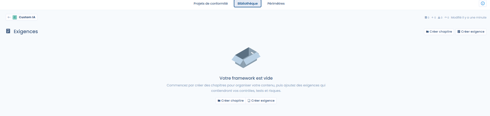
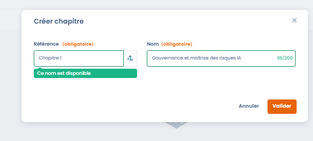
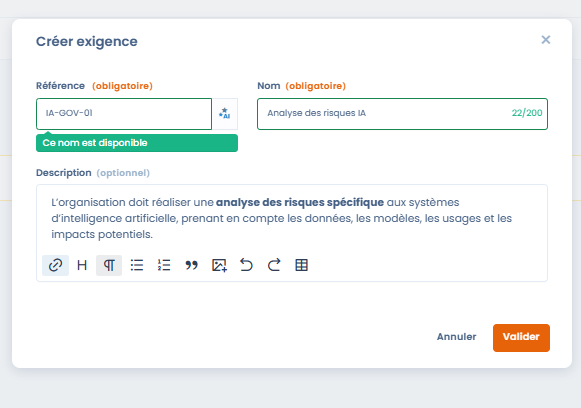
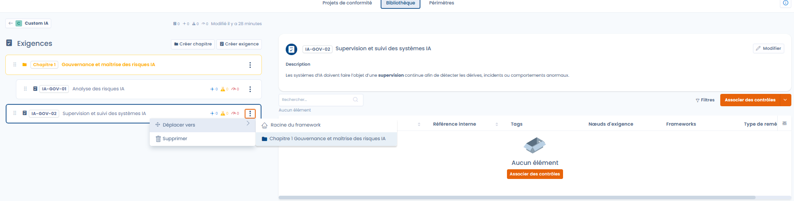
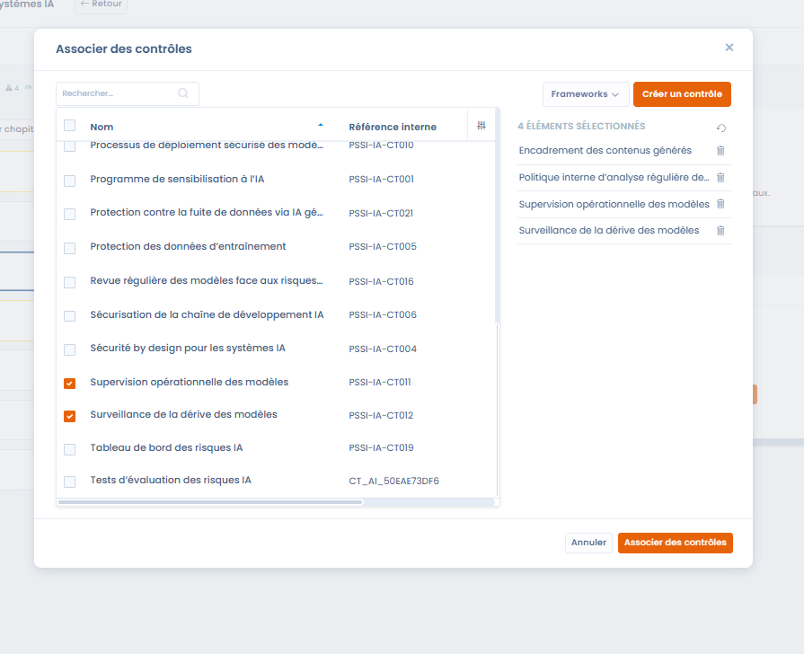
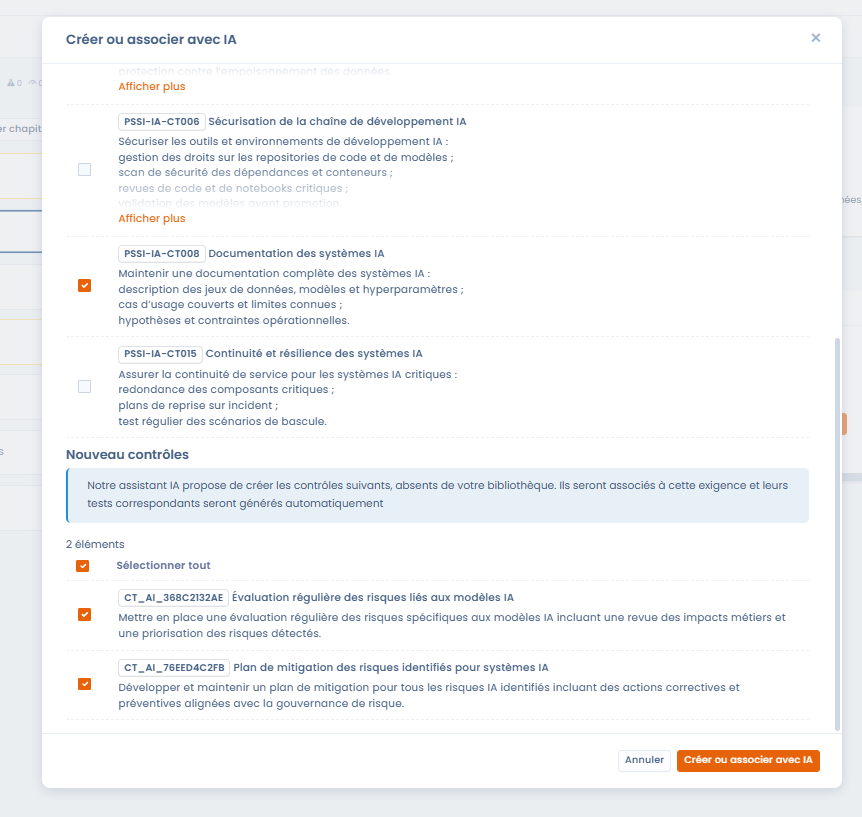

# Création de framework personnalisé

#### Introduction

La création d’un framework personnalisé permet de construire un référentiel de conformité **adapté au contexte spécifique de l’organisation** : politique interne, référentiel sectoriel, démarche IA, sécurité, qualité ou gouvernance.

Un framework personnalisé peut être :

* construit **entièrement depuis zéro**,
* ou servir de **socle commun** pour plusieurs projets de conformité.

***

### Étape 1 – Création du framework



Lors de la création d’un framework personnalisé, l’utilisateur définit :

* **Le nom du framework** (ex. _Custom IA_, _PSSI-IA – Démo_)
* **La langue du framework**, qui déterminera la langue par défaut des exigences et contrôles

Une fois créé, le framework est ajouté à la Librairie, dans un état **brouillon**.



<figure><figcaption></figcaption></figure>



***

### Étape 2 – Consultation et actions disponibles

Par défaut, un framework nouvellement créé est :

* **vide**
* **en lecture seule**

#### Actions disponibles tant que le framework n’est pas modifié

* **Exporter** : récupérer le framework au format JSON / Excel
* **Dupliquer** : créer une copie du framework
* **Déplacer dans la corbeille** : supprimer le framework

👉 **Aucun ajout ou modification n’est possible tant que le framework n’est pas en mode édition.**

***

### Étape 3 – Passer en mode édition



Pour enrichir le framework (chapitres, exigences, contrôles…), il est nécessaire de :

1. Cliquer sur **Modifier**
2. Passer le framework en **mode édition**

En mode édition, l’utilisateur peut :

* Créer des **chapitres**
* Ajouter des **exigences**
* Structurer progressivement le référentiel




<figure><figcaption></figcaption></figure>




***

## Création et structuration des exigences

Une fois le framework créé et passé en **mode édition**, l’utilisateur peut commencer à structurer son référentiel à l’aide de **chapitres** et **d’exigences**.\
Cette étape permet de traduire un cadre réglementaire, normatif ou interne en éléments exploitables dans Dastra.

***

### Structuration par chapitres



<figure><figcaption></figcaption></figure>



Les chapitres permettent d’organiser le framework de manière lisible et cohérente.



#### Règles de structuration

Dastra autorise :

* des **chapitres racine**
* des **sous-chapitres**

👉 La profondeur est volontairement limitée à **deux niveaux maximum** afin de :

* garantir la lisibilité du référentiel
* éviter des structures trop complexes
* faciliter l’exploitation des exigences dans les projets de conformité

#### Champs à renseigner

Lors de la création d’un chapitre :

* **Référence** : identifiant interne du chapitre
* **Nom** : intitulé fonctionnel du chapitre

&#x20;


_Bonne pratique_ : utiliser les chapitres pour structurer par grands thèmes\
(ex. gouvernance, sécurité, exploitation, usages…).


***

### Création d’une exigence



Les exigences expriment les **attentes de conformité** auxquelles l’organisation doit répondre.\
Elles constituent le lien direct entre le référentiel et les contrôles opérationnels.



<figure><figcaption></figcaption></figure>



#### Champs disponibles

* **Référence (obligatoire)**\
  Identifiant unique de l’exigence dans le framework
* **Nom (obligatoire)**\
  Formulation synthétique de l’exigence
* **Description (optionnelle)**\
  Détail du contenu attendu, du périmètre et des objectifs de l’exigence

***

### Assistance IA pour la référence d’exigence



<figure><figcaption></figcaption></figure>



Lors de la création d’une exigence, Dastra propose une **assistance IA** pour générer automatiquement une référence cohérente avec :

* le nom de l’exigence
* le chapitre parent
* le contexte du framework




👉 Cette fonctionnalité permet :

* d’harmoniser les conventions de nommage
* d’éviter les incohérences ou doublons
* de gagner du temps lors de la création de référentiels personnalisés

L’utilisateur reste libre de modifier la référence proposée.

***

### Organisation et gestion des exigences

<figure><figcaption></figcaption></figure>

Une fois créées, les exigences peuvent être :

* déplacées vers un autre chapitre
* supprimées
* enrichies progressivement

Chaque exigence affiche également des indicateurs synthétiques (liens avec contrôles, risques, tests), facilitant la compréhension de son niveau de couverture.

***

### Association des contrôles à une exigence



Les contrôles sont les éléments **opérationnels** qui permettent de démontrer la conformité à une ou plusieurs exigences.

Pour associer des contrôles à une exigence, deux approches sont possibles.



<figure><figcaption></figcaption></figure>



***

#### Option 1 – Associer des contrôles existants




L’utilisateur peut sélectionner un ou plusieurs contrôles déjà présents dans la Librairie et les rattacher à l’exigence.




<figure><figcaption></figcaption></figure>



👉 Un même contrôle peut être associé à **plusieurs exigences**, favorisant :

* la mutualisation
* la cohérence du référentiel
* une meilleure traçabilité

***

#### Option 2 – Créer ou associer des contrôles avec l’IA



<figure><figcaption></figcaption></figure>



Dastra propose une fonctionnalité d’assistance IA permettant de :

* identifier automatiquement des **contrôles existants pertinents**
* proposer la **création de nouveaux contrôles** lorsque nécessaire

L’IA s’appuie sur :

* le contenu de l’exigence
* le contexte du framework
* les contrôles déjà présents dans la Librairie



👉 Les contrôles créés via l’IA peuvent inclure automatiquement :

* leur description
* leur rattachement à l’exigence
* les tests associés

***

### Bénéfices de cette approche

Cette démarche permet :

* une **structuration progressive** du framework
* des **recoupements volontaires** entre exigences
* la création de contrôles transverses couvrant plusieurs exigences
* une base solide pour la gestion des risques et des projets de conformité
