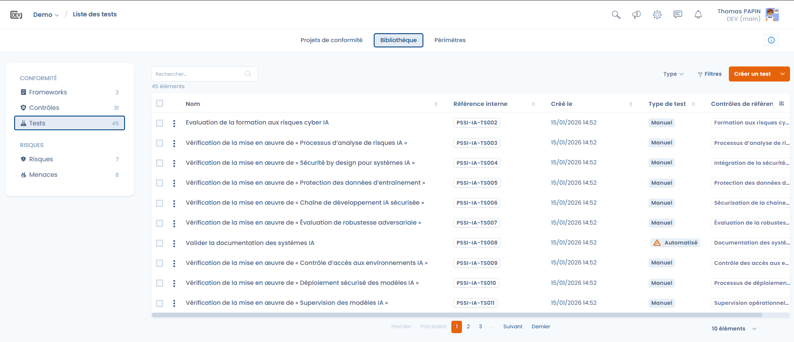
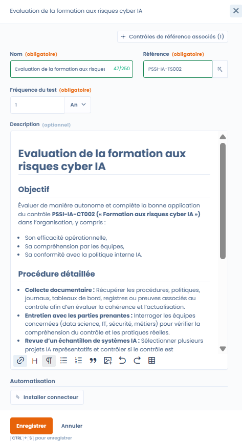
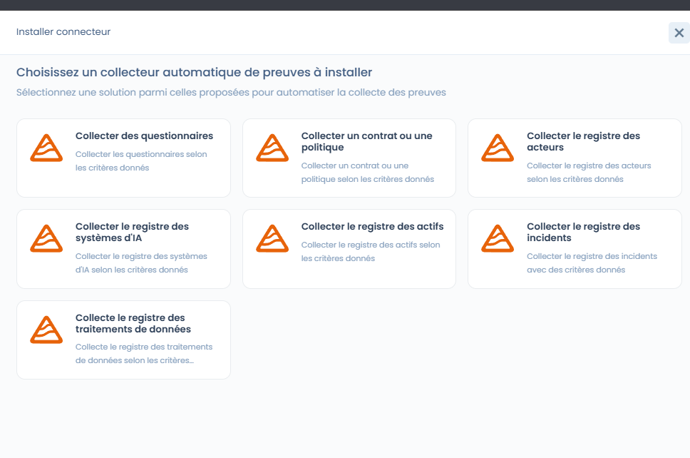
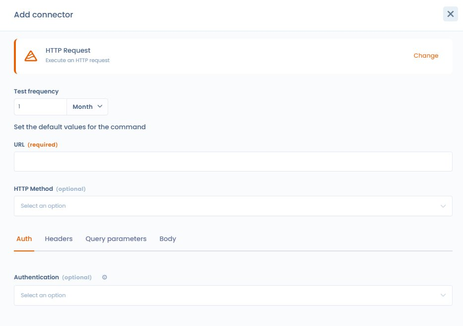

# Tests

Un test définit **comment** et **à quelle fréquence** un contrôle est évalué, et sur quelles preuves repose cette évaluation.

Les tests constituent le lien opérationnel entre :

* les **contrôles** (mesures mises en œuvre),
* les **preuves** collectées,
* et les **résultats de conformité** observés dans le temps.

***

### Rôle des tests dans Dastra

Un test permet de répondre à une question simple mais essentielle :

> _Le contrôle est-il effectivement appliqué et efficace ?_

Chaque test est :

* associé à un **contrôle de référence**
* exécuté selon une **fréquence définie**
* utilisé dans les **projets de conformité** pour produire des preuves et des résultats exploitables

***

### Vue bibliothèque des tests

<figure><figcaption></figcaption></figure>

La bibliothèque des tests offre une vision transverse de tous les tests disponibles, avec notamment :

* leur type (manuel ou automatisé),
* la date de création,
* les contrôles associés,
* des filtres avancés (framework, type, exigences, tests orphelins).

👉 Cette vue permet :

* d’identifier les tests réutilisés dans plusieurs contextes,
* de détecter les tests non rattachés,
* d’industrialiser les méthodes de vérification.

***

### Tests manuels (par défaut)

Par défaut, un test est **manuel**.

📌 Un test manuel repose sur une **action humaine**, par exemple :

* revue documentaire,
* entretien avec les équipes,
* vérification d’un registre,
* audit ponctuel d’un processus.

#### Fonctionnement dans un projet de conformité

Lorsqu’un test manuel est ajouté à un projet :

* il requiert une **mise à jour régulière des preuves**
* selon la **fréquence définie** dans le test (mensuelle, trimestrielle, annuelle, etc.)

👉 Cela permet de garantir une conformité **vivante**, mise à jour dans le temps.

***

### Configuration d’un test



Lors de la création ou de l’édition d’un test, l’utilisateur définit :

* **le nom et la référence du test** (avec générateur de référence)
* **la fréquence du test**
* **la description détaillée**, incluant :
  * l’objectif du test
  * la procédure à suivre
  * les éléments de preuve attendus



<figure><figcaption></figcaption></figure>



Ces informations servent de guide opérationnel lors de l’exécution du test dans un projet.

***

### Tests automatisés avec les connecteurs Dastra

Dastra propose plusieurs types de connecteurs prêts à l’emploi (questionnaires, registres, politiques, etc.), ainsi qu’un connecteur générique. Ces connecteurs sont utilisés directement dans les **tests automatisés** du module Compliance.

<figure><figcaption></figcaption></figure>

En complément des tests manuels, Dastra permet de configurer des **tests automatisés** à l’aide de **connecteurs**.

Un test automatisé s’appuie sur un connecteur Dastra pour :

* interroger directement des éléments de l’espace de travail
* collecter automatiquement des preuves
* vérifier la conformité selon des critères définis

#### Exemples de connecteurs

Les connecteurs peuvent notamment permettre de :

* collecter un **registre des systèmes d’IA**
* vérifier la **présence et la mise à jour de documents** (ex. documentation des SIA)
* interroger des registres (actifs, incidents, traitements de données)
* analyser des questionnaires ou politiques

📌 Exemple :\
Un test automatisé peut vérifier que chaque système d’IA dispose d’une documentation conforme et à jour, sans intervention manuelle.

### Ajout d’un connecteur personnalisé

En complément des connecteurs standards, Dastra permet de créer des **connecteurs personnalisés** afin d’automatiser la collecte de preuves dans les tests de conformité.

Un connecteur personnalisé permet :

* d’exécuter une requête technique (ex. requête HTTP),
* d’interroger une source interne ou externe,
* de collecter automatiquement des éléments factuels,
* de produire des preuves exploitables dans les audits.

Le connecteur devient ainsi une **source de preuve récurrente et traçable**.

#### Requête HTTP

Le connecteur **Requête HTTP** permet d’interroger n’importe quelle API ou endpoint exposé.

Il est particulièrement adapté pour :

* interroger des outils tiers,
* vérifier l’existence ou l’état d’une ressource,
* automatiser des contrôles techniques ou documentaires.

### Configuration du connecteur HTTP

<figure><figcaption>
Interface de configuration du connecteur HTTP avec ses onglets Auth, Headers, Query parameters et Body
</figcaption></figure>

L’interface de configuration du connecteur HTTP a été repensée pour faciliter la construction et le test des requêtes directement depuis Dastra.

L’interface de configuration du connecteur HTTP permet de construire une requête sans connaître la syntaxe JSON :

* **Sélecteur de méthode d'authentification** : choisissez directement entre **Clé API (API Key)**, **Jeton d'autorisation (Authorization Token Bearer)** ou **Authentification basique (Basic Authentication)**, sans saisir manuellement les en-têtes au format JSON.
* **Identifiants masqués** : les champs sensibles (jeton, mot de passe) sont masqués par défaut. Une icône en forme d'œil permet de les révéler ponctuellement ; ces valeurs n'apparaissent jamais en clair dans les journaux.
* **Éditeurs clé/valeur (de type Postman)** : configurez facilement les en-têtes personnalisés et les paramètres de requête (query parameters) sous forme de paires clé/valeur, sans rédiger de JSON.
* **Aperçu en lecture seule** : un aperçu affiche les en-têtes qui seront réellement envoyés lors de l'exécution, les valeurs sensibles restant masquées.

#### Constructeur de requête

Un éditeur visuel permet de configurer chaque composante de la requête :

| Champ                | Description                                                                                             |
| -------------------- | ------------------------------------------------------------------------------------------------------- |
| **URL**              | Endpoint à interroger (obligatoire). Supporte les variables entre accolades `{{variable}}`.             |
| **Méthode HTTP**     | GET, POST, PUT, PATCH, DELETE.                                                                          |
| **En-têtes**         | Ajout de headers clé/valeur — gestion de l’authentification par token, clé API, ou header personnalisé. |
| **Corps de requête** | Payload JSON ou texte libre (pour les méthodes POST/PUT/PATCH).                                         |
| **Variables**        | Déclarez des variables réutilisables dans l’URL et le corps de requête, valorisées à l’exécution.       |

#### Test de la requête

Un bouton **Tester la requête** permet d’exécuter la requête en direct depuis l’interface de configuration et d’afficher la réponse brute. Cela facilite le débogage avant de lier le connecteur à un test de conformité.

#### Analyse de la réponse

Définissez les **critères de succès** : code HTTP attendu, présence d’un champ dans la réponse JSON, valeur cible d’un attribut. Le résultat de l’analyse est enregistré comme preuve dans le projet de conformité.

### Avantages des tests automatisés

Les tests automatisés permettent :

* une **collecte continue des preuves**
* une réduction de la charge opérationnelle
* une meilleure fiabilité des contrôles
* une détection plus rapide des écarts

Ils sont particulièrement adaptés aux contrôles récurrents ou structurés.

***

### Joindre une preuve depuis le gestionnaire de fichiers

Lors de l'ajout d'une preuve à un test, il est possible de sélectionner un fichier directement depuis le **gestionnaire de fichiers** Dastra, sans avoir à le réimporter. Cliquez sur **"Explorateur de fichiers"** dans la fenêtre d'ajout de preuve.

<figure><figcaption>
Le bouton "Explorateur de fichiers" permet de sélectionner une preuve déjà présente dans le gestionnaire de fichiers Dastra
</figcaption></figure>

***

### Analyse IA des preuves

Dastra peut analyser automatiquement les preuves jointes à un test et indiquer si elles correspondent à ce que la procédure attendait. Cette fonctionnalité est une **aide à la décision pour l'auditeur** — elle ne remplace jamais le jugement humain et n'accepte ni ne rejette une preuve à la place du client.

#### Comment ça fonctionne

Lorsqu'une preuve est ajoutée à une procédure de test, l'IA reçoit deux éléments :

1. La **description de la procédure** — ce que le test attend comme preuve
2. Le **contenu de la preuve** fournie — analysé selon son type (voir ci-dessous)

Elle compare les deux et renvoie quatre informations, affichées dans le tableau des preuves sous forme d'un **badge coloré accompagné d'une infobulle** :

| Information            | Description                                                   |
| ---------------------- | ------------------------------------------------------------- |
| **Appréciation**       | `Correct` · `ProbablementCorrect` · `NonConforme` · `Inconnu` |
| **Score de confiance** | De 0 à 100 % — reflète la certitude de l'IA sur son verdict   |
| **Description**        | Résumé court du document analysé                              |
| **Justification**      | Explication du verdict au regard des critères de la procédure |

#### Types de preuves supportés

L'analyse s'adapte automatiquement au type de preuve fournie :

| Type de preuve              | Méthode d'analyse                         |
| --------------------------- | ----------------------------------------- |
| Capture d'écran / image     | Analyse visuelle du contenu               |
| Document (PDF, Word, texte) | Lecture et extraction du contenu textuel  |
| URL / page web              | Récupération de la page via l'URL fournie |
| Aucune preuve jointe        | Résultat automatiquement `Indéterminé`    |


Une **infobulle** accessible depuis le résultat de l'analyse explique la **méthode utilisée** par l'IA pour la preuve concernée (OCR, lecture du libellé, confrontation à la procédure de test…). Elle contient également un lien vers cette documentation pour approfondir le fonctionnement de l'analyse.


#### Activation et paramétrage

La fonctionnalité est **optionnelle** et désactivée par défaut. Pour l'activer, rendez-vous dans **Paramètres → Conformité** et activez l'option **"Analyse IA automatique des preuves"**.


Tant que la fonctionnalité n'est pas activée, **aucune donnée de preuve n'est envoyée au modèle d'IA**.


Le modèle d'IA utilisé pour l'analyse des preuves peut être configuré selon le choix de votre organisation, via les paramètres de l'assistant IA (famille de modèles ou Custom AI provider).

#### Ce que l'analyse ne fait pas

* Elle **n'accepte ni ne rejette** une preuve automatiquement — la décision finale appartient toujours à l'auditeur.
* Elle ne modifie pas le statut du test.
* Elle est non contraignante : un score de confiance faible (`Indéterminé` ou `Probablement correct`) signale simplement qu'une vérification humaine est recommandée.

***

### Fusion de tests

Tout comme pour les contrôles, la bibliothèque de tests peut accumuler des tests redondants — notamment après l'import de plusieurs frameworks. La fonctionnalité de **fusion de tests** permet de consolider ces doublons en un seul test de référence.

#### Comment fonctionne la fusion

Depuis la bibliothèque de tests, sélectionnez les tests à fusionner puis cliquez sur **Fusionner**. Choisissez le test **cible** à conserver : les associations des tests sources (contrôles liés, résultats d'exécution, fréquence) sont reportées sur le test cible, puis les tests sources sont supprimés.


La fusion est irréversible. Vérifiez les associations de chaque test source avant de confirmer.


#### Cas d'usage typiques

* **Déduplication** : deux imports de frameworks ont créé un test "Vérification de la politique de confidentialité" en double — la fusion les consolide.
* **Rationalisation** : plusieurs tests manuels très proches peuvent être regroupés en un seul test plus complet.
* **Nettoyage avant audit** : réduire le nombre de tests orphelins améliore la lisibilité du tableau de bord.

***

### Lier un test à un document

Un test de conformité peut être associé à un ou plusieurs **documents du gestionnaire de fichiers** Dastra — contrats, politiques, preuves documentaires, accords de sous-traitance. Cette liaison permet de retrouver facilement les tests associés à chaque document, et inversement.

#### Depuis la vue d'un document

Lorsqu'un test est lié à un document, un panneau **Tests** apparaît dans la vue d'édition du document ou du contrat concerné, affichant la référence, le nom et le statut de chaque test associé.

<figure><figcaption>
Un test lié apparaît dans le panneau Tests à droite du document (ici : G-T2 Lawful Basis Spot Check — Done / Pass)
</figcaption></figure>

#### Depuis le gestionnaire de fichiers

Dans le gestionnaire de fichiers, la fiche détail d'un document affiche dans la colonne latérale toutes les entités Dastra auxquelles il est rattaché : traitements, contrats, et tests de conformité.

<figure><figcaption>
Le gestionnair