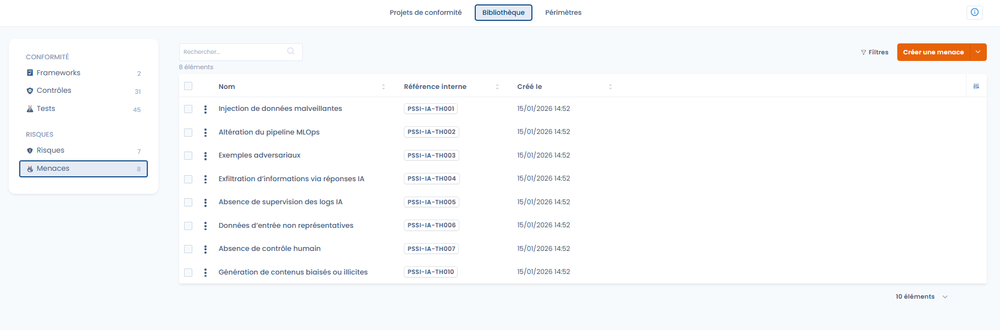
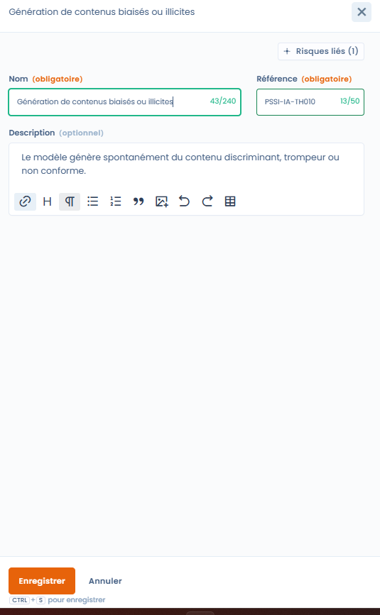

# Menaces

Dans Dastra, une menace représente le **facteur déclencheur** d’un risque :\
elle décrit _comment_ ou _pourquoi_ un risque peut se matérialiser.

👉 Les menaces viennent enrichir l’analyse des risques, sans complexifier leur évaluation.

***

### Menaces, risques et contrôles : logique causale

Le modèle Dastra repose sur une chaîne simple et lisible :

> **Menace → Risque → Contrôles → Tests**

* Une **menace** décrit une situation, un comportement ou un événement
* Un **risque** décrit l’impact potentiel pour l’organisation
* Les **contrôles** visent à limiter la survenue ou les effets du risque
* Les **tests** permettent de vérifier l’efficacité des contrôles

📌 Exemple :

* **Menace** : absence de supervision des logs IA
* **Risque** : fuite d’informations via requêtes IA
* **Contrôles** : journalisation, supervision, sensibilisation
* **Tests** : vérification des journaux, audits périodiques

***

### Vue bibliothèque des menaces

<figure><figcaption></figcaption></figure>

La bibliothèque des menaces centralise l’ensemble des menaces identifiées, avec :

* leur nom et leur référence,
* leur date de création,
* des filtres pour faciliter la navigation.

👉 Cette vue permet de :

* réutiliser des menaces existantes,
* garantir une terminologie homogène,
* structurer des scénarios de risque cohérents.

***

### Création et gestion d’une menace




Lors de la création ou de l’édition d’une menace, l’utilisateur renseigne :

* **le nom de la menace**
* **une référence interne**
* une **description optionnelle** permettant de contextualiser la menace



<figure><figcaption></figcaption></figure>



Le module est volontairement **léger** :\
les menaces ne portent pas d’évaluation chiffrée et ne sont pas liées directement aux contrôles.

***

### Association aux risques

Une menace est associée à **un ou plusieurs risques**.

Cette association permet :

* de documenter précisément les scénarios de risque,
* d’améliorer la compréhension des causes,
* de renforcer la cohérence de l’analyse globale.

👉 Une même menace peut contribuer à plusieurs risques, et inversement.

***

### Pourquoi utiliser les menaces

L’utilisation des menaces permet :

* une analyse plus fine et plus réaliste des risques,
* une meilleure traçabilité des scénarios,
* une communication plus claire auprès des parties prenantes (RSSI, DPO, métiers).

Les menaces complètent l’analyse sans alourdir la gestion opérationnelle.

***

### Synthèse

Les menaces sont un **outil de clarification**.\
Elles permettent de mieux comprendre **l’origine des risques**, et donc de mieux justifier les contrôles mis en place.
