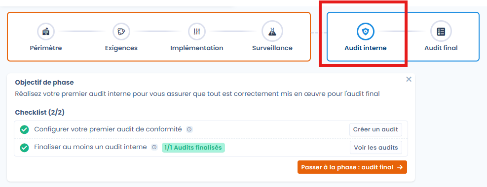
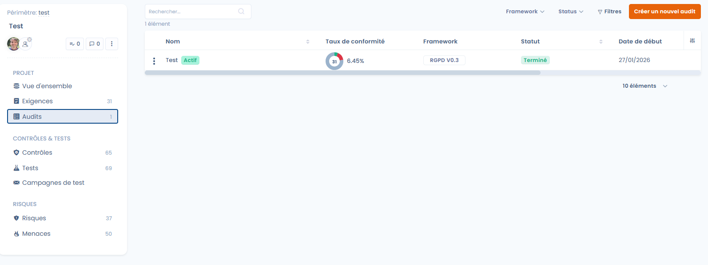
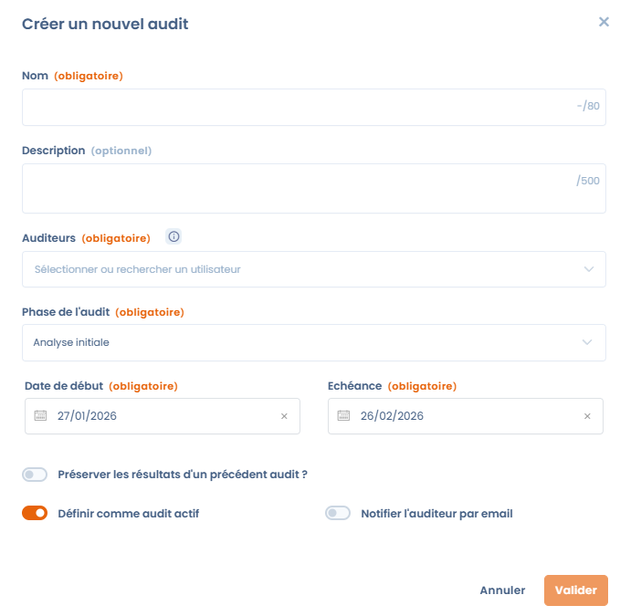
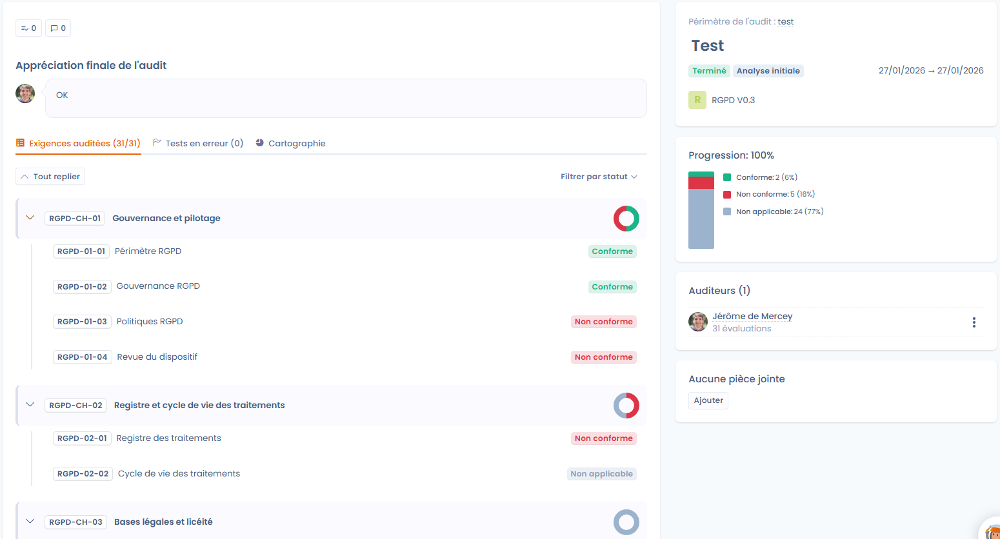

# Audits

La phase d'Audit permet de valider officiellement l'état de conformité à un instant T. Elle s’appuie sur le travail de préparation et de surveillance effectué en amont pour offrir une évaluation structurée, qu'elle soit réalisée en interne ou par des auditeurs externes.

**🎯 Objectif de la phase**&#x20;

Préparer et réaliser l'ensemble des audits de conformité de manière centralisée, collaborer avec les parties prenantes et assurer le suivi des corrections suite aux écarts détectés.

<figure><figcaption></figcaption></figure>

***

### Vue d’ensemble du module

Le module Audit transforme la conformité théorique en une réalité mesurable en regroupant frameworks, contrôles, risques et audits sur une plateforme unique. Cette phase repose sur 4 piliers majeurs :

1. Réalisation des audits : Effectuez des audits internes ou externes en utilisant des frameworks standards (RGPD, AI Act...) ou vos propres grilles personnalisées.
2. Collaboration : Facilitez les échanges via un accès centralisé aux preuves, un système de délégation et une gestion fine de la gouvernance.
3. Liaison avec la conformité : Réutilisez directement les contrôles et preuves déjà présents dans vos projets pour automatiser la collecte.
4. Gestion des écarts : Identifiez les non-conformités et transformez-les immédiatement en plans d'actions correctives.

#### Une architecture ouverte

Dastra offre une gestion multi-utilisateurs pour piloter la conformité à l'échelle d'un groupe, ainsi qu'une interopérabilité totale via des APIs et des exports multi-formats.

<figure><figcaption></figcaption></figure>

***

### 1. Créer une nouvelle mission d'audit

La création d'une mission est le point de départ de votre évaluation. Depuis le module Audits, cliquez sur le bouton de création pour ouvrir le formulaire de paramétrage.

#### 1. Informations générales

* Nom (obligatoire) : Titre clair de la mission (ex: "Audit de conformité annuel"), limité à 80 caractères.
* Description (optionnel) : Précisez le contexte ou le périmètre spécifique (jusqu'à 500 caractères).
* Auditeurs (obligatoire) : Sélectionnez les utilisateurs responsables de la réalisation de l'évaluation. Si vous ne figurez pas dans cette liste, vous ne pourrez pas répondre aux questions de l'audit (même si vous êtes propriétaire de l'organisation).&#x20;

<figure><figcaption></figcaption></figure>

#### 2. Phase de l'audit et Calendrier

Le choix de la phase permet de segmenter votre mission et de filtrer vos tableaux de bord de gouvernance.

| **Phase**        | **Description & Objectif**                                                                       |
| ---------------- | ------------------------------------------------------------------------------------------------ |
| Analyse initiale | Phase de cadrage : définition du périmètre, du référentiel et des enjeux réglementaires.         |
| Préparation      | Phase logistique : affectation des contrôles aux auditeurs et planification des entretiens.      |
| Pré-audit        | "Audit à blanc" : auto-évaluation pour identifier les écarts avant l'échéance officielle.        |
| Audit final      | Phase de clôture : notation finale, rédaction des conclusions et génération du rapport officiel. |

* Dates clés (obligatoire) : Indiquez une Date de début et une Échéance pour encadrer la mission dans le temps.

#### 3. Options avancées et automatisation

* Préserver les résultats d'un précédent audit : Permet de repartir d'une base existante pour les audits récurrents. Cela peut être utile pour refaire un audit à la suite d'un audit dont les contrôles n'ont pas été satisfaisants.
* Définir comme audit actif : Intègre immédiatement l'audit dans vos indicateurs de suivi en temps réel. Cet audit sera utilisé dans le tableau de bord pour afficher le taux de conformité.
* Notifier l'auditeur par email : Automatise l'envoi d'une invitation aux collaborateurs désignés.

***

### Résultat attendu

À l’issue de cette phase, l'organisation dispose d'un état des lieux officiel, d'une piste d'audit complète (historique) et d'un plan de remédiation précis pour traiter les écarts et améliorer la gouvernance.

> Prochaine étape : Une fois la mission créée, vous pourrez commencer l'évaluation des points de contrôle et la validation des preuves associées.

### 2. Pilotage et exécution de la mission d'audit

Une fois la mission créée et lancée, vous accédez au tableau de bord opérationnel de l'audit. Cette interface centralisée permet de suivre l'avancement des évaluations et de gérer les collaborateurs en temps réel.

#### Vue d'ensemble de l'avancement

Le dashboard affiche une synthèse visuelle de l'état de santé de votre audit :

* Indicateurs d'exigences : Suivez le nombre total d'exigences à auditer (ex: 0/31) et visualisez immédiatement les points bloquants via l'onglet "Tests en erreur".
* Graphique de progression : Un diagramme circulaire permet de visualiser la répartition des contrôles (non audités, conformes, non conformes).
* Statut de la mission : Rappel de la phase actuelle (ex: "Analyse initiale"), des dates limites et du framework utilisé (ex: "RGPD V0.3").

#### Interface d'évaluation et de notation

En cliquant sur "Compléter l'audit", l'auditeur accède à l'espace de travail détaillé pour chaque point de contrôle :

* Navigation par référentiel : L'arborescence complète du framework est affichée à gauche (Gouvernance, Registre, Bases légales, etc.) pour une navigation fluide.
* Outils de notation : Pour chaque exigence, l'auditeur sélectionne un statut précis :
  * Conforme (Vert)
  * Partiellement conforme (Jaune)
  * Non conforme (Rouge)
  * Non applicable (Gris)
* Justification et preuve : Un éditeur de texte permet de saisir des commentaires détaillés. L'auditeur peut également basculer sur l'onglet "Détails du framework" pour consulter les exigences théoriques avant de valider.

#### Collaboration et Gestion documentaire

Le dashboard sert également de hub collaboratif pour l'équipe d'audit :

* Gestion des auditeurs : Visualisez les membres de l'équipe assignés et ajoutez de nouveaux auditeurs en cours de mission si nécessaire.
* Pièces jointes : Centralisez tous les documents de preuve externes directement dans l'onglet "Pièces jointes" du dashboard pour qu'ils soient accessibles à l'ensemble des contrôleurs.
* Cartographie : Un onglet dédié permet de visualiser les liens entre les exigences et les éléments de votre inventaire de conformité.

***

Résultat de cette étape : L'audit est maintenant en cours d'exécution. Chaque saisie met à jour dynamiquement les indicateurs de conformité globale du projet.

### 3. Évaluation des exigences et vérification des contrôles

Une fois l'audit lancé, la phase d'évaluation consiste à passer en revue chaque exigence du référentiel pour valider la conformité réelle sur la base des contrôles et tests existants.

#### Structure de l'écran d'évaluation

L'interface d'évaluation est conçue pour offrir une visibilité complète sur les preuves sans quitter la page d'audit :

* Volet de navigation (gauche) : Affiche l'arborescence du framework (ex: RGPD V0.3) découpée en chapitres et exigences. Un indicateur visuel (check vert) confirme les points déjà traités.
* Zone centrale de travail : Présente l'objectif de l'exigence sélectionnée et la liste exhaustive des contrôles et tests associés.
* Panneau de décision (droite) : Regroupe les outils de notation, la saisie des commentaires et l'historique des modifications.

<figure><figcaption></figcaption></figure>

#### Vérification des preuves (Contrôles et Tests)

Le cœur de l'audit Dastra réside dans sa capacité à lier l'audit aux preuves de surveillance :

* Consultation des contrôles : Pour chaque exigence, l'auditeur visualise les contrôles actifs (ex: Cartographie du périmètre).
* Examen des tests : Sous chaque contrôle, les tests exécutés sont listés avec leurs documents de preuve joints (fichiers PDF, captures, etc.).
* Visualisation directe : L'auditeur peut ouvrir et consulter les fichiers de preuves directement depuis l'interface pour valider leur conformité.

#### Notation et Statuts de conformité

Après analyse des preuves, l'auditeur attribue un statut définitif à l'exigence :

* Conforme : L'exigence est totalement satisfaite par les preuves fournies.
* Partiellement conforme : Des preuves existent mais sont insuffisantes ou incomplètes.
* Non conforme : Absence de preuves ou contrôle jugé inefficace.
* Non applicable : L'exigence ne concerne pas le périmètre de l'audit.

#### Pilotage en temps réel

Pendant l'évaluation, le système met à jour dynamiquement les indicateurs de suivi :

* Progression : Un compteur en bas de page indique la position actuelle (ex: 1/31).
* Statistiques de conformité : Le graphique à droite affiche en temps réel le pourcentage de conformité atteint (ex: 3% conforme) par rapport aux points restants à auditer.
* Finalisation : Une fois toutes les exigences traitées, le bouton "Finaliser l'audit" permet de verrouiller l'évaluation et de passer à la génération du rapport.

***

Résultat attendu : Chaque exigence est désormais documentée avec un avis d'expert et des preuves vérifiées, garantissant une piste d'audit inaltérable pour les régulateurs ou la direction.

### 4. Finalisation et clôture de l'audit

Une fois que l'ensemble des exigences du framework a été passé en revue, la mission doit être formellement clôturée. Cette étape verrouille les évaluations pour garantir l'intégrité des résultats et générer les rapports définitifs.

#### Appréciation finale

Lorsque vous cliquez sur le bouton "Finaliser l'audit", une fenêtre de validation apparaît. Avant de clôturer, l'auditeur doit fournir une Appréciation finale de l'audit (obligatoire, jusqu'à 1000 caractères).

Cette synthèse permet de :

* Donner un avis global sur le niveau de maturité du périmètre audité.
* Souligner les points de vigilance majeurs ou les succès constatés.
* Joindre des documents de synthèse finaux via l'explorateur de fichiers (limite de 50 Mo par fichier).

> Attention : Une fois l'audit finalisé, il n'est plus possible de modifier les évaluations individuelles de chaque exigence.

***

#### Exploitation des résultats et Reporting

L'audit finalisé alimente instantanément la gouvernance de l'organisation grâce aux fonctionnalités de sortie de Dastra :

**Tableau de bord de conformité**

Les résultats sont consolidés dans une vue d'ensemble affichant le pourcentage de conformité par audit (ex: 75% pour le NIST, 57% pour le RGPD). Ces indicateurs permettent de comparer le niveau de sécurité entre différentes entités ou projets.

<figure><figcaption></figcaption></figure>

**Export et Archivage**

Grâce à une architecture ouverte, vous pouvez communiquer vos résultats efficacement :

* Génération de rapports : Exports disponibles dans de nombreux formats pour diffusion interne ou externe.
* Piste d'audit : Conservation d'un historique structuré, mesurable et réutilisable pour les années suivantes.

**Gestion des écarts (Plan d'action)**

L'étape ultime consiste à traiter les non-conformités détectées :

* Identification automatique des écarts (points rouges ou jaunes lors de l'évaluation).
* Possibilité de lier ces écarts à de nouveaux plans d'actions pour corriger les faiblesses avant le prochain cycle de surveillance.

***

Résultat final : Votre organisation dispose désormais d'une preuve de conformité certifiée, opposable en cas de contrôle, et d'une feuille de route claire pour l'amélioration continue de sa gouvernance.
