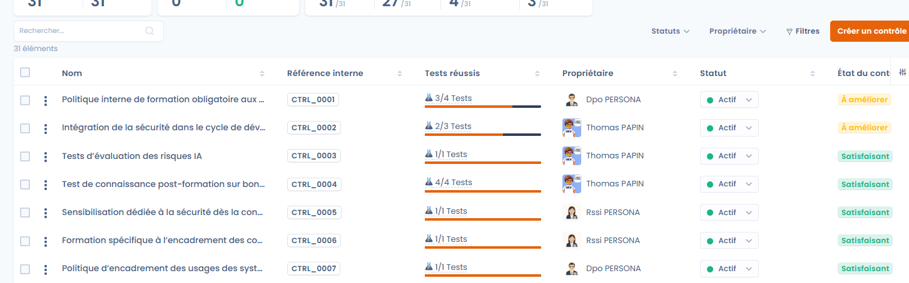
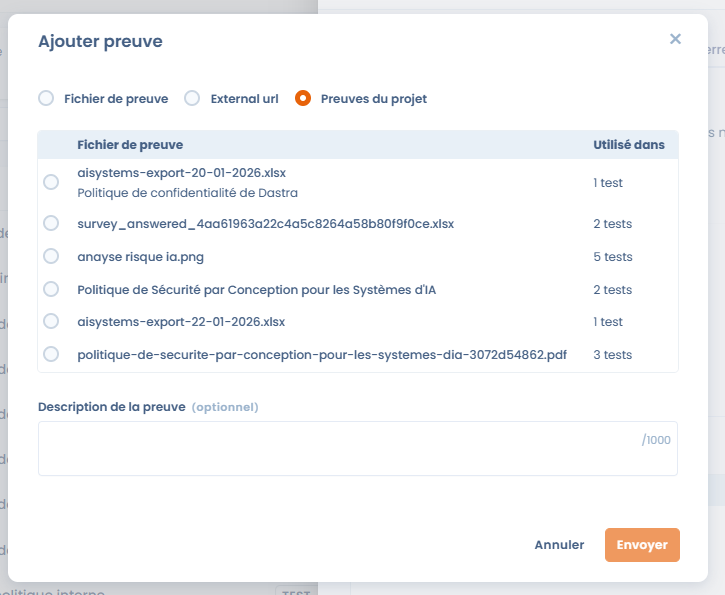
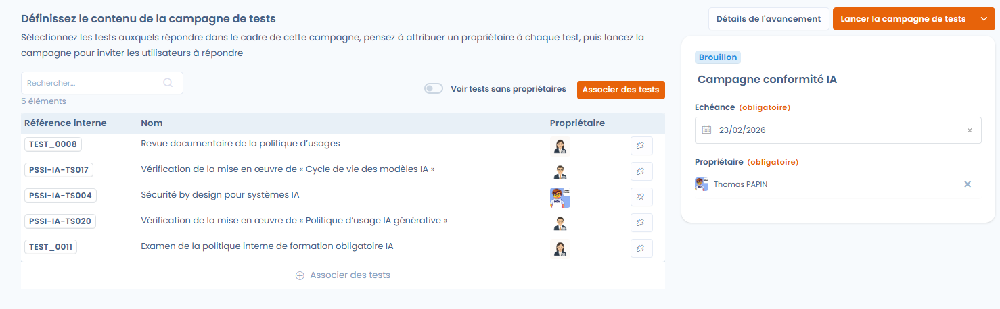
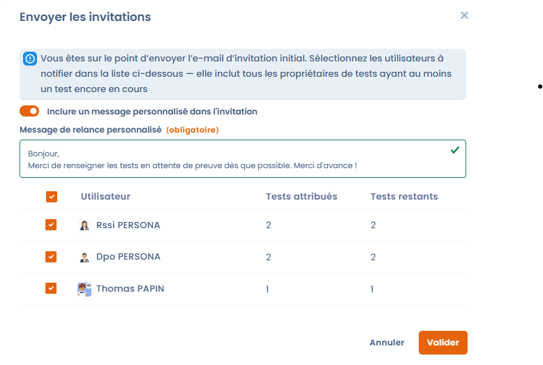
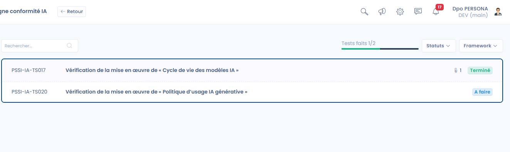

# Surveillance de la conformité

Elle vise à **vérifier dans le temps l’efficacité réelle des contrôles**, à collecter les preuves associées et à suivre l’évolution de la conformité via des campagnes de tests récurrentes.

> 🎯 Objectif de la phase\
> Collecter des preuves sur l’ensemble du projet à l’aide de campagnes de tests, s’assurer qu’un maximum de contrôles passent et maintenir un niveau de conformité mesurable dans le temps.

***

### Vue d’ensemble de la phase de surveillance

Dans cette phase, le projet bascule d’une logique de préparation à une logique d’**exécution continue** :

* les contrôles sont déjà implémentés,
* les tests sont exécutés régulièrement,
* les preuves sont collectées, mises à jour et évaluées,
* les indicateurs de conformité deviennent exploitables.

<figure><figcaption></figcaption></figure>

***

### Suivi global des contrôles et des tests

La page de surveillance offre une vision synthétique de l’état du projet :

* **Statut des contrôles** : proportion de contrôles satisfaisants ou à améliorer.
* **État des tests** :
  * tests réussis,
  * preuves manquantes,
  * tests en échec.
* **Fraîcheur des tests** :
  * tests à jour,
  * tests périmés nécessitant une nouvelle preuve.

Ces indicateurs permettent d’identifier rapidement les points de vigilance et de prioriser les actions correctives.

<figure><figcaption></figcaption></figure>

***

### Gestion des preuves



Les preuves constituent le cœur de la phase de surveillance.\
Elles peuvent être ajoutées directement depuis un test et être **réutilisées sur plusieurs tests du projet**.

Les modes de collecte disponibles incluent notamment :

* ajout de fichiers de preuve,
* liens externes,
* sélection de preuves déjà présentes dans le projet.

Chaque preuve peut être documentée afin de faciliter les audits ultérieurs.




<figure><figcaption></figcaption></figure>



***

### Campagnes de tests

Les **campagnes de tests** permettent d’orchestrer l’exécution des tests à grande échelle.

Une campagne permet de :

* regrouper un ensemble de tests à exécuter,
* attribuer un propriétaire à chaque test,
* définir une échéance globale,
* suivre l’avancement de manière centralisée.

Lors de la création d’une campagne, il est possible de **pré-sélectionner automatiquement tous les tests en attente de preuves**, afin de faciliter le lancement.

<figure><figcaption></figcaption></figure>

***

### Lancement et suivi des campagnes



Une fois la campagne configurée :

* les utilisateurs concernés reçoivent une **invitation par e-mail**,
* un message personnalisé peut être ajouté pour contextualiser la demande,
* chaque test progresse individuellement (_à faire_, _terminé_).

L’avancement global de la campagne est visible en temps réel, permettant au responsable du projet d’identifier rapidement les retards ou blocages.




<figure><figcaption></figcaption></figure>



***

### Validation des tests

Chaque test dispose d’un cycle de vie clair :

* consultation de la procédure,
* ajout ou mise à jour des preuves,
* validation du test.

Une fois validé, le test contribue automatiquement à l’amélioration du statut du contrôle associé et aux indicateurs globaux du projet. L'invitation envoie l'utilisateur vers un tableau de suivi personnalisé dans lequel il peut renseigner les preuves des tests pour lesquels il est propriétaire.

<figure><figcaption></figcaption></figure>

***

### Résultat attendu de la phase de surveillance

À l’issue de cette phase, le projet dispose :

* de **preuves collectées et tracées**,
* de **tests régulièrement exécutés et mis à jour**,
* d’une **vision fiable et mesurable de la conformité réelle**,
* d’une base solide pour préparer les phases d’**audit interne** et de **certification**.
