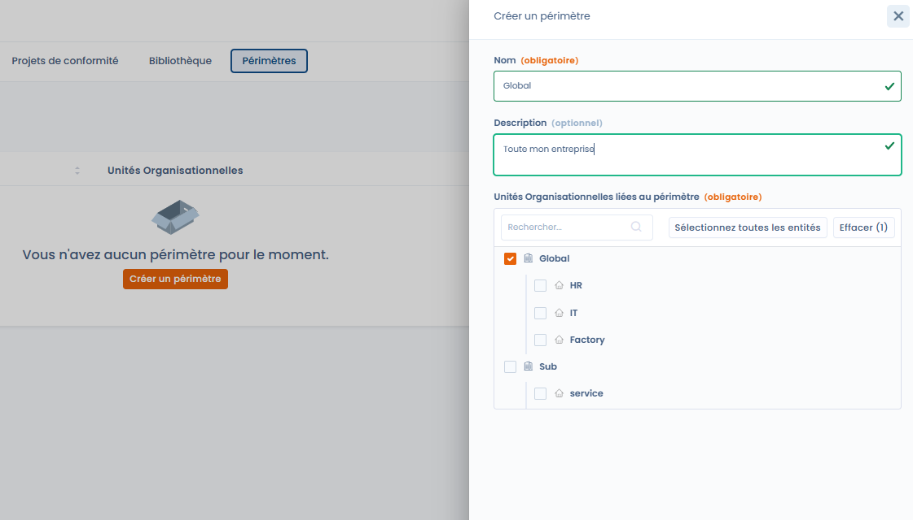

# Périmètres

Ils servent à regrouper des **unités organisationnelles** afin d’appliquer une démarche de conformité à tout ou partie de l’organisation.

Un périmètre répond à une question simple :

> _Sur quelles entités organisationnelles s’applique ce projet de conformité ?_

***

### Rôle des périmètres dans Dastra

Dans Dastra, les périmètres sont utilisés exclusivement dans les **projets de conformité**.\
Ils permettent de :

* cibler précisément les entités concernées,
* adapter les exigences, contrôles et tests au bon niveau,
* structurer la conformité selon la réalité organisationnelle.

👉 Un périmètre ne modifie pas les frameworks :\
il **détermine où** la conformité s’applique, pas **ce qui** s’applique.

***

### Un découpage organisationnel flexible

Un périmètre est défini à partir des **unités organisationnelles** existantes dans l’espace de travail.

Il peut représenter :

* l’ensemble de l’entreprise (ex. _Global_)
* une direction ou un département (ex. _IT_, _RH_)
* un site, une filiale ou une activité spécifique

Les unités organisationnelles peuvent être sélectionnées individuellement ou par groupes, en respectant leur hiérarchie.

***

### Création d’un périmètre

Lors de la création d’un périmètre, l’utilisateur renseigne :

* **le nom du périmètre** (ex. _Global_, _IT & Sécurité_)
* une **description optionnelle**
* les **unités organisationnelles** incluses dans le périmètre (obligatoire)

<figure><figcaption></figcaption></figure>

👉 Un périmètre doit toujours contenir **au moins une unité organisationnelle**.

***

### Exemple de périmètre

📌 Exemple :

* **Nom** : Global
* **Description** : Toute l’entreprise
* **Unités organisationnelles** :
  * Global
  * HR
  * IT
  * Factory
  * Sub / Service

Ce périmètre pourra ensuite être sélectionné dans un projet de conformité pour indiquer que celui-ci s’applique à l’ensemble de l’organisation.

***

### Bonnes pratiques

* Créer un **périmètre global** pour les démarches transverses
* Créer des **périmètres plus restreints** pour des projets ciblés
* Réutiliser les périmètres entre projets pour garantir la cohérence
* Nommer les périmètres de façon explicite et métier

***

### Lien avec les projets de conformité

Les périmètres sont sélectionnés **au moment de la création d’un projet de conformité**.

Ils permettent :

* d’appliquer un même framework à plusieurs entités,
* de suivre la conformité par périmètre,
* de comparer les résultats entre différentes parties de l’organisation.

***

### Synthèse

Les périmètres sont un **outil de cadrage organisationnel**.\
Ils permettent d’aligner la conformité avec la structure réelle de l’entreprise, sans complexifier les référentiels.
