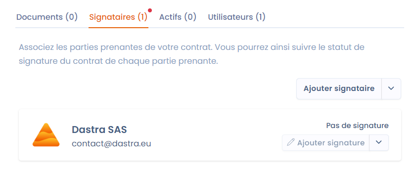

# Les signataires


Le signataire d'un contrat est en général une personne physique ou morale qui est **référencée an tant qu'acteur dans Dastra**.


Indiquez les parties impliquées dans le contrat en spécifiant les signataires nécessaires.

Un signataire est représenté par un acteur issu de votre [referentials.md](../cartography/referentials.md "mention"). De la même manière que pour les actifs, vous retrouverez sur la fiche des acteurs (signataires) associés à votre contrat le détail de tous les contrats auxquels ils sont associés.

<figure><figcaption>
Déclarer des signataires
</figcaption></figure>

Vous pouvez gérer la signature de chaque signataire de manière indépendante (voir section [signer-le-contrat.md](signer-le-contrat.md "mention"))
