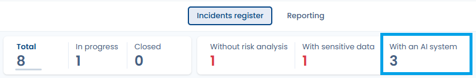

# Documenter une nouvelle violation de données

## Introduction

Il y a 2 manières possible pour renseigner une nouvelle violation de données dans DASTRA :

1. Renseigner directement manuellement toute nouvelle violation
2. Importer les violations par fichier Excel, csv ou texte

### Documentation manuelle d'une violation de données

En cliquant sur le bouton "Ajouter une violation de données", une fenêtre apparaît où vous pouvez détailler la violation de données. Suivez les étapes et cliquez sur "Enregistrer et quitter". Ca y est, vous avez documenté votre première violation de données manuellement !



### Import / export du registre des violations de données

L'ensemble du registre des violations de données est importable et exportable. Pour importer une violation, cliquez sur l'icône de flèche à côté du bouton "ajouter une violation de données".

Un fenêtre apparaît avec un bouton "import". Cliquez dessus, télécharger le modèle de registre puis suivez les instructions pour importer les violations dans Dastra. Une fois importée, la violation sera directement disponible dans le registre de violations de données.

### Comment faire une analyse de risque de la violation de données ?



***

### Lier un système d'IA à une violation de données

Lorsqu'une violation de données implique un système d'IA — qu'il en soit la cause, le vecteur ou qu'il traite les données concernées — vous pouvez l'associer directement à la fiche de violation.

Depuis la page d'édition de la violation, dans la section **Informations complémentaires**, utilisez le champ **Systèmes d'IA liés** pour rechercher et associer un ou plusieurs systèmes d'IA déclarés dans votre workspace.

<figure><figcaption>
Section « Systèmes d'IA » du formulaire de violation — recherchez et sélectionnez les systèmes impliqués
</figcaption></figure>

Cette association vous permet de :

* Identifier rapidement les systèmes d'IA impliqués dans des incidents
* Relier la violation à la documentation de conformité AI Act du système concerné
* Centraliser le suivi des incidents par système d'IA dans votre registre
* Filtrer et afficher les incidents par système d'IA grâce à la colonne **Systèmes d'IA liés** et à son filtre dédié dans le registre des violations
* Tenir compte automatiquement des systèmes d'IA liés dans le rapport post-mortem généré par l'IA

Cette association répond à la convergence des obligations du RGPD et du règlement européen sur l'intelligence artificielle (AI Act).

#### Indicateur "Avec un système d'IA" dans le registre des incidents

Le registre des violations de données affiche un indicateur **Avec un système d'IA** dans la barre de statistiques en haut de la liste. Le tableau de bord des violations de données présente également un indicateur du nombre d'incidents impliquant au moins un système d'IA. Ces compteurs permettent de piloter d'un coup d'œil la part des incidents impliquant un système d'IA dans votre organisation.

<figure><figcaption>
Colonne « Systèmes d'IA liés » du registre et indicateur du nombre d'incidents impliquant au moins un système d'IA
</figcaption></figure>
