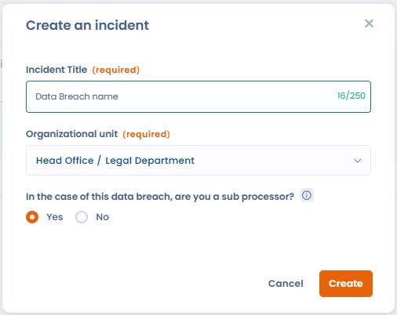
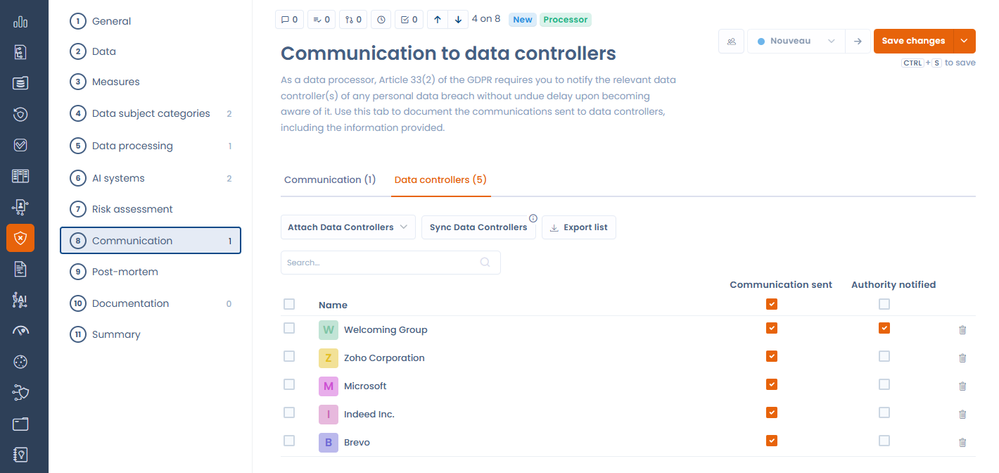

# Incidents en tant que sous-traitant

Le module de violations de données de Dastra s'adapte au **rôle de votre organisation** dans l'incident : Responsable de traitement (RT) ou Sous-traitant (ST). Ce rôle détermine les obligations applicables et conditionne les étapes affichées dans le formulaire.

***

## Déclarer son rôle à la création

Lors de la création d'un nouvel incident, un sélecteur permet de choisir entre :

* **Responsable de traitement** — flux standard : notification CNIL, communication aux personnes concernées, analyse de risque.
* **Sous-traitant** — flux adapté : l'obligation de notification directe à l'autorité de contrôle ne s'applique pas ; c'est au responsable de traitement de notifier.

<figure><figcaption>
Lors de la création, indiquez le rôle de votre organisation dans l'incident : Responsable de traitement ou Sous-traitant
</figcaption></figure>


**Base réglementaire — Art. 33(2) RGPD**

Le sous-traitant est tenu de notifier toute violation de données personnelles au responsable de traitement **dans les meilleurs délais** après en avoir pris connaissance. Il n'a pas d'obligation de notification directe à l'autorité de contrôle, cette obligation incombant au responsable de traitement.


***

## Différences du formulaire en mode Sous-traitant

Lorsque le rôle **Sous-traitant** est sélectionné :

| Élément | Mode RT | Mode ST |
| ------- | ------- | ------- |
| Étape de notification à l'autorité de contrôle | ✅ Affichée | ❌ Masquée |
| Section communication aux personnes concernées | Standard | Remplacée par la section ST (voir ci-dessous) |
| Section de communication aux RT clients | ❌ Absente | ✅ Présente |

***

## Section de communication aux responsables de traitement clients

En mode Sous-traitant, une section dédiée remplace la communication standard. Elle vous permet de :

* **Associer les RT clients** concernés par l'incident — la liste peut être synchronisée automatiquement depuis les traitements liés à l'incident
* **Suivre le statut de notification** de chaque RT (notifié / en attente)
* **Exporter la liste** des RT impliqués pour votre dossier de conformité

<figure><figcaption>
L'onglet Responsables de traitement liste les RT clients à notifier, avec les actions Joindre, Synchroniser et Exporter
</figcaption></figure>

### Synchronisation automatique des RT depuis les traitements l