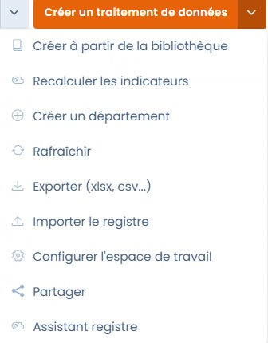
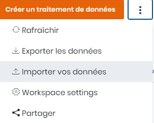
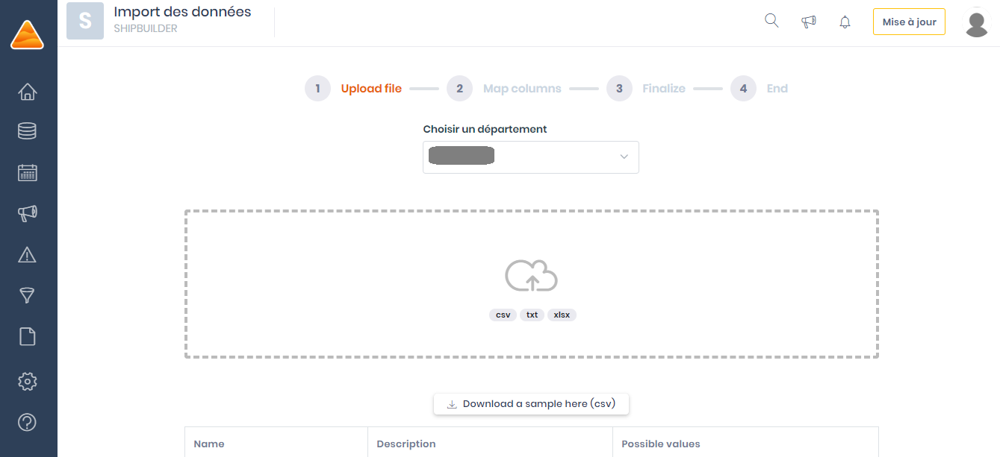
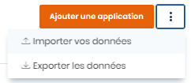

# Exporter / importer le registre

## L'export de registre



Pour exporter l'ensemble du registre, il vous suffit de vous rendre dans le module "Registre", de cliquer sur la flèche en haut à droite à côté de la création d'un traitement, puis de sélectionner "exporter le registre".

Choisissez ensuite le format d'export ainsi que le type d'export désiré (complet ou format article 30), et cliquez sur "Télécharger le fichier". Ca y est, votre registre est exporté !

### Format article 30/CNIL

Le format dit article 30 correspond à ce qui est exigé par le RGPD. L'export prendra en compte les champs obligatoires au sens du RGPD. En effet, le RGPD oblige à la création du registre des activités de traitement. Les informations contenues sont :

* Nom du traitement
* Finalités (sans les bases légales)
* Données et conservation
* Destinataires et transferts éventuels
* Mesures de sécurité

### Format complet

Le format complet est le format natif de Dastra. Vous exportez l'ensemble des champs composant la fiche de traitement.


Il est également possible de n'exporter qu'un ou plusieurs traitements du registre, au lieu du registre entier. Pour cela, sélectionnez les traitements concernés manuellement en cochant les cases à gauche du registre, puis "Choisir une action groupée" et "Exporter".


## L'import de registre

#### L'import via le tableur Excel complexe

L'import d'un registre existant peut représenter une tâche fastidieuse si vous avez un nombre important de traitements.

Chez DASTRA, nous avons intégré un fichier Excel qui vous permettra d'importer vos traitements en masse et en une seule fois.

Il offre également l'avantage d'importer et de créer directement dans notre plateforme **l'ensemble** de vos **référentiels** et ne se limite pas aux traitements.

Vous pourrez ainsi renseigner vos _Actifs_, vos _Jeux de données_, vos _Acteurs_, vos _Mesures de sécurité_, etc.



Vous pourrez télécharger [ici ](https://docs.google.com/spreadsheets/d/1u_QLMbx9k4fFm7jBrpnt65i8fVfOzYz8/edit?usp=sharing\&ouid=117505938343554554786\&rtpof=true\&sd=true)le tableur Excel relatif au formatage des données, nécessaire pour un import sans erreurs!

#### Import Standard

Pour éviter de remplir chaque traitement à la main et prendre en compte tous les formats possibles de registre, Dastra a conçu une méthodologie se reposant sur le principe de la **ségrégation du registre en domaines de données**. Ainsi, 7 étapes sont conseillées pour importer l’ensemble d’un registre existant dans Dastra.


Ces étapes, non obligatoires, sont néanmoins fortement conseillées notamment lorsque le registre de traitement contient de nombreux traitements.


N'hésitez pas à consulter également notre bibliothèque de modèles de traitements de données : [https://www.dastra.eu/fr/data-processing/referentials](https://www.dastra.eu/fr/data-processing/referentials)

## Etape 1 : Import des labels de traitement

Pour importer vos labels de traitements existants, il faut cliquer sur l'onglet "importer vos données" dans la section Registre, onglet Registre:

Ensuite, téléchargez un échantillon de notre fichier tel que présenté à l'écran.

Remplissez le fichier téléchargé avec vos labels de traitements en respectant l'ordre suivant :

| Colonne          | Description                           | Valeurs possibles                                   |
| ---------------- | ------------------------------------- | --------------------------------------------------- |
| Ref              | Référence interne (string)            |                                                     |
| Processing state | Etat du traitement (processing state) | "Study", "BeingDeployed", "InProduction", "Stopped" |
| Label            | Nom (string)                          |                                                     |
| Description      | Description (String)                  |                                                     |

Ci-dessous un exemple de fichier respectant le format demandé disponible à l'import et pouvant être importé en "glisser-déposer" dans Dastra :



Importez-le directement dans notre interface par glisser-déposer, puis cliquez sur Continuez.

Ca y est, vos labels de traitements sont importés !

## Etape 2 : import du référentiel des actifs

Pour importer vos applications/actifs existantes, il faut cliquer sur l'onglet "importer" dans le module Référentiels, onglet Actifs :

Ensuite, téléchargez un échantillon de notre fichier tel que présenté à l'écran. Remplissez le fichier téléchargé avec vos applications en respectant l'ordre suivant :

| Colonne                    | Description                             | Valeurs possibles                       |
| -------------------------- | --------------------------------------- | --------------------------------------- |
| Description                | Description (string)                    |                                         |
| Label                      | Nom (string)                            |                                         |
| ApplicationState           | Application state (applicationstate)    | "InProduction""InDevelopment""Stopped"  |
| ApplicationType            | Application type (applicationtype)      | "Software""WebApp""Saas""Module""Other" |
| HostingType                | Hosting type (hostingtype)              | "InHouse""OutSourced"                   |
| SupportType                | Support type (supporttype)              | "InHouse""OutSourced"                   |
| DevelopmentType            | Development type (developmenttype)      | "InHouse""OutSourced"                   |
| HostName                   | Host name (string)                      |                                         |
| PrivacyByDesignImplemented | Privacy by design implemented (boolean) | "true""false"                           |

Ci-dessous un exemple de fichier respectant le format demandé disponible à l'import et pouvant être importé en "glisser-déposer" dans Dastra :



Importez-le directement dans notre interface par glisser-déposer, puis cliquez sur Continuez.

Ca y est, vos applications sont importées !

## Etape 3 : import du référentiel des acteurs

Recommencez la procédure similaire aux précédentes depuis le module Référentiels, onglet Acteurs. Ci-dessous un exemple:

Votre référentiel des acteurs référence l'ensemble des parties prenantes à un traitement. Personnes morales telles que les sous-traitants, les clients ou les responsables conjoints ou les personnes physiques telles que les interlocuteurs des traitements.

Ce référentiel sert d'annuaire interne dans l'espace de travail. Pour chaque acteur, vous pourrez définir un type le caractérisant. Par exemple, si vous souhaitez ajouter votre référentiel de sous-traitants, vous ajoutez tous les acteurs et chaque sous-traitant devra être associé à un traitement.

## Etape 4 : import du référentiel des mesures de sécurité

Recommencez la procédure similaire aux précédentes depuis le module Référentiels, onglet Mesures.

## Etape 5 : import du glossaire de données

Recommencez la procédure similaire aux précédentes depuis le module Référentiels, onglet Glossaire de données.

## Etape 6 : import du référentiel des jeux de données

Recommencez la procédure similaire aux précédentes depuis la section Registre, onglet Règles de conservation.

### Export / import des jeux de données avec leurs champs

Il est désormais possible d'exporter et d'importer vos jeux de données **en incluant les champs de données associés**. Cette fonctionnalité facilite la migration d'une cartographie existante ou la mise à jour en masse de votre glossaire de données.

#### Exporter les jeux de données avec leurs champs

Depuis le module **Cartographie > Jeux de données** :

1. Sélectionnez les jeux de données à exporter (ou exportez la liste complète)
2. Cliquez sur **Exporter**
3. Choisissez le format **Complet (avec champs de données)**

Le fichier exporté inclut, pour chaque jeu de données : son nom, sa description, ses catégories de personnes concernées, sa règle de conservation — et la liste des champs de données associés avec leur catégorie RGPD et leur indicateur de sensibilité.

#### Importer des jeux de données avec leurs champs

Le fichier d'import suit le même format que l'export. Pour chaque jeu de données, vous pouvez renseigner les champs de données directement dans les colonnes dédiées du tableur. Lors de l'import :

* Les champs inexistants dans le glossaire de données sont **créés automatiquement**
* Les champs déjà présents sont **associés** au jeu de données sans duplication


Cette fonctionnalité est particulièrement utile pour harmoniser la cartographie des données entre plusieurs workspaces ou pour initialiser un nouveau workspace depuis une cartographie existante.


## Etape 7 : Construction des liaisons

Maintenant que les référentiels ont tous été importés, éditez chacun des traitements et remplissez les informations sur la bases des informations importées en suivant le guide ci-dessous:


[remplir-le-questionnaire](remplir-le-questionnaire/)


Ca y est, les liaisons sont construites !
