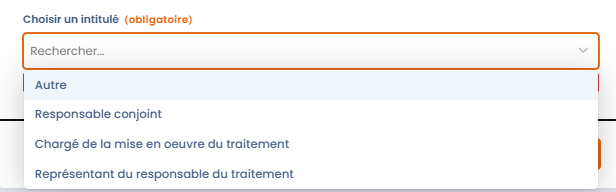
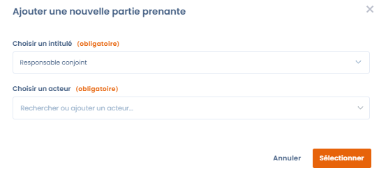

# Parties prenantes



## Ajouter des utilisateurs sur un traitement&#x20;

Dastra vous permet d'attacher des utilisateurs à un traitement.

**Attention, il ne s'agit pas d'acteurs mais d'utilisateurs (personnes physiques qui disposent d'un compte d'accès à la plateforme Dastra).**&#x20;


Les comptes utilisateurs doivent être créés depuis au moins une heure avant de pouvoir être ajoutés en tant que parties prenantes.


Les rôles ainsi définis permettront de structurer efficacement la gestion et la mise en œuvre de vos traitements dans Dastra.

Voici une manière de définir les rôles de vos utilisateurs pour vos traitements :&#x20;

* **Approbateur** : il s'agit de l'utilisateur dans Dastra qui est en charge de valider que le traitement et les éléments associés tels qu'ils sont indiqués dans Dastra sont valides selon les attendus de l'organisation. ll peut être différent du signataire du responsable du traitement. Par exemple, il peut s'agir d'un responsable de service, d'un DPO, ou d'un relais DPO.&#x20;
* **Réalisateur** : c'est l'utilisateur qui a pour rôle de mettre en œuvre les actions nécessaires sur le traitement et le décrire. Il peut s'agir de la mise en place des mesures de sécurité des données, de la gestion des accès ou de toute autre tâche requise pour assurer la conformité du traitement. Il peut s'agir d'un chef de projet ou d'un responsable métier dédié.
* **Informé** : cette catégorie regroupe les utilisateurs qui doivent être tenus informés de l'avancement et de l'état du traitement, sans avoir de rôle actif dans sa validation ou sa réalisation. Cela peut inclure des membres de l'équipe de direction, des gestionnaires de projet, ou d'autres parties prenantes qui ont un intérêt sur le traitement.

## Identifiez les acteurs principaux sur le traitement&#x20;

Vous pouvez indiquer les acteurs concernés par la mise en œuvre du traitement. Cela peut par exemple être un service ou un département d’une entreprise (comme le service des ressources humaines par exemple) mais également une personne dédiée s’il s’agit d’un projet (chef de projet par exemple).  

Vous indiquez également l’identité du représentant du responsable du traitement, le cas échéant, du ou des responsables conjoints du traitement.&#x20;

<figure><figcaption></figcaption></figure>

## Ajouter un responsable conjoint (coresponsable de traitement)

Pour ajouter un responsable conjoint, il faut ajouter une nouvelle partie prenante et sélectionner "Responsable conjoint".&#x20;

Vous serez invité à ajouter un acteur en tant que responsable conjoint.&#x20;

<figure><figcaption></figcaption></figure>

## Ajouter un chargé de la mise en oeuvre du traitement

Le chargé de la mise en oeuvre correspond au service qui est responsable opérationnel du traitement. Il s'agit généralement du service qui utilise les données et met en oeuvre l'activité de traitement.&#x20;

Il peut s'agir d'un service ou d'une personne physique.&#x20;

Dans Dastra, vous devrez ajouter un acteur.&#x20;

## Ajouter un représentant du responsable du traitement

Le représentant du responsable du traitement correspond au représentant opérationnel du responsable du traitement (RT). Par exemple, il peut s'agir d'un membre du COMEX ou encore d'un conseiller municipal (le RT étant représenté par le maire).

## Ajouter un responsable de traitement opérationnel

Le responsable de traitement opérationnel (RTO) est utilisé en interne par certaines organisations pour désigner une personne ayant des responsabilités précises dans la gestion opérationnelle des traitements de données.

#### 📌 **Rôle du RTO dans la gouvernance de protection des données personnelles**

Le **RTO** (Responsable de Traitement Opérationnel) n’est pas une notion définie directement par le RGPD, mais il peut être utilisé en interne par certaines organisations pour désigner une personne ayant des responsabilités précises dans la gestion opérationnelle des traitements de données.

1. **Mise en œuvre des traitements de données**
   * Le RTO est souvent **un relais opérationnel du Responsable de Traitement** (RT) au sein d’une direction métier (ex. RH, Marketing, IT, etc.).
   * Il est chargé de **l’exécution des traitements au quotidien**, conformément aux instructions du Responsable de Traitement et en respectant les principes de protection des données.
2. **Application des mesures de conformité**
   * Il veille à ce que les traitements soient effectués en accord avec les politiques internes de conformité et les obligations de protection des données.
   * Il applique les mesures techniques et organisationnelles définies par l’entreprise pour garantir la sécurité et la confidentialité des données.
3. **Collaboration avec le DPO et le Responsable de Traitement**
   * Il travaille en **collaboration étroite avec le Délégué à la Protection des Données (DPO)** pour s’assurer que les traitements respectent les règles de protection des données.
   * Il peut être un interlocuteur privilégié pour le DPO lorsqu’il s’agit de **répondre aux droits des personnes concernées (droit d’accès, rectification, suppression, etc.)**.
4. **Gestion des incidents et des violations de données**
   * Il peut être impliqué dans la **détection et la gestion des violations de données**, en appliquant les procédures internes pour **réagir rapidement** et notifier l’incident si nécessaire.
   * Il assure le suivi des incidents et aide à la mise en place d’actions correctives.
5. **Documentation et tenue du registre des traitements**
   * Il participe à la mise à jour du **registre des traitements**, en documentant les traitements sous sa responsabilité et en s’assurant que les informations sont bien remontées au Responsable de Traitement ou au DPO.

#### **Différence entre Responsable de Traitement et Responsable de Traitement Opérationnel**

| **Critère**               | **Responsable de Traitement (RT)**                          | **Responsable de Traitement Opérationnel (RTO)** |
| ------------------------- | ----------------------------------------------------------- | ------------------------------------------------ |
| **Rôle**                  | Définit les finalités et les moyens du traitement           | Met en œuvre les traitements sur le terrain      |
| **Décisions**             | Décide du pourquoi et du comment des traitements            | Applique les décisions et gère l'exécution       |
| **Responsabilité légale** | Engage la responsabilité juridique en cas de non-conformité | Opère sous la responsabilité du RT               |
| **Lien avec le DPO**      | Interagit avec le DPO pour définir les politiques           | Exécute les recommandations du DPO               |

