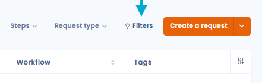
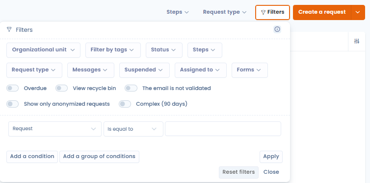
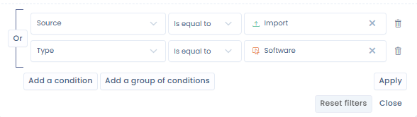
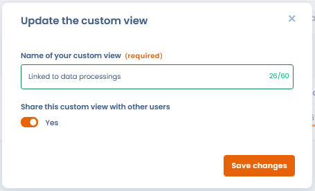
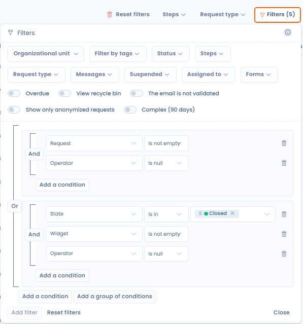

# Filtres avancés



## Utilisation

Les filtres avancés permettent de filtrer vos données sur presque tous les champs de vos entités.

* Allez dans un module de Dastra (par exemple, le module des exercices de droits
* Cliquez sur le bouton "Filtres" en haut à droite de la table de données.

<figure><figcaption></figcaption></figure>

* Une petite fenêtre s'affiche, elle vous présente une liste de filtres standards les plus utilisés, en appliquant un de ces filtres, le tableau se met à jour automatiquement.

<figure><figcaption></figcaption></figure>

<p align="center"><sub><mark style="color:$info;">Combo de filtres avancés des demandes d'exercices de droits</mark></sub></p>


La combinaison de ces filtres est cumuliative.

_Par exemple : si je filtre sur un ou deux tags "complexe" et "en attente" + je sélectionne une unité organisationnelle "Contoso" : cela m'affichera toutes les lignes qui contiennent les 2 tags "complexe" et "en attente" **et** qui sont dans l'unité organisationnelle "Contoso"_


* Si vous ne trouvez pas de filtres qui vous conviennent, vous pouvez cliquer sur le bouton "Ajouter un filtre". Là vous allez pouvoir éditer la combinaison de filtres qui correspondra le mieux à vos besoins

<figure><figcaption></figcaption></figure>

Par défaut, Dastra fait persister les filtres que vous sélectionnez, ce qui signifie que si vous changez de page ou que vous rafraîchissez votre navigateur, les filtres sont conservés. Ces filtres sont propre à votre navigateur et votre espace de travail (Ils sont stockés en **LocalStorage**).

## Vues personnalisées

Vous pouvez enregistrer l'état courant de vos filtres (et votre sélection de colonnes) sous forme de **vue nommée**, puis basculer entre vos vues en un seul clic depuis la barre d'outils de chaque liste.

Pour créer une vue :

1. Appliquez les filtres et la sélection de colonnes souhaités.
2. Cliquez sur le bouton **"Enregistrer"** dans la barre d'outils.
3. Donnez un nom à votre vue et confirmez.

La vue apparaît alors directement dans la barre d'outils de la section concernée — accessible en un clic, sans repasser par le panneau "Filtres".

<figure><figcaption></figcaption></figure>

Vous pouvez **partager une vue** avec les autres utilisateurs de votre espace de travail. Les vues partagées apparaissent sous la rubrique **"Vues partagées"** dans la barre d'outils.

<figure><figcaption></figcaption></figure>

<figure><figcaption></figcaption></figure>

Cette fonctionnalité est disponible dans toutes les sections listant des objets : demandes d'exercice de droits, registre des traitements, actifs, contrats, systèmes d'IA, violations de données…

## Groupes de conditions

Les filtres avancés supportent désormais les **groupes de conditions**, ce qui permet de construire des logiques de filtrage complexes combinant des opérateurs **ET** et **OU** au sein d'une même vue.

### Principe

Sans groupes, toutes les conditions d'un filtre sont combinées avec un **ET** implicite : le résultat doit satisfaire _toutes_ les conditions simultanément.

Avec les groupes de conditions, vous pouvez créer des blocs indépendants. Au sein d'un groupe, les conditions sont liées par **ET**. Entre les groupes, la logique est **OU** : le résultat doit satisfaire les conditions d'_au moins un_ groupe.

Exemple :

```
Groupe 1 : statut = "En cours" ET priorité = "Haute"
OU
Groupe 2 : statut = "En retard"
```

Ce filtre affiche toutes les demandes en cours et prioritaires, **et aussi** toutes celles en retard — quelle que soit leur priorité.

### Créer un groupe de conditions

1. Ouvrez le panneau de filtres et cliquez sur **"Ajouter un filtre"**.
2. Dans l'éditeur de filtres, cliquez sur **"Ajouter un groupe"**.
3. Choisissez l'opérateur du groupe (**ET** ou **OU**) puis ajoutez vos conditions.
4. Pour des règles plus complexes, imbriquez des **sous-groupes** de conditions à l'intérieur d'un groupe (par exemple : _(Étape = « En cours » ET Adresse renseignée) OU (Canal de collecte = « Email entrant »)_).
5. Réorganisez ou supprimez individuellement chaque condition ou groupe à l'aide des contrôles dédiés.
6. Enregistrez la vue pour réutiliser ce filtre ultérieurement.


Les filtres et vues personnalisées existants restent fonctionnels : ils sont convertis automatiquement vers l'éditeur structuré.


<figure><figcaption><p>Exemple de filtres à groupes de conditions : deux blocs ET reliés par OU, avec les boutons « Ajouter une condition » et « Ajouter un groupe »</p></figcaption></figure>


Les groupes de conditions sont disponibles dans toutes les listes