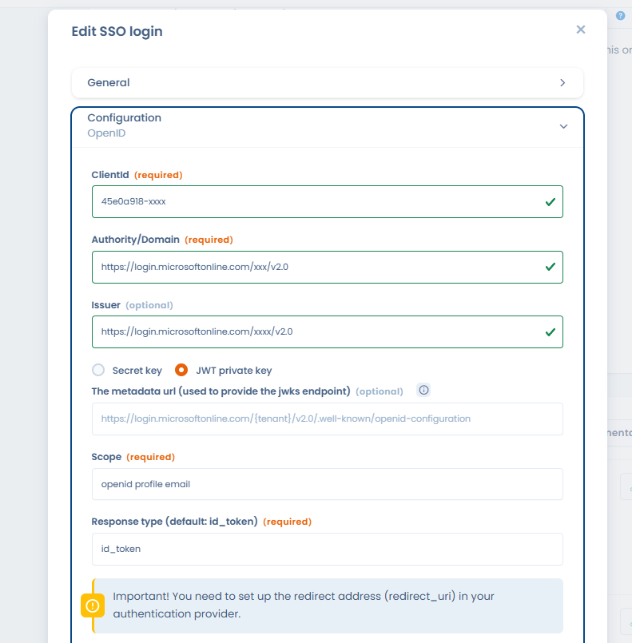

# Assistant IA

## Quels cas d'usage avec Dastra ?&#x20;

Avec Dastra, vous pouvez utiliser l'IA pour deux cas d'usages principaux :&#x20;

### **Générer des traitements de données**

Générez rapidement des traitements de données au format attendu par Dastra à partir d'une description rapide de votre traitement.&#x20;

A partir de l'usage décrit des données, Dastra vous proposera un modèle de traitement incluant un nom, un ou des jeux de données incluant des champs, une durée de conservation, des mesures de sécurité, des destinataires et une description du traitement. \
En un rien de temps, vous pourrez créer votre traitement.&#x20;

Vous avez une modification à apporter sur ce qui est proposé ? Editez le traitement une fois créé directement.

### **Générer des actifs**

Générez rapidement des actifs (de type logiciel par exemple) au format attendu par Dastra. L'IA vous proposera un nom, des liens vers la politique de confidentialité de l'acteur, créera un acteur en tant qu'éditeur.&#x20;

Gagnez en rapidité et laissez l'IA préremplir ces informations pour vous.&#x20;



### **Générer des jeux de données**

Générez rapidement des jeux de données au format attendu par Dastra à partir d'une description simple.&#x20;

Pour générer un jeu de données avec IA :&#x20;

1. Allez sur [la page des jeux de données](https://app.dastra.eu/workspace/0/referentials/data-retention-rules)
2. Cliquez sur **Créer un jeu de données > Créer avec assistant IA**
3. Renseignez dans le champ texte une description courte de votre jeu de données
4. Cliquez sur **Suivant,** patientez quelques instants le temps que votre jeu de données soit créé
5. Sur l'écran de synthèse du jeu de données, appliquez les correctifs éventuels et cliquez sur **Créer**

Une fois le jeu de données généré ? Editez le traitement une fois créé directement.

### **Générer des notices d'information sur le traitement**

1. Rendez-vous dans la page de modification d'un traitement de données
2. Dans la section 11. documentation, cliquez sur "Générer une notice d'information"
3. Choisissez le format que vous souhaitez, vous pouvez même personnaliser les instructions de génération en cliquant sur "Personnalisée". Cliquez ensuite sur le bouton "Générer"
4. Copier le texte généré ou insérez le dans votre documentation de traitement

<figure><figcaption></figcaption></figure>

### Générer une réponse à un questionnaire (PIA, Analyse de risque, ...)

1. Aller dans la rubrique "Questionnaires", sélectionnez le modèle que vous souhaitez utiliser. Par exemple, le modèle du PIA de la CNIL
2. Cliquez sur "Planifier un questionnaire"
3. Sélectionnez "Réponse assistée par IA"
4. Vous pouvez renseigner directement le traitement qui servira de source aux réponses du questionnaire ou saisissez des instructions personnalisées
5. Une fois la réponse générée, il est possible d'y apporter des corrections.

<figure><figcaption></figcaption></figure>

###

### **Générer des réponses aux demandes d'exercice de droits**

Vous pouvez facilement générer des réponses aux demandes d'exercice de droit dans plusieurs langues à partir de l'étape de communication de la demande. Différentes options de personnalisation sont possibles pour adapter le texte à votre convenance (raccourcir ou allonger le texte, adopter un ton plus ou moins formel, etc...)

Pour générer une réponse :&#x20;

1. Allez sur un [exercice de droit ](../gerer-les-exercices-des-droits/gestion-des-demandes-dexercices-de-droits.md)en cours de réponse
2. Remplissez les informations jusqu'à l'étape **Communication/Transmission**
3. Cliquez sur **Générez avec IA** et patientez quelques instants que l'assistant génère une première réponse basée sur les informations suivantes&#x20;
   1. nom et prénom du destinataire
   2. message de la demande
   3. langue à utiliser
   4. nom de l'espace de travail
   5. finalités
   6. nom de l'opérateur de la demande
   7. date de la demande et nombre de jours restants (en fonction de la complexité)
   8. Etat et ID de la demande
4. Vous pouvez alors éditer le texte proposer ou utiliser une des options de reformulation pour relancer la génération (attendez quelques instants pour voir le résultat)
5. Cliquez enfin sur **valider ce message** et ajoutez les pièces jointes éventuelles avant de lancer l'envoi en cliquant sur **envoyer**

A noter qu'une limitation du nombre d'essais par minute est en place pour cette fonctionnalité

## Comment utiliser l'IA générative de Dastra ?

Vous pouvez utiliser l'assistant IA pour générer des traitements de données ou des actifs. Pour cela cliquez sur le bouton "Créer un traitement" et sur "générer avec IA". L'assistant IA vous fera une proposition de modèle de données que vous pourrez ensuite adapter à vos besoins.

{% embed url="https://files.gitbook.com/v0/b/gitbook-x-prod.appspot.com/o/spaces%2F-LvBxs22wUMicv9uWp6C-2584506019%2Fuploads%2F3LnwYaR0wxVm1itxA4XH%2Fia-gpt-dastra.mp4?alt=media&token=ba3d66f4-e290-4215-83ec-7a2f91641d39" %}


**Que faire si je ne souhaite pas avoir cette fonctionnalité sur mon compte ?**

Si jamais vous ne souhaitez pas que cette option soit disponible dans votre espace de travail, vous pouvez [nous contacter ](../../commencer/le-support/faire-une-demande-de-support.md)afin que nous désactivions la fonctionnalité au niveau de votre organisation.


## Comment ça marche ?

Dastra utilise les modèles d'**IA OpenAI GPT 3.5** et **GPT 4.0** (Modèles de [ChatGPT](https://chat.openai.com/)) ainsi que le modèle **Mistral-Large** de [**MistralAI** ](https://mistral.ai/)fournis par [le service AI hébergé sur Azure](https://azure.microsoft.com/fr-fr/products/cognitive-services/openai-service). Les modèles utilisés sont pré-entrainés. **Nous ne transférons absolument aucune donnée de votre organisation** dans le but d'entraîner cette intelligence artificielle.

Dastra utilise simplement la puissance de l'IA générative pour générer du contenu à partir de simple requête textuelle. Dastra a simplement fourni le modèle de document attendu (JSON) et un exemple de traitement de données (issu de notre bibliothèque) que nous souhaitons avoir et le modèle d'IA s'occupe du reste.

Nous transférons uniquement le texte du prompt pour la génération d'objets dans Dastra. Pour la génération de message d'exercice de droits, le contexte du message est intégré à la demande de génération afin de proposer une réponse personnalisée à la demande ([voir le détail des champs transmis](ai-assistant.md#generer-des-reponses-aux-demandes-dexercice-de-droits))

Nous avons fait le choix de vous proposer différents modèles d'IA génératives car nous avons trouvé des intérêts pour chaque version, vous pouvez trouver le tableau récapitulatif ci dessous afin de vous aider à choisir le modèle correspondant le mieux à votre besoin :

<table><thead><tr><th width="106">Modèle</th><th width="112">Version</th><th width="177">Avantages</th><th width="194">Inconvénients</th><th>Cas d’usage</th></tr></thead><tbody><tr><td>GPT</td><td>3.5 Turbo</td><td><ul><li>Vitesse</li><li>Prix</li></ul></td><td><ul><li>Base de connaissance de l'IA vieillissante (avant 2022)</li><li>Réponses parfois "simplistes"</li><li>Editeur US</li></ul></td><td><ul><li>Génération d’objet</li><li><em>Chat Bot interne</em></li></ul></td></tr><tr><td>GPT</td><td>4.0</td><td><ul><li>Réponses complètes et pertinentes</li><li>Fonctionnalités avancées</li></ul></td><td><ul><li>Temps de génération</li><li>Hallucinations et réponses ne suivant pas toujours les instructions</li><li>Editeur US</li></ul></td><td>Génération de message et de reformulation pour les exercices de droits</td></tr><tr><td>Mistral</td><td>Large</td><td><ul><li>Qualité des réponses</li><li>Editeur français</li></ul></td><td><ul><li>Intégration dans Azure moins avancée</li><li>Certaines fonctionnalités sont encore expérimentales</li></ul></td><td><ul><li>Génération d’objets</li><li>Génération de messages</li></ul></td></tr></tbody></table>

&#x20;


**Avertissement sur la qualité du contenu suggéré !**&#x20;

Les données générées par l'assistant **sont uniquement des propositions**. Il est nécessaires de bien relire et mettre à jour les informations générées automatiquement par l'assistant. Dastra ne s'engage pas sur la qualité des informations proposées.


Dastra **ne réalise aucun transfert de données** présentes dans votre espace de travail vers le service d'IA.

Les requêtes textuelles et les résultats du service :

* **ne sont PAS disponibles pour d'autres clients** et ne sont PAS à la disposition d'OpenAI ou de MistralAI.
* **ne sont PAS utilisés pour améliorer les modèles de l'OpenAI ou de MistralAI**&#x20;
* **ne sont PAS utilisées pour améliorer automatiquement les modèles Azure OpenAI** pour votre utilisation dans votre ressource (les modèles sont sans état, sauf si vous affinez explicitement les modèles avec vos données d'entraînement).&#x20;

Si vous souhaitez avoir plus d'informations sur le fonctionnement de ce modèle, [rendez-vous sur cette page ](https://learn.microsoft.com/en-us/legal/cognitive-services/openai/data-privacy)
