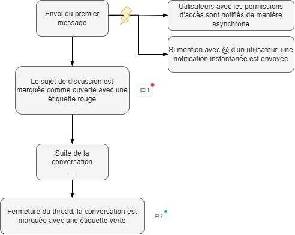

# Discussions internes

## Fonctionnement

Vous pouvez discuter à la manière d'un chat sur tous les éléments présents dans Dastra : tâches, traitements, systèmes d'ia, incidents, actifs...

Comment faire ?

* **Accédez à une fiche traitement, actif ou autres**
* **Cliquez sur ce bouton :**&#x20;

<figure><figcaption></figcaption></figure>

* **Saisissez votre message** en y incluant d'éventuelles pièces jointes&#x20;
* **Cliquez sur le bouton envoyer**

Voici le schéma du fonctionnement du workflow des discussions internes : &#x20;

<figure><figcaption></figcaption></figure>

## Mentions

Vous pouvez mentionnez les utilisateurs concernés expressément **en utilisant le raccourci "@"** de votre clavier. Une liste d'utilisateur vous sera proposée. Vous pouvez rechercher dans l'intégralité des utilisateurs de votre espace de travail :&#x20;

<figure><figcaption></figcaption></figure>

L'objectif de la mention est d'envoyer automatiquement une notification mail à l'utilisateur concerné.

## Notifications

Les notifications de message sont envoyées automatiquement dès lors qu'un message est envoyé sur l'objet concerné. 2 types de notifications sont envoyées automatiquement :&#x20;

* Envoi d'un message asynchrone de notification à l'ensemble des membres de l'espace de travail ayant accès à l'objet concerné
* Envoi d'un message instantané à l'ensemble des utilisateurs mentionnés dans la conversation.

Pour en savoir plus, consultez [notre page sur les notifications](../settings/notifications.md).


**Si vous utilisez Slack**, vous pouvez mettre en place la notification automatique des utilisateurs dans Slack via [la page intégration de votre espace de travail](https://app.dastra.eu/workspace/0/settings/integrations)


## Ouverture/Fermeture de la conversation

Lorsqu'un message est envoyé sur un objet où il n'y a pas de conversation existante ou que la discussion a été préalablement fermée, la conversation passe en statut "Ouvert". Celle-ci s'affichera ainsi dans l'interface avec un petit rond rouge et dans le hub de conversation générale.&#x20;

<figure><figcaption></figcaption></figure>

Une fois la conversation terminée. Si vous possédez le droit de Fermeture des topics de conversation, vous pouvez cliquer sur le bouton "Fermer la conversation". Cela aura pour conséquence d'afficher en vert l'indicateur de conversation : \

### Hub des conversations

Afin de centraliser l'ensemble des conversations ouvertes dans Dastra, vous pouvez accéder [au hub centralisé des conversations ](https://app.dastra.eu/workspace/0/comments). Vous pouvez y accéder en cliquant sur ce lien dans la barre de navigation : \
.png>)

Celui ci centralise l'intégralité des conversations sur votre espace de travail. Vous pouvez répondre ainsi à toutes les questions de vos utilisateurs tout en accédant aux fiches des éléments concernés.
