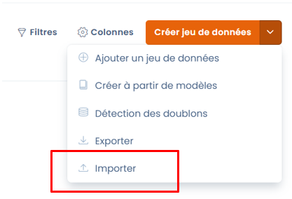

# 😇 Foire aux questions

## Comment importer des jeux de données ?

Pour importer des jeux de données, il faut vous rendre dans le module cartographie et sélectionner les jeux de données.&#x20;

Vous pouvez vous y rendre en cliquant sur ce bouton : [https://app.dastra.eu/workspace/0/referentials/data-retention-rules](https://app.dastra.eu/workspace/0/referentials/data-retention-rules)

Dans le sous-menu du bouton "Créer un jeu de données", cliquez sur importer.&#x20;

&#x20;

<figure><figcaption></figcaption></figure>

Vous pourrez ensuite télécharger le modèle de fichier et voir le format des colonnes attendu dans le modèle de fichier d'import. Il ne vous suffira ensuite plus qu'à déposer le fichier d'import pour que l'import soit réalisé.&#x20;

