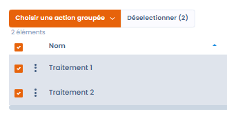

# Fusion d'éléments

## À quoi sert l'outil de fusion

La fonctionnalité de **fusion d’éléments** de Dastra a été conçue pour simplifier la gestion des doublons et des éléments similaires dans vos données de conformité. Elle vous permet de **regrouper plusieurs éléments identiques ou proches** en un seul, sans avoir à effectuer manuellement le **rattachement complexe à l’ensemble des entités associées** (traitements, responsables, registres...).

Cette fonctionnalité vise à **assurer la cohérence de votre référentiel** tout en **limitant les manipulations manuelles**, vous faisant gagner en temps et en fiabilité.

## Sur quels éléments peuvent être utilisés l'outil de fusion

L'outil de fusion peut être utilisé sur :

* Les traitements
* Les actifs
* Les acteurs
* Les jeux de données
* Les glossaires de données
* Les mesures
* Les catégories de personnes concernées
* Les tâches
* Les contrôles de conformité (contrôles appliqués et contrôles de référence)
* Les tests de conformité (tests opérationnels et tests de référence)


La fusion des contrôles et des tests de conformité s'effectue depuis la bibliothèque ou le projet du module Conformité, via les actions groupées. Vous pouvez sélectionner jusqu'à 30 éléments à fusionner. Pour le détail de cette opération, consultez les pages [Contrôles](../compliance/library/controls.md) et [Tests](../compliance/library/tests.md).


## Comment fusionner les éléments ?

Il vous suffit de sélectionner les éléments à fusionner :

<figure><figcaption>
 
</figcaption></figure>

Puis de cliquer sur "Choisir une action groupée" et "fusionner les données" :&#x20;

\

Vous accéderez alors à une page dédiée qui vous permettra de :

Sélectionner l’élément principal à conserver après fusion.

Choisir les champs des éléments à supprimer que vous souhaitez récupérer dans l’élément principal.\

Si des champs n'apparaissent pas sur cette page, ce seront les valeurs des champs de l'élément conservé qui seront automatiquement conservées.\
\
Vous pouvez ensuite cliquer sur le bouton "Enregistrer" pour lancer la fusion.


Les entités (traitements, analyses, etc.) associées aux éléments supprimés seront automatiquement rattachées à l’élément conservé, évitant toute perte ou déconnexion dans votre registre.

