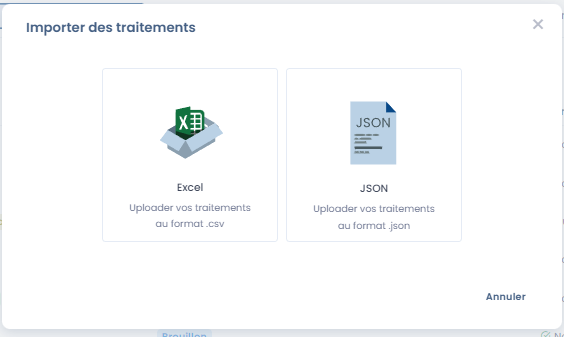
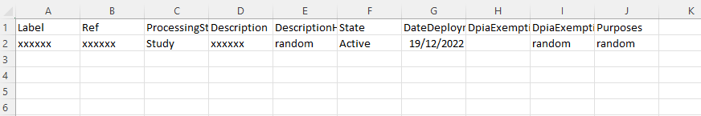
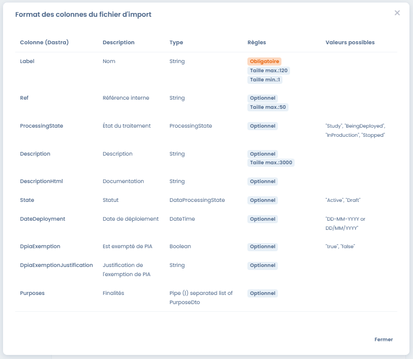

# Importer vos données (Excel, Csv)



## L'import de données dans Dastra

Dastra vous permet très facilement d'importer vos propres données sous format tableur directement dans l'application.

Les imports sont possibles dans les modules suivants :&#x20;

* import du registre
* import des acteurs
* import des actifs
* import des jeux de données
* import des champs
* import des mesures de sécurité
* import des catégories de personnes concernées
* import des réponses d'audit
* import des modèles d'audit (à venir)
* import des types de risques
* import des demandes d'exercice de droits
* import des violations de données
* import des tâches

Dans chaque import, le processus est le même.&#x20;

Il s'effectue en 4 étapes :&#x20;

1. [Préparation du fichier de données](importer-vos-donnees-excel-csv.md#1.-preparation-du-fichier-de-donnees)
2. [Téléchargement du fichier](importer-vos-donnees-excel-csv.md#2.-charger-le-fichier)
3. [Vérification des données avant import](importer-vos-donnees-excel-csv.md#3.-verifiez-vos-donnees)
4. [Import des données](importer-vos-donnees-excel-csv.md#4.-importez-les-donnees)

### 1. Préparation du fichier de données

Dastra supporte que les formats de données suivants :

* **Excel** (.xlsx)
* **Fichiers plats** (.csv,.txt) avec séparateur ; et encodage UTF-8 (l'encodage est important pour avoir les accents)
* **JSON** (Uniquement pour l'import du registre complet et les modèles de traitements)

Pour accéder au menu d'import de données, cliquez sur le bouton "importer" sous chaque flèche du bouton de création.

<figure><figcaption></figcaption></figure>

Sélectionnez Excel si cela vous est demandé :&#x20;

<figure><figcaption></figcaption></figure>

#### Téléchargement du modèle de fichier

Ensuite, téléchargez un modèle de fichier en cliquant sur le bouton "Télécharger le modèle de fichier"

<figure><figcaption></figcaption></figure>

Le modèle de fichier est **un fichier au format CSV** que vous pouvez facilement éditer avec un tableau Libre Office, Wordpad, Excel ou Google Sheet.

Celui-ci contiendra toutes les colonnes nécessaires avec des exemples de données.

Exemple de fichier (pour le registre) : &#x20;

<figure><figcaption>
La ligne 2 contient des données d'exemple qu'il faut remplacer
</figcaption></figure>

#### Renseignement du modèle de fichier

Remplissez le fichier téléchargé avec vos données.

Pour chaque fichier de données, vous pourrez afficher les valeurs attendues sur les colonnes :&#x20;

<figure><figcaption>
Valeurs attendues pour le fichier d'import du registre
</figcaption></figure>

Les imports contiennent des valeurs attendues en anglais. C'est tout à fait normal. En effet, il s'agit d'un import technique en base de données.&#x20;

Les valeurs en anglais correspondent aux listes déroulantes des boutons de sélection.&#x20;

Par exemple, dans l'import du registre, le champ "processing state" correspond au champ "état du traitement" dans Dastra. Il s'agit du champ indiqué dans la première étape "Généralités".

Le champ "State" correspond au statut du traitement ("brouillon" pour "Draft" ou "publié" pour "Active").&#x20;

### Jeux de données : import des champs associés

L'export et l'import des jeux de données incluent leurs **champs de données** associés. Le fichier exporté liste, pour chaque jeu de données, l'ensemble des champs liés (libellé, classification de sensibilité, catégorie de données personnelles) et peut être réimporté directement pour rétablir ces associations, sans étape supplémentaire.

Lors d'un import en mode **écrasement** (mise à jour des données existantes), les associations de champs sont alignées sur le contenu du fichier :

* les champs absents du fichier sont **dissociés** du jeu de données ;
* les champs qui n'existent pas encore dans l'espace de travail sont **créés automatiquement**.


Vérifiez le contenu de votre fichier avant un import en mode écrasement : tout champ non listé sera retiré du jeu de données correspondant.


### 2. Charger le fichier

Une fois votre fichier de données prêt, vous devrez dans certains cas indiquer une unité organisationnelle. Tous les fichiers importés seront placés dans cette unité organisationnelle.&#x20;


Seuls les imports d'objets qui peuvent être attachés à des unités organisationnelles sont concernés. Par exemple, le registre des traitements ou les violations de données. Les acteurs, mesures ou jeux de données ne sont pas concernés.


#### Mettre à jour les données via l'import

Il est proposé de cocher une case permettant de mettre à jour les données existantes.&#x20;

Cette fonctionnalité permet de mettre à jour les données dans Dastra à partir des données du fichier Excel.&#x20;

Par défaut, l'import va créer des nouveaux objets. Si l'objet existe déjà (un acteur par exemple), l'import ne créera pas de nouvel objet.&#x20;

Il est possible de mettre à jour un objet existant (par exemple un acteur).&#x20;

Dans ce cas, il faut sélectionner la case "Mettre à jour à les données existantes" et choisir le champ de correspondance. Ce champ sera la clé permettant d'identifier les champs à mettre à jour.&#x20;

<figure><figcaption>
Mise à jour des données
</figcaption></figure>

En cliquant sur le bouton "Ecraser les données des lignes qui matchent", les données correspondantes seront remplacées par les données de l'import.

#### Envoi du fichier

Envoyez le fichier en cliquant dans la zone

<figure><figcaption></figcaption></figure>


Vous pouvez également envoyer vos fichiers en effectuant un glisser-déposer dans la zone d'envoi des fichiers


### 3. Vérifiez vos données

L'utilitaire suivant vous permet de valider et d'éventuellement choisir les colonnes de votre fichier Excel sur les colonnes attendues en format d'import.

<figure><figcaption></figcaption></figure>

Si tout vous semble conforme, vous pouvez lancer l'import des données.

### 4. Importez les données

Lancez l'import des données en cliquant sur le bouton continuer. Le processus d'import va alors se déclencher.

<figure><figcaption></figcaption></figure>

### 5. C'est fini !

Bravo ! vous êtes arrivé au bout de ce guide ! Nous vous recommandons de vérifier que les données ont bien été importés dans l'outil.

