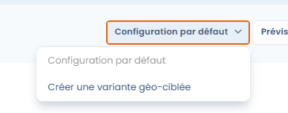

# Variantes géo-ciblées

### Présentation

Le module de consentement Dastra permet de créer des **variantes géo-ciblées** de votre bannière de cookies. Chaque variante est une version personnalisée du widget — apparence, textes, services exposés — qui s'affiche automatiquement en fonction de la **localisation géographique de l'utilisateur**, détectée via son adresse IP.

Cette fonctionnalité est particulièrement utile pour les organisations opérant dans plusieurs pays ou zones réglementaires, car les obligations en matière de consentement aux cookies varient sensiblement selon les législations locales (RGPD/ePrivacy en Europe, CCPA en Californie, LGPD au Brésil, etc.).


**Pourquoi c'est important juridiquement**

La bannière conforme en France n'est pas nécessairement conforme pour un utilisateur californien (opt-out plutôt qu'opt-in) ou britannique (post-Brexit, l'ICO a ses propres lignes directrices). Les variantes géo-ciblées vous permettent d'adapter précisément votre CMP à chaque contexte légal sans multiplier les widgets.


***

### Créer une variante géo-ciblée

#### 1. Accéder à la configuration

Depuis le module **Cookies**, sélectionnez votre widget, puis rendez-vous dans l'onglet **Variantes**.

Cliquez sur **"Créer une variante géo-ciblée"**.

<figure><figcaption></figcaption></figure>

#### 2. Nommer la variante

Renseignez un **label** descriptif (80 caractères max). Choisissez un nom explicite pour faciliter la gestion, par exemple : `Bannière – Californie (CCPA)` ou `Bannière – Zone EEE`.

#### 3. Sélectionner les zones géographiques ciblées

Choisissez les **pays ou régions** pour lesquels cette variante s'appliquera. La recherche est disponible dans la liste.

Dastra propose deux raccourcis :

* **EU/EEE** : pré-sélectionne automatiquement tous les pays de l'Espace Économique Européen.
* **All adequate country** : pré-sélectionne les pays reconnus adéquats par la Commission européenne au sens de l'article 45 RGPD.

La liste est organisée par pays, avec la possibilité de cibler des **régions infra-nationales** (ex. : régions françaises, États américains). Cela permet, par exemple, de créer une variante spécifique uniquement pour la Californie au sein d'un widget plus général pour les États-Unis.


**Ordre de priorité des variantes**

Si plusieurs variantes peuvent s'appliquer à un même utilisateur (ex. un utilisateur en Île-de-France avec une variante "France" et une variante "Île-de-France"), c'est la variante **la plus spécifique** (région) qui prend la priorité sur la variante plus générale (pays).


#### 4. Personnaliser la variante

Une fois la variante créée, vous pouvez la configurer de manière **entièrement indépendante** du widget principal :

* **Apparence** : couleurs, disposition, boutons
* **Textes & traductions** : libellés adaptés au contexte légal local
* **Services exposés** : vous pouvez restreindre ou étendre la liste des traceurs présentés
* **Déclencheurs** : conditions d'affichage spécifiques

#### 5. Désactiver l'affichage de la bannière (optionnel)

Une option permet de **ne pas afficher de bannière** pour les utilisateurs de la zone ciblée.

Lorsqu'elle est activée, aucune fenêtre de consentement ne s'affiche pour les visiteurs concernés. Tous les cookies sont alors déclenchés avec leur **consentement par défaut**, tel que configuré au niveau de chaque service dans le widget.


**Réservé aux zones sans obligation de consentement préalable**

Cette option est pertinente pour des pays où la réglementation locale n'impose pas de recueil actif du consentement avant le dépôt de cookies (ex. : certains pays hors EEE sans législation ePrivacy équivalente). Elle ne doit **jamais** être utilisée pour des utilisateurs situés dans l'UE/EEE, au Royaume-Uni ou dans toute autre juridiction imposant un opt-in.



Le "consentement par défaut" de chaque service est paramétrable dans la configuration du widget, dans la section **Services**. Vérifiez ces valeurs avant d'activer cette option.


***

### Cas d'usage typiques

| Situation                                     | Configuration recommandée                                                      |
| --------------------------------------------- | ------------------------------------------------------------------------------ |
| Site européen avec trafic américain           | Variante EEE (opt-in strict) + variante USA/Californie (opt-out CCPA)          |
| Site français avec une filiale allemande      | Variante France + variante Allemagne avec textes adaptés aux exigences du BfDI |
| Site global avec conformité minimale hors EEE | Widget par défaut mondial + variante EEE conforme RGPD                         |

***

### Fonctionnement technique

La détection géographique est réalisée automatiquement par le SDK Dastra à partir de **l'adresse IP** de l'utilisateur, sans nécessiter de configuration supplémentaire de votre côté.

Aucune donnée de localisation n'est stockée dans le profil de consentement de l'utilisateur : la géolocalisation sert uniquement à sélectionner la variante à afficher.


Pour tester l'affichage d'une variante spécifique depuis votre navigateur, vous pouvez utiliser un VPN ou contacter le support Dastra pour activer un mode de prévisualisation par zone.

