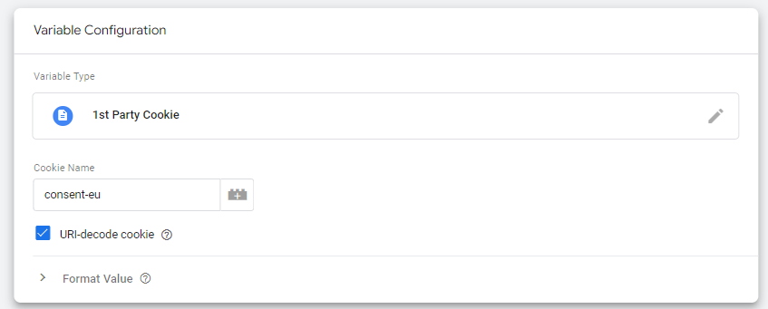
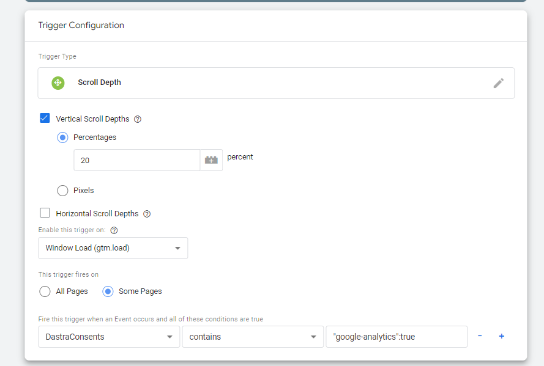
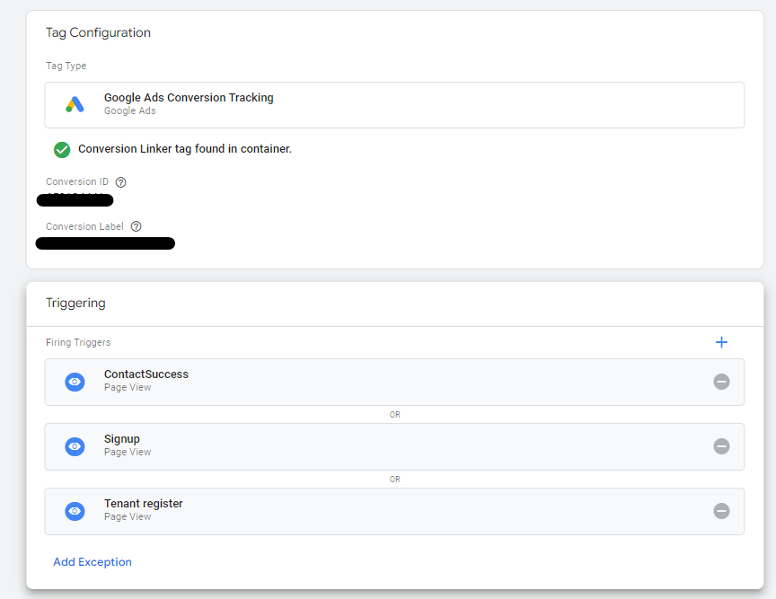
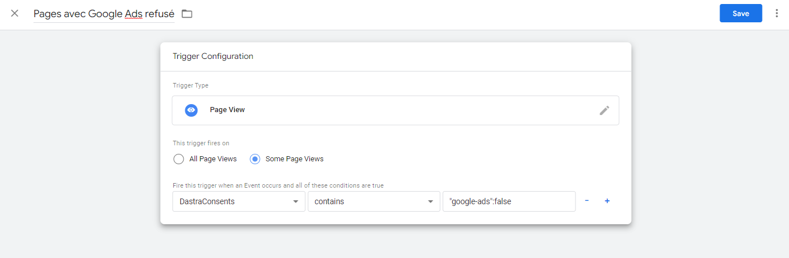
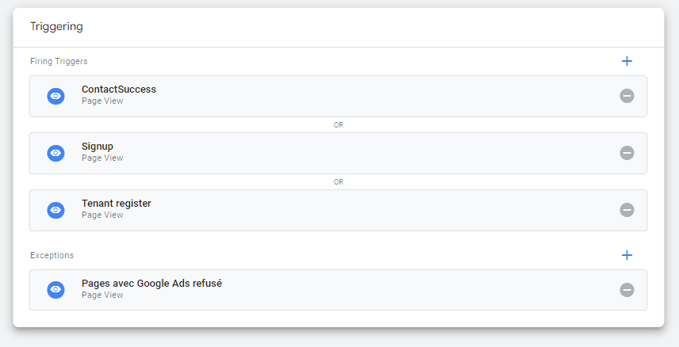

# Google Tag Manager

## Introduction

Google Tag Manager est un outil de taggage performant qui centralise l'ensemble des snippets de code que vous souhaitez intégrer dans votre site (Dastra peut d'ailleurs en faire partie !).\
Cette solution de taggage est très efficace pour implémenter le consentement effectif des cookies car elle ne nécessite pas de redéployer l'intégralité du site web lors de chaque modification de tags.

## Google Consent Mode V2

Dastra supporte nativement le **Google Consent Mode V2**. Cette intégration permet d'envoyer un signal `consent_update` à GTM dès qu'un utilisateur exprime son consentement, afin que les tags Google respectent ce choix avant de déclencher le tracking.

### Étape 1 — Activer le Consent Mode V2 sur le service

Dans la configuration du service concerné (ex. Google Analytics, Google Ads), cochez l'option **"Google Consent Mode V2"**. Une fois activée, la bannière Dastra enverra automatiquement le signal `consent_update` à GTM lors de chaque interaction de l'utilisateur avec le bandeau.

### Étape 2 — Placer le code de consentement par défaut avant GTM

Pour que les tags Google attendent le signal de consentement avant de se déclencher, insérez le snippet suivant **avant** le code d'initialisation de GTM dans votre page :

```html
<script>
  window.dataLayer = window.dataLayer || [];
  function gtag() { dataLayer.push(arguments) }
  gtag('consent', 'default', {
    ad_storage: 'denied',
    analytics_storage: 'denied',
    ad_user_data: 'denied',
    ad_personalization: 'denied',
    wait_for_update: 500
  });
</script>
```

Ce snippet indique aux tags Google qu'ils doivent attendre au maximum 500 ms le signal `consent_update` avant d'exécuter le tracking. Si l'utilisateur accepte les services concernés, la bannière Dastra déclenche automatiquement ce signal et les tags peuvent alors s'exécuter.


Ce snippet doit impérativement être placé **avant** l'initialisation de GTM. S'il est chargé après, les tags Google peuvent se déclencher sans attendre le consentement.


### Installation : en dur ou via GTM ?

Le script Dastra CMP peut être intégré directement dans le code de la page (en dur) ou via GTM. Les deux méthodes sont valides. L'installation en dur est cependant recommandée car elle garantit que le snippet de consentement par défaut (ci-dessus) s'exécute bien avant GTM, ce qui est une condition nécessaire au bon fonctionnement du Consent Mode V2.

### Ajout de nouveaux services et réinitialisation du consentement

Dastra ne re-propose pas automatiquement le bandeau aux visiteurs ayant déjà exprimé un consentement lorsque de nouveaux services sont ajoutés à la configuration. Si vous ajoutez un nouvel outil (ex. un nouvel outil analytics) et souhaitez obtenir le consentement des visiteurs existants pour ce service, vous devez **réinitialiser les consentements** depuis l'interface Dastra. Un bouton dédié dans la configuration du widget permet de forcer l'affichage du bandeau à tous les visiteurs lors de leur prochaine visite, y compris ceux ayant déjà effectué un choix.

## Évènements envoyés à GTM dans le DataLayer

Les évènements suivants sont automatiquement envoyés au dataLayer de google :

| Nom                               | Signification                                                                                  |
| --------------------------------- | ---------------------------------------------------------------------------------------------- |
| dastra:consent:{your-vendor-name} | Cet évènement est envoyé quand l'utilisateur a accepté les cookies de ce fournisseur           |
| dastra:refused:{your-vendor-name} | Cet évènement est déclenché quand l'utilisateur n'a pas consenti aux cookies de ce fournisseur |

Vous pouvez par conséquent déclencher les balises correspondant aux différents fournisseurs configurés dans le widget en utilisant ces deux évènements.

## Exemple

Dans cet exemple, nous allons déclencher le tag Google Optimize au consentement de l'utilisateur.

Dans votre container GTM, créez un déclencheur sur évènement du dataLayer portant le nom de "dastra:consent:google-optimize"

La balise Google Optimize ne se déclenchera alors que sur cet évènement. Voici ce que ça donne dans l'interface de GTM :


## Cas spécifique des "blocking triggers"

Dans certains cas, vous avez besoin de désactiver certaines balises si le consentement n'a pas été donné. L'évènement "dastra:consent:\<nom du service>" ne s'exécutant qu'au moment de l'affichage d'une page, cela peut dans certains cas être insuffisant si vous utilisez des triggers d'interaction dans la page différents tels que des clics sur des éléments de la page, des hauteurs de scroll...

Dans ce cas, il est nécessaire d'effectuer certains paramétrages afin de **lire directement la valeur du consentement stocké dans le cookie de consentement**.

### 1. Créer une variable "DastraConsents"

#### Définir la variable

**Connectez vous** à votre compte Google Tag Manager et allez dans "Variables", puis créez une nouvelle "Variable définie par l'utilisateur".

#### Sélectionnez "1st party cookies"

Nommez votre tag "DastraConsents" par exemple. Dans le champ nom du cookie (Cookie name), entrez le nom du cookie de consentement (par défaut : **consent-eu**).\
Pensez à **sélectionner l'option "URI-decode cookie"**

<figure><figcaption></figcaption></figure>

#### Configurez ensuite votre trigger de cette façon :&#x20;

Dans ce cas, notre balise se déclenche si la profondeur de scroll dans la page est > 20%. Nous voulons que cette balise ne se déclenche que si le service google analytics a été autorisé par l'utilisateur. Voici comment configurer le déclencheur de la balise.

<figure><figcaption></figcaption></figure>

Dans la partie "Some Pages", si vous souhaitez activer la balise uniquement quand l'utilisation d'un service a été consenti, saisissez la formule **DastraConsents contains "{serviceName}":true** (exemple "crisp":true) sans espace

Si vous souhaitez déclencher la balise dans le cas d'un refus, mettez la formule :

**DastraConsents contains "{serviceName}":false** (exemple "google-analytics":false)

#### Cas de plusieurs déclencheurs du même type avec une exception

Si vous avez de nombreux déclencheurs différents pour une même balise, il est également tout à fait possible de créer une exception de cette manière.\
Exemple d'une balise avec plusieurs déclencheurs :&#x20;

<figure><figcaption></figcaption></figure>

Dans ce cas nous souhaitons ajouter une exception, si la balise google ads (google-ads) n'est pas accepté, nous ne voulons pas que la balise se déclenche .

Cliquez sur "**Ajouter une exception**" (Add Exception)


Attention les exceptions ne fonctionnent bien que quand elles sont du même type. Si vos triggers sont du type "Page view", l'exception doit être également de type page view


Créez un déclencheur du même type avec pour nom par exemple "Pages vues avec le service Google Ads refusé explicitement".&#x20;


Si vous souhaitez également ne pas activer la balise par défaut y compris si l'utilisateur n'a pas cliqué sur la modal de consentement (et donc n'a pas de cookies stockant les préférences). Dans ce cas vous pouvez utiliser un trigger avec une négation du type :&#x20;

**DastraConsents Does not contain "google-ads":true**


<figure><figcaption></figcaption></figure>

Cliquez sur "Sauvegarder". Vous devriez avoir ceci :

<figure><figcaption></figcaption></figure>

Enregistrez vos changements et vous devriez constater que vos balises sont bien désactivées sur les pages en question si le consentement n'est pas donné.

### Cas spécifique : rafraîchissement de la page si changement de la configuration des consentements

#### Refus des cookies suite à acceptation :

Dans certain cas, certaines balises ne sont pas correctement nettoyés suite au refus des cookies. Cela se produit notamment dans le cas où un utilisateur décide d'accepter les cookies puis clique de nouveau sur le widget et décide de revenir sur son consentement. Dans la plupart des cas cela ne pose aucun problème car les marqueurs ne sont de toute façon par exécutés plusieurs fois dans la page et donc il n'est plus nécessaire de supprimer les balises scripts insérées dans la page.&#x20;

Dans certaines situations, il est possible que les balises soient toujours actives.

Pour empêcher ce type de problèmes, il est possible de forcer le rafraîchissement de la page ce qui permet de réinitialiser totalement l'ensemble des marqueurs ou sdk javascript chargés par les services.

Il suffit d'insérer le code suivant (en dessous de la balise d'initialisation du widget Dastra si possible)

```html
<script>
// If any service is refused explicitely in the modal
window.addEventListener('dastra:consents:any_refused', function(){
    // Refresh the current page
    location.reload();
})
</script>
```

#### Mise à jour du consentement :

Pour recharger la page quand n'importe quel consentement change d'une façon ou d'une autre, utilisez la fonction _updated_ avec le code suivant :&#x20;

```markup
<script>
window.addEventListener('dastra:consents:updated', function(){
    // Refresh the current page
    location.reload();
})
</script>
```

#### Acceptation totale des traceurs :

Pour recharger la page lors de l'acceptation totale des traceurs (bouton "tout accepter") :&#x20;

```markup
<script>
window.addEventListener('dastra:consents:all_accepted', function(){
    // Refresh the current page
    location.reload();
})
</script>
```

#### &#x20;Acceptation d'un service spécifique :

Pour recharger la page lors de l'acceptation d'un service spécifique :&#x20;

```markup
<script>
window.addEventListener('dastra:consent:<slug du service>', function(){
    // Refresh the current page
    location.reload();
})
</script>
```


