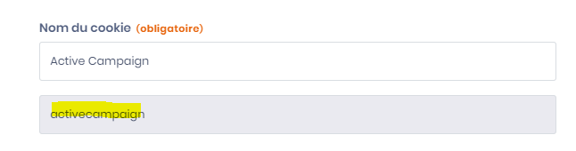

# Gérer le consentement programmatiquement

## Où sont stockés les consentements ?

L'intégralité de la preuve du consentement de l'utilisateur est stocké dans le localStorage du navigateur (La clé de stockage est nommée dastra-consents) au format json. La propagation des consentements en dépend, c'est pourquoi, il n'est pas recommandé de modifier directement les données de cette clé


&#x20;Il n'est pas recommandé de modifier directement les données se trouvant dans le localStorage. Utilisez de préférence le SDK Javascript de dastra.


### Accès au service de consentement

Le service de consentement de dastra est accessible de cette façon

```javascript
<script>
  window.dastra = window.dastra || [];
  window.dastra.push(['cookieReady',function(manager)
  {console.log(manager.consent)}]);
</script>
```

### Liste des méthodes disponibles dans le manageur de consentement

dans manager.consent, vous disposez des méthodes suivantes :

- open() : ouvre le widget de consentement
- close() : ferme le widget de consentement
- getAllConsents() : récupère tous les consentements
- hasConsented() : retourne `true` si l'utilisateur a déjà enregistré un consentement explicite
- getPurposeConsent(purposeLabel:string) : récupère le consentement d'une catégorie de cookies
- setPurposeConsent(purposeLabel:string, consent:bool): définit le consentement pour une catégorie
- getServiceConsent(serviceShortName:string): récupère le consentement d'un service particulier.
- setServiceConsent(serviceShortName:string, consent:bool): définit le consentement d'un élément particulier

### Récupérer la liste des consentements de l'utilisateur (getAllConsents)

Une fois que vous accédez au manager de consentement, il est très aisé de récupérer les consentements de l'utilisateur courant :

```javascript
<script>
dastra = dastra || []
dastra.push(['cookieReady', function(manager){
    // Get the complete consent services list
    var consents = manager.consent.getAllConsents()
}]);
</script>
```

La méthode ci-dessus renvoie la liste de tous les consentements de l'utilisateur

```javascript
[
  {
    "id":"000000-0000000-000000",
    "name": "Service name",
    "purpose": 1,
    "logoUrl": "https://logo-url/img.jpg",
    "privacyPolicyUrl":"",
    "description": "Short description",
    "defaultConsent": true,
    "requiredConsent":true
  },
  ...
]
```

### Interroger les consentements par catégorie (getPurposeConsent/setPurposeConsent)

Les catégories de cookies sont identifiées par les labels suivants :

| Catégorie   | Label          |
| ----------- | -------------- |
| Nécessaires | `Necessary`    |
| Préférences | `Preference`   |
| Analytique  | `Analytical`   |
| Marketing   | `Marketing`    |
| Autre       | `Other`        |
| Non classé  | `Unclassified` |


Utilisez bien les **labels en chaîne de caractères** (ex. `'Analytical'`) et non les valeurs numériques, qui ne sont pas supportées par l'API.


```javascript
<script>
window.dastra = window.dastra || [];
window.dastra.push(['cookieReady',function(manager){
    let consents = manager.consent.getPurposeConsent('Analytical');
    manager.consent.setPurposeConsent('Analytical', false);

    // persist consent in cookies
    manager.consent.save();
}]);
</script>
```

### Manipuler les consentements par service

Pour manipuler les consentements par service, vous aurez besoin du nom simplifié du service disponible dans l'interface de gestion des services de votre widget.


**Comment trouver le nom simplifié du service ?**\
Rendez-vous dans l'interface de gestion des services, en éditant un service, le nom simplifié (slug) du service apparaît en dessous du nom du cookie.




```javascript
<script>
window.dastra = window.dastra || [];
window.dastra.push(['cookieReady',function(manager){
    let cookieService = 'google-analytics';
    let consents = manager.consent.getServiceConsent(cookieService);
    manager.consent.setServiceConsent(cookieService, false);

    // sauvegarder le consentement
    manager.consent.save();
}]);
</script>
```

### Exemple complet

L'exemple suivant montre comment appliquer un refus global par programmation — par exemple lorsque l'utilisateur clique sur un bouton "Tout refuser" personnalisé, ou pour honorer un signal de confidentialité navigateur.

```javascript
<script>
window.dastra = window.dastra || [];
window.dastra.push(['cookieReady', function(manager) {

  // N'agir que si l'utilisateur n'a pas encore fait de choix explicite
  if (!manager.consent.hasConsented()) {

    // Refuser toutes les catégories non essentielles
    manager.consent.setPurposeConsent('Preference',   false);
    manager.consent.setPurposeConsent('Analytical',   false);
    manager.consent.setPurposeConsent('Marketing',    false);
    manager.consent.setPurposeConsent('Other',        false);
    manager.consent.setPurposeConsent('Unclassified', false);

    // Sauvegarder le choix dans le navigateur
    manager.consent.save();
  }

}]);
</script>
```

Il est également possible d'accepter sélectivement certaines catégories — par exemple accepter uniquement l'analytique :

```javascript
<script>
window.dastra = window.dastra || [];
window.dastra.push(['cookieReady', function(manager) {

  manager.consent.setPurposeConsent('Analytical', true);
  manager.consent.setPurposeConsent('Marketing',  false);
  manager.consent.save();

}]);
</script>
```
