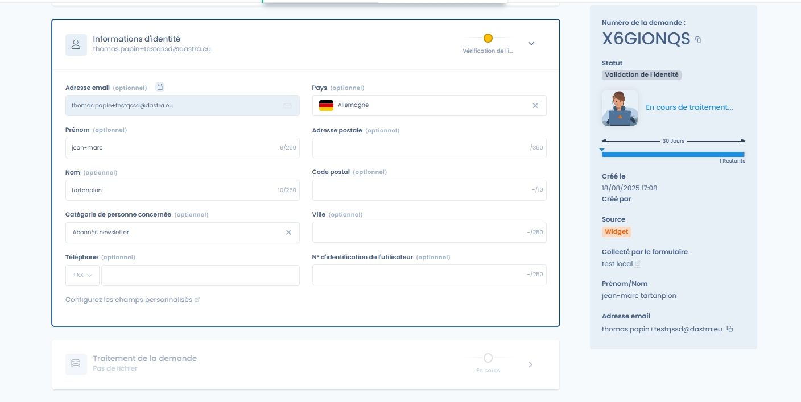
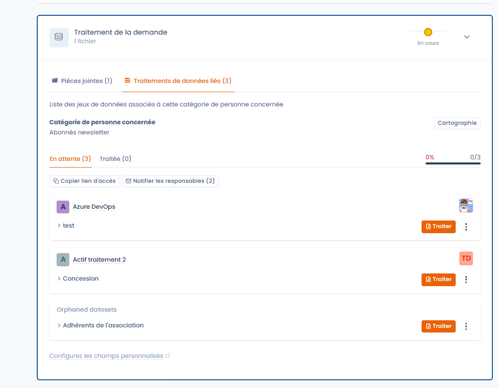
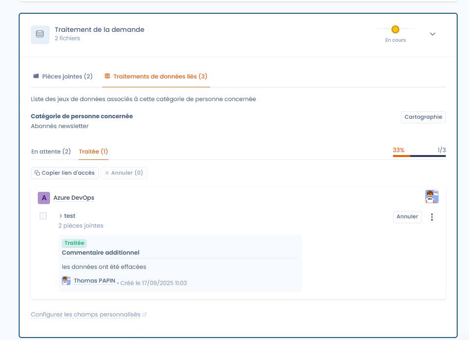
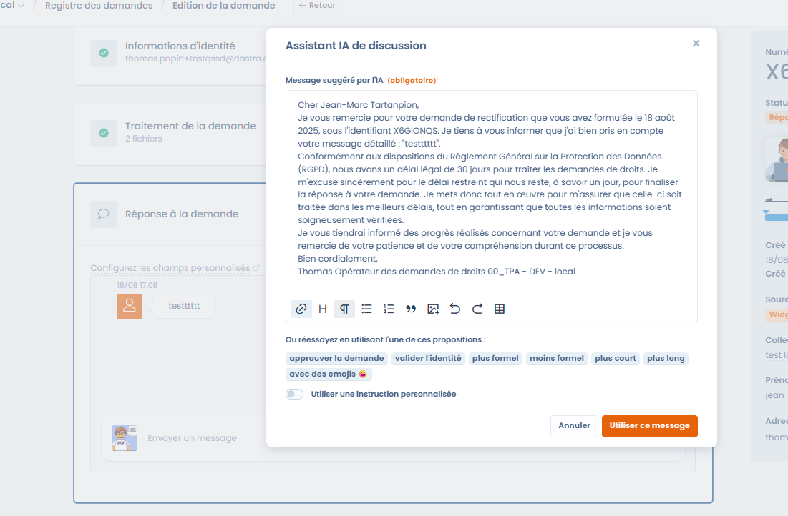

# Édition et traitement des demandes

Dastra vous permet de gérer l’ensemble du cycle de vie d’une demande d’exercice de droits (DSAR).\
Depuis l’interface, vous pouvez :

* **Qualifier la demande** : type de droit concerné, unité organisationnelle, gestion des délais.
* **Vérifier l’identité** du demandeur en complétant ou adaptant les informations collectées.
* **Traiter les données associées** en consultant les jeux de données liés, en téléversant des preuves et en notifiant les responsables.
* **Répondre directement** au demandeur grâce à l’assistant IA, avec traçabilité complète des échanges.

Chaque étape est documentée et historisée, garantissant la conformité légale et une réponse claire aux personnes concernées.

***

### Qualification de la demande

Lorsqu’une demande est enregistrée, elle apparaît dans le registre des demandes.\
Depuis l’écran de **qualification**, vous pouvez :

1. Définir le **type de droit** concerné (accès, rectification, suppression, opposition, etc.).
2. Assigner la demande à une **unité organisationnelle**.
3. Gérer les **délais de traitement** :
   * Délai légal de 30 jours.
   * Possibilité de marquer la demande comme complexe (90 jours).
   * Suspendre temporairement le délai si nécessaire.

<figure><figcaption>
L'interface de gestion d'une demande
</figcaption></figure>

***

### Vérification de l’identité

Dastra permet de vérifier l’identité de la personne à l’origine de la demande.\
Vous pouvez compléter ou modifier les informations collectées via le formulaire initial :

* Adresse email, prénom, nom.
* Données complémentaires : pays, adresse postale, téléphone, identifiant utilisateur, etc.
* Catégorie de personne concernée (ex. abonnés newsletter, clients, salariés).

<figure><figcaption>
Section sur l'identité du demandeur
</figcaption></figure>

***

### Traitement de la demande

L’onglet **Traitement de la demande** regroupe toutes les actions liées à l’exécution.

#### Pièces jointes

Vous pouvez téléverser des fichiers de preuve ou des exports contenant les données du demandeur.\
Ces fichiers pourront ensuite être joints lors de la réponse.

<figure><figcaption>
Ajout de fichiers à la demande
</figcaption></figure>

***

#### Traitements de données liés

Dastra identifie automatiquement les jeux de données associés à la **catégorie de personnes concernées**.\
Chaque jeu de données doit être traité individuellement.

* Statuts disponibles : **En attente** / **Traité**.
* Affichage de l’avancement global (progression en pourcentage).

<figure><figcaption>
Traitement avancé par jeu de données
</figcaption></figure>

***

**Détails d’un jeu de données**

Vous pouvez visualisez directement les liens entre le jeu de données et les actifs en cliquant sur le bouton **Cartographie**

<figure><figcaption>
Visualisez le lien entre la catégorie de personne et le responsable à contacter
</figcaption></figure>

En cliquant sur **Traiter**, vous accédez aux informations détaillées :

* Catégories de données concernées (vie professionnelle, vie personnelle, identité, etc.).
* Base légale et durée de conservation.
* Modalités de suppression après la période de conservation.

<figure><figcaption>
Accès rapide au detail de l'actif
</figcaption></figure>

***

**Marquer un traitement comme traité**

Pour chaque jeu de données :

1. Consultez les informations.
2. Justifiez le traitement effectué (ex. suppression, rectification).
3. Ajoutez, si nécessaire, des fichiers de preuve.
4. Cliquez sur **Marquer comme traité**.

<figure><figcaption>
Interface de traitement de la demande spécifique à l'actif
</figcaption></figure>

Une fois marqué comme traité, le statut est mis à jour et un commentaire peut être ajouté.

<figure><figcaption></figcaption></figure>

***

#### Collaboration et notifications

Vous pouvez notifier automatiquement les responsables des actifs concernés.\
Une fenêtre permet de sélectionner les personnes à avertir par email.

<figure><figcaption>
Notifiez rapidement les propriétaires des actifs
</figcaption></figure>

***

### Réponse à la demande

Une fois le traitement terminé, il est possible de répondre directement au demandeur.

* L’**Assistant IA** vous propose un message conforme et personnalisable.
* Vous pouvez ajuster le ton : plus formel, plus court, plus long, avec emojis.
* Le message final peut être envoyé directement depuis Dastra.

<figure><figcaption>
Echangez des messages avec le demandeur, en utilisant l'IA si vous le souhaitez
</figcaption></figure>

***

### Actions supplémentaires sur une demande

En plus des étapes principales (qualification, vérification, traitement et réponse), Dastra propose un menu **Actions** qui permet d’effectuer des opérations avancées sur une demande.

<figure><figcaption>
Accèdez rapidement aux nombreuses actions supplémentaires disponibles
</figcaption></figure>

Les actions disponibles incluent notamment :

* **Champs personnalisés** : ajouter ou modifier des champs spécifiques pour enrichir la demande.
* **Copier le lien d’accès au portail demandeur** : partager un lien direct avec la personne concernée.
* **Envoyer un mail** : envoyer un message lié à la demande directement depuis la plateforme.
* **Exporter** : exporter les informations de la demande.
* **Règles de workflow** : appliquer ou déclencher une règle d’automatisation.
* **Suspendre la demande** : mettre en pause le délai légal de traitement (voir ci-dessous).
* **Fermer la demande** : marquer manuellement la demande comme terminée.
* **Réinitialiser le jeton d’accès** : recréer un lien sécurisé pour le demandeur.
* **Anonymiser** : effacer les données identifiantes liées à la demande.
* **Déplacer dans la corbeille** : archiver ou supprimer la demande.

***

#### Suspension d’une demande

Dans certains cas, il est nécessaire de **suspendre temporairement** une demande (par exemple en attente d’une vérification d’identité).\
La suspension interrompt le délai légal et celui-ci ne reprend qu’une fois la suspension levée.

<figure><figcaption>
Suspendez une demande dans l'attente d'une réponse du demander par exemple
</figcaption></figure>

* **Date de la suspension** : obligatoire.
* **Justification** : champ libre pour documenter la raison (ex. en attente de pièces justificatives).

Une fois la demande suspendue, l’interface affiche clairement l’état et propose un bouton pour lever la suspension.

<figure><figcaption></figcaption></figure>

Le compteur de jours restants est automatiquement recalculé, en prenant en compte la période de suspension.

***

### Suivi global

Chaque demande conserve l’historique complet :

* Messages échangés.
* Pièces jointes ajoutées.
* Statut et avancement du traitement.

Cela permet de garantir la traçabilité et la conformité en cas de contrôle.
