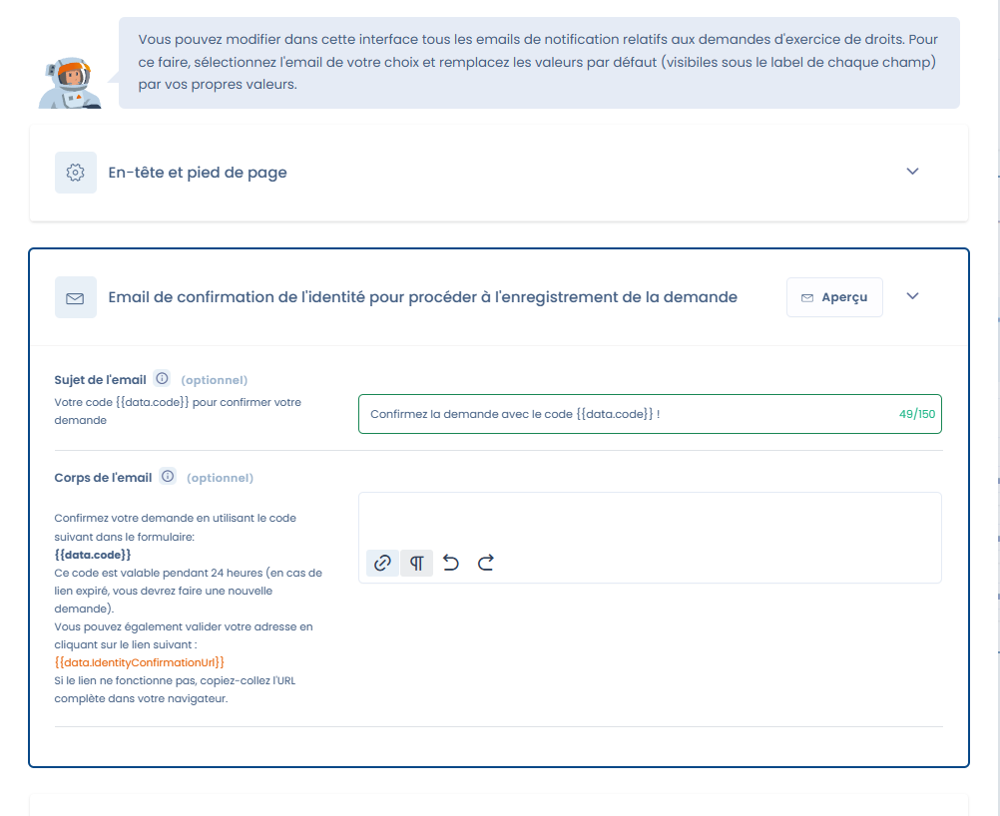
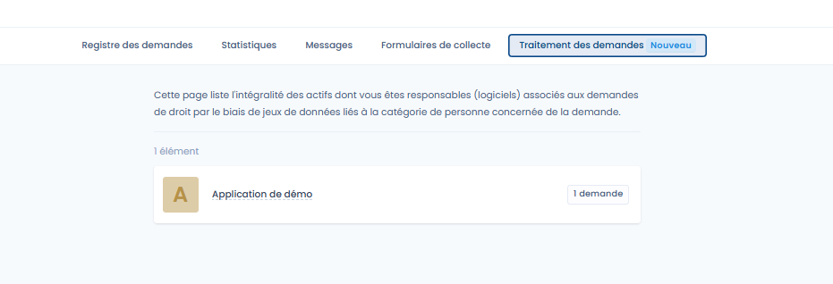

# Fonctionnalités avancées liées aux exercices de droits

### Paramétrage avancé dans l’espace de travail

Les paramètres globaux de l’espace de travail permettent de configurer deux fonctionnalités clés :

#### 1. Règles de purge des demandes

Vous pouvez automatiser la purge des demandes archivées pour respecter vos politiques internes de conservation :

* **Suppression des demandes** : les données associées sont définitivement supprimées.
* **Anonymisation des demandes** : les données personnelles sont rendues anonymes tout en conservant une trace statistique.

Un paramètre optionnel permet de définir l’âge maximum d’une demande avant purge (ex. 180 jours).

<figure><figcaption>
Configuration de la purge des demandes archivées
</figcaption></figure>

***

#### 2. Personnalisation des emails envoyés aux demandeurs

L’interface vous permet de modifier l’ensemble des emails de notification relatifs aux demandes d’exercice de droits si vous ne voulez pas utilisez nos formulations.\
Vous pouvez :

* Adapter les **sujets et corps des messages**.
* Gérer les **traductions multilingues** afin d’envoyer des emails dans la langue choisie par le demandeur.
* Ajouter des langues supplémentaires (par défaut, les emails seront envoyés en anglais si aucune traduction n’est définie).

<figure><figcaption>
Personnalisation des langues
</figcaption></figure>

<figure><figcaption>
Personnalisation d'un message
</figcaption></figure>


Veuillez faire attention à la présence éventuelle de balise (ici : `{{data.code}}`) : cela signifie que des données seront insérées lors de la génération du message et sont nécessaires au bon fonctionnement !&#x20;

Vous pouvez bien entendu ajouter d'autres informations dans le texte (tapez `{{` pour ouvrir la lise des variables disponibles)


***

### Espace demandeur

Chaque personne à l’origine d’une demande accède à un **espace dédié**, sécurisé par un code unique transmis par email.

Depuis cet espace, le demandeur peut :

* Suivre l’avancement de sa demande.
* Consulter les messages envoyés par l’organisation.
* Répondre et échanger directement avec le responsable.
* Télécharger ou déposer des documents justificatifs.

<figure><figcaption>
L'espace d'échange avec le demandeur
</figcaption></figure>

Cet espace permet d’assurer la traçabilité, le suivi et la transparence des échanges, tout en évitant les envois non sécurisés par email classique.

***

### Interface de traitement des demandes (propriétaires d’actifs)

Lorsqu’un utilisateur est défini comme **propriétaire d’un actif** lié à un jeu de données concerné par une demande, il dispose d’une interface dédiée pour traiter ces demandes (il n'aura pas accès à la liste des demandes mais **il doit cependant avec le droit d'acces au référentiel)**.

Fonctionnalités disponibles :

* Visualiser la liste des demandes à traiter.
* Accéder aux jeux de données concernés par la demande.
* Fournir les preuves, copier ou supprimer les données demandées.
* Marquer la demande comme traitée ou non recevable avec un commentaire.

<figure><figcaption>
Liste des demandes à traiter
</figcaption></figure>

<figure><figcaption>
Demandes en attente de traitement
</figcaption></figure>

<figure><figcaption>
Exemple de demande traitée
</figcaption></figure>

***

### Actions supplémentaires dans les workflows automatiques

En complément de ces fonctionnalités et pour vous permettre d'aller encore plus loin dans vos capacités de traitement des demandes d'exercices de droit, nous avons mis en place des actions spécifiques que vous pouvez configurer selon vos règles de gestion !

<figure><figcaption>
Actions spécifiques aux demandes de droit
</figcaption></figure>


### Pour plus d'informations sur les workflows, veuillez vous référer à la [documentation dédiée](../settings/workflow-rules.md)


### En résumé

Ces fonctionnalités avancées complètent le cycle classique de gestion des droits en apportant :

* Plus de **contrôle sur la conservation et l’anonymisation** des demandes.
* Une **meilleure communication** avec les demandeurs via un espace sécurisé.
* Une **interface claire et efficace pour les responsables d’actifs**, qui peuvent intervenir directement sur les demandes dont ils sont en charge.
* Des actions spécifiques pour automatiser les traitements de vos demandes
