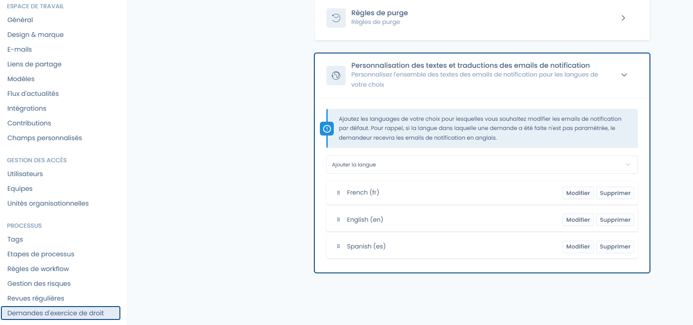
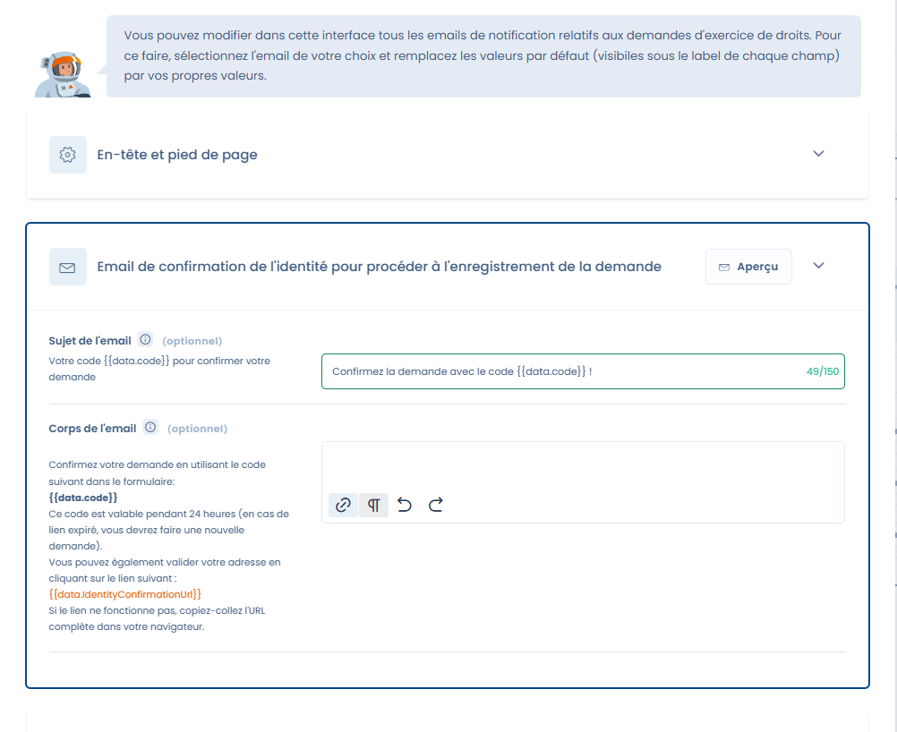

# Personnalisation des emails envoyés aux demandeurs

L’interface vous permet de modifier l’ensemble des emails de notification relatifs aux demandes d’exercice de droits si vous ne voulez pas utilisez nos formulations.\
Vous pouvez :

* Adapter les **sujets et corps des messages**.
* Gérer les **traductions multilingues** afin d’envoyer des emails dans la langue choisie par le demandeur.
* Ajouter des langues supplémentaires (par défaut, les emails seront envoyés en anglais si aucune traduction n’est définie).

<figure><figcaption>
Personnalisation des langues
</figcaption></figure>

<figure><figcaption>
Personnalisation d'un message
</figcaption></figure>


Veuillez faire attention à la présence éventuelle de balise (ici : `{{data.code}}`) : cela signifie que des données seront insérées lors de la génération du message et sont nécessaires au bon fonctionnement !&#x20;

Vous pouvez bien entendu ajouter d'autres informations dans le texte (tapez `{{` pour ouvrir la liste des variables disponibles)

