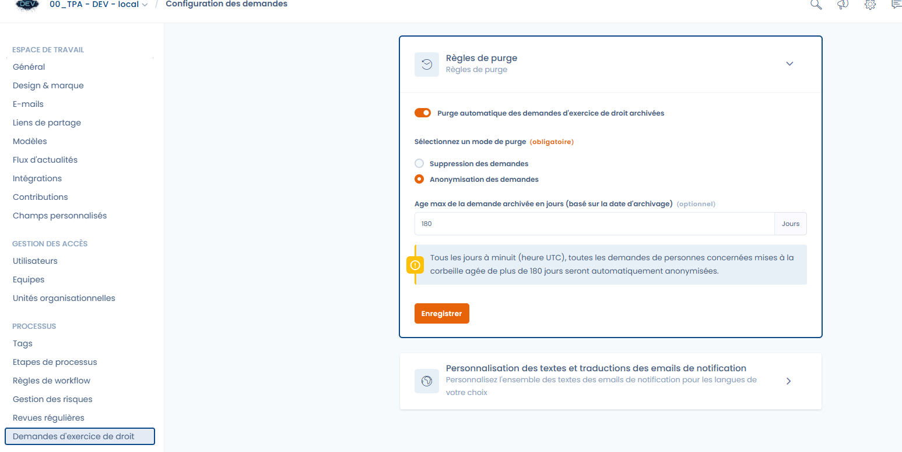

# Règles de purge des demandes


Vous devez disposer des **droits d’administrateur** sur l'espace de travail pour accéder à cette fonctionnalité.


Vous pouvez **automatiser la purge des demandes mises à la corbeille** afin de respecter vos politiques internes de conservation et notamment le principe de limitation de la durée de conservation prévu par le RGPD.

Cette fonctionnalité vous permet de définir :

* le **périmètre** des demandes concernées par la purge,
* le **mode de traitement** (suppression ou anonymisation),
* et la **durée maximale de conservation** avant déclenchement automatique.

***

#### 🔍 Critères de sélection des données

La purge s’applique **uniquement aux demandes présentes dans la corbeille**.\
Les demandes encore en cours de traitement, clôturées ou archivées **ne sont pas concernées**.

Chaque nuit, Dastra vérifie les demandes selon leur **date de mise à la corbeille**.\
Si une demande dépasse la durée maximale définie (par exemple 180 jours), elle devient éligible à la purge.

**Sont donc concernées :**

* Les demandes **placées dans la corbeille** depuis plus longtemps que la durée configurée ;
* Tous les types de demandes (accès, suppression, opposition, etc.) ;
* Quelle que soit leur origine (portail, API, import).

***

#### ⚙️ Modes de purge disponibles

**1. Suppression des demandes**

Les demandes concernées sont **définitivement supprimées** du système.\
Cette action est **irréversible**.

Effets :

* Les données personnelles et le contenu des échanges sont supprimés de manière définitive ;
* Les pièces jointes et fichiers associés sont effacés ;
* Les logs d’audit conservent uniquement des métadonnées techniques (horodatage, utilisateur, opération).

***

**2. Anonymisation des demandes**

Les demandes restent visibles dans Dastra mais **toutes les données personnelles** qu’elles contiennent sont **remplacées par des valeurs fictives**.

Cette option permet de conserver une **trace statistique non identifiable** pour vos rapports et indicateurs.

Concrètement :

* Les champs contenant des données personnelles (nom, prénom, email, identifiant, message, etc.) sont remplacés par des valeurs génériques (`John DOE`, `anonymized@example.com`, `XXXXXX`) ;
* Les pièces jointes sont supprimées ;
* Les métadonnées non identifiantes (type de demande, statut, dates) sont conservées pour le reporting.
* Les journaux d'activité (logs) associés sont purgés

> 💡 **Objectif :** permettre le suivi statistique tout en garantissant la suppression de toute information identifiable.

<figure><figcaption></figcaption></figure>

***

#### ⏱️ Définir la durée avant purge

Un paramètre vous permet de définir l’**âge maximum d’une demande dans la corbeille** avant purge (exemple : 180 jours).\
Ce délai est calculé à partir de la **date de mise à la corbeille**.

Chaque nuit à minuit (UTC), Dastra récupère les demandes concernées et exécute automatiquement la purge selon le mode sélectionné.

***

#### 🧩 Exemple de configuration

* **Mode de purge :** Suppression des demandes
* **Durée maximale :** 180 jours (6 mois)

\
➡️ Chaque nuit, toutes les demandes mises à la corbeille depuis plus de 180 jours seront automatiquement supprimées.

***

#### ✅ Bonnes pratiques

* Définissez un délai de conservation cohérent avec votre politique interne de conservation des demandes (par exemple 5 ans ou 1825 jours).
* Utilisez la **suppression** pour un effacement complet.
* Utilisez **l’anonymisation** si vous souhaitez conserver des statistiques d’activité.
* Vérifiez que la purge automatique est **activée** pour que le traitement s’exécute chaque nuit.

