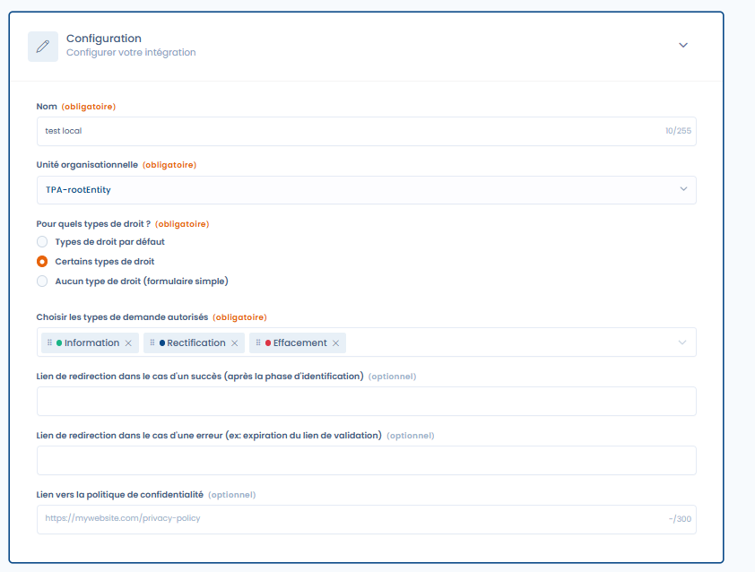
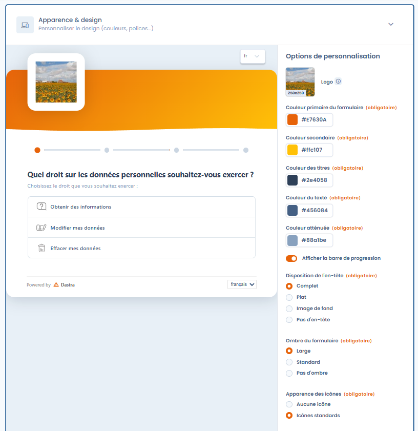
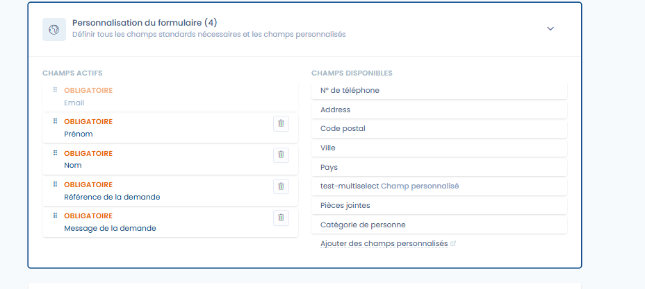
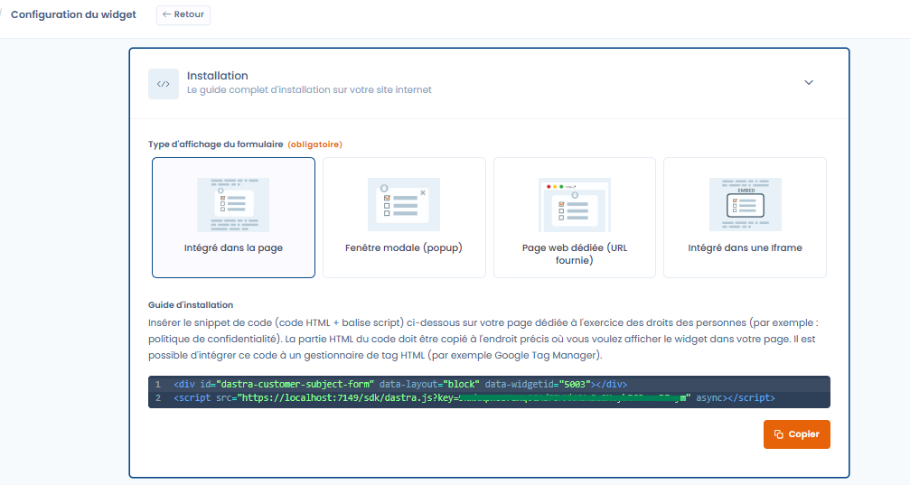
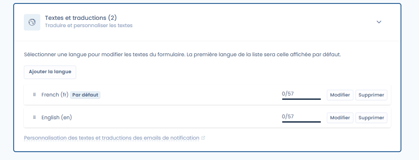
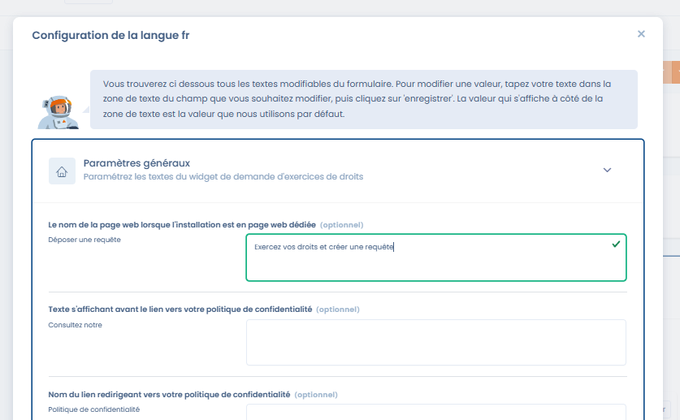

# Implémenter un widget d’exercice des droits

## Implémenter un widget d’exercice des droits

Le widget Dastra vous permet d’ajouter un formulaire d’exercice des droits directement sur votre site web.\
Il est totalement personnalisable et offre :

* **Configuration générale** : choix des droits, redirections, politique de confidentialité.
* **Personnalisation visuelle** : couleurs, logos, images de fond, icônes, barre de progression.
* **Champs personnalisés** : ajoutez vos propres champs pour collecter les informations nécessaires.
* **Modes d’intégration** : insertion dans une page, popup, iframe ou URL dédiée.
* **Multilingue** : traduisez et adaptez tous les textes du widget.

***

### Workflow d’intégration

Voici le schéma général du fonctionnement d’un widget d’exercice de droits dans Dastra :

Ce diagramme illustre le processus :

1. La personne concernée soumet une demande via le widget.
2. La demande est transmise et enregistrée dans Dastra.
3. Vous êtes notifiés et pouvez la qualifier et la traiter dans la plateforme.
4. La personne concernée reçoit une réponse via le portail demandeur.

#### Vidéo tutoriel

Voici une vidéo tutorielle qui montre comment mettre en place un widget de collecte de demandes de droits.\
⚠️ Attention : la vidéo n’est pas totalement à jour visuellement, mais reste utile pour comprendre les grandes étapes.



***

### Configuration générale

Lors de la création d’un widget, vous définissez :

* Le **nom du widget** et l’**unité organisationnelle** concernée.
* Les **types de droits disponibles** (information, rectification, effacement, etc.).
* Les liens de redirection (succès, erreur, politique de confidentialité).

<figure><figcaption>
Configuration du widget
</figcaption></figure>

***

### Personnalisation de l’apparence

Vous pouvez adapter l’apparence du formulaire à votre charte graphique.

Options disponibles :

* **Logo** et **image de fond**.
* Couleurs : primaire, secondaire, titres, texte, atténuée.
* Disposition de l’en-tête : complet, plat, image de fond ou pas d’en-tête.
* Ombre du formulaire : large, standard ou aucune.
* Apparence des icônes.
* Affichage de la barre de progression.
* CSS personnalisé (pour les "experts")

<figure><figcaption>
Adaptez l'apparence du widget
</figcaption></figure>

***

### Personnalisation des champs

Vous pouvez choisir les champs qui apparaissent dans le formulaire.

* Certains champs sont obligatoires (email, prénom, nom, référence de la demande, message).
* Vous pouvez ajouter des champs facultatifs (téléphone, adresse, code postal, ville, pays, etc.).
* Possibilité d’ajouter vos propres **champs personnalisés**.

<figure><figcaption>
Personnalisez les champs disponibles dans le widget
</figcaption></figure>

***

### Installation du widget

Le widget peut être intégré de différentes manières :

* **Intégré dans la page** (snippet HTML).
* **Fenêtre modale (popup)**.
* **Page web dédiée** (URL fournie).
* **Intégré dans une iframe**.

Le code fourni est un snippet HTML + script JavaScript à insérer sur votre site ou dans un gestionnaire de tag (par exemple Google Tag Manager).

<figure><figcaption>
Guide d'installation
</figcaption></figure>

***

### Textes et traductions

Le widget est multilingue : vous pouvez ajouter plusieurs langues et personnaliser les traductions.\
La première langue de la liste sera affichée par défaut.

<figure><figcaption>
Personnalisation des textes du widget
</figcaption></figure>

Pour chaque langue, vous pouvez modifier les textes affichés :

* Nom de la page (en cas d’intégration en page dédiée).
* Messages avant les liens de politique de confidentialité.
* Textes de boutons ou d’instructions.

<figure><figcaption>
Changez facilement une partie du texte
</figcaption></figure>

***

### Résultat côté utilisateur

Le widget ainsi configuré permet aux personnes concernées de sélectionner le type de droit qu’elles souhaitent exercer et de soumettre facilement leur demande.\
Le formulaire s’adapte automatiquement à la configuration (langues, apparence, champs).

***
