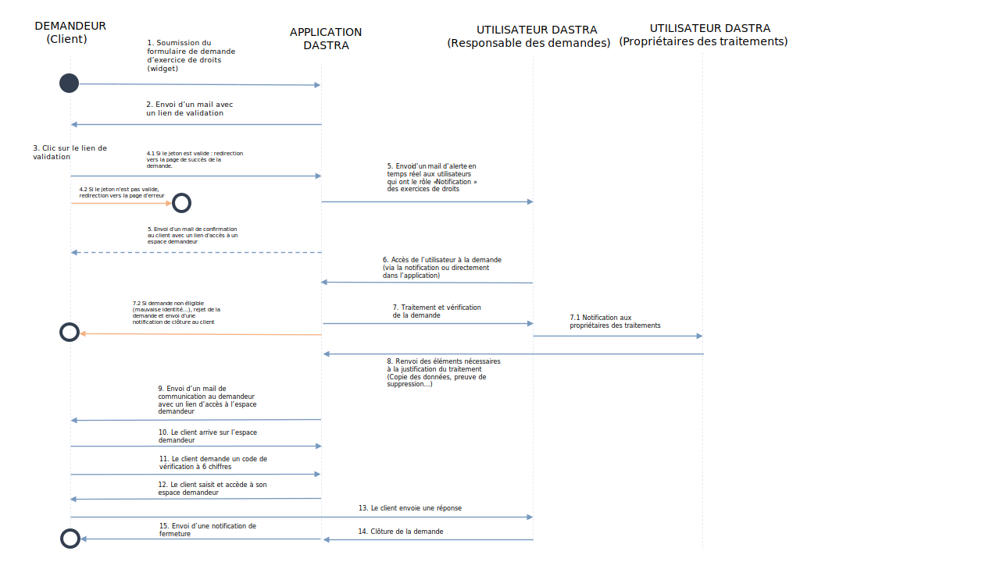

# Formulaire de collecte de demandes

## Processus

Le processus de demande d'exercice de droits via le widget se déroule comme **sur le schéma ci-dessous** :

## Mise en place

DASTRA vous permet de mettre un place un formulaire d'exercice des droits directement sur votre site, à l'instar de ce qui est fait sur sa [politique de confidentialité](https://www.dastra.eu/fr/privacy-policy) :&#x20;

 (1).png>)

En cliquant sur le bouton "Accéder au service en ligne", une fenêtre apparaît, permettant à l'internaute le désirant d'effectuer sa demande :

.png>)

Pour mettre en place un tel formulaire, il suffit de paramétrer votre widget en utilisant notre fonctionnalité d'intégration directement dans le module.&#x20;

Un **extrait de code HTML** sera généré que vous aurez à placer à l'endroit où vous souhaitez voir le formulaire apparaître.&#x20;

Pour en savoir plus sur comment implémenter un formulaire d'exercice des droits sur votre site internet, [contactez-nous](https://www.dastra.eu/fr/contact?type=quote).

## Configurer un widget de collecte des demandes de droit.

Voici un tutoriel vidéo vous permettant de suivre les étapes de mise en place d'un widget de collecte des demandes de droit.



