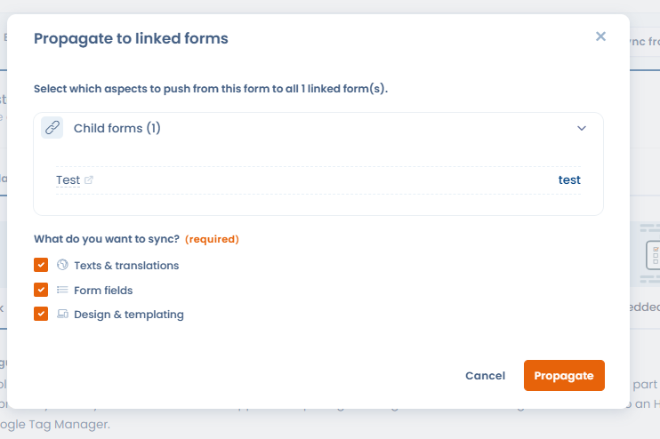

# Synchronisation des widgets

Lorsque plusieurs widgets de demande d'exercice de droits partagent une configuration similaire (mêmes champs, mêmes textes), il est possible de les **synchroniser**. Désignez un widget comme **source**, associez-y des widgets enfants, puis propagez toute modification en un seul clic vers l'ensemble des widgets liés.

Cette fonctionnalité est particulièrement utile pour les organisations qui gèrent plusieurs variantes d'un même widget (par exemple, un widget de suppression de compte décliné par application ou par marché géographique).

## Synchroniser depuis un autre widget

Pour récupérer la configuration d'un widget existant vers le widget courant, utilisez le bouton **"Sync from..."** depuis la page de personnalisation du widget.

<figure><figcaption>
Le bouton "Sync from..." permet de synchroniser la configuration depuis un widget source
</figcaption></figure>

Une fenêtre s'ouvre pour choisir le widget source et sélectionner les éléments à synchroniser : textes et traductions, champs de formulaire, design et gabarit.

<figure><figcaption>
Sélection du widget source et des éléments à importer
</figcaption></figure>

## Propager les modifications vers les widgets enfants

Une fois vos modifications effectuées sur le widget source, propagez-les en un clic à tous les widgets liés via **"Propager vers les widgets liés"**.

<figure><figcaption>
Propagation des modifications du widget source vers tous ses enfants (textes, champs, design)
</figcaption></figure>
