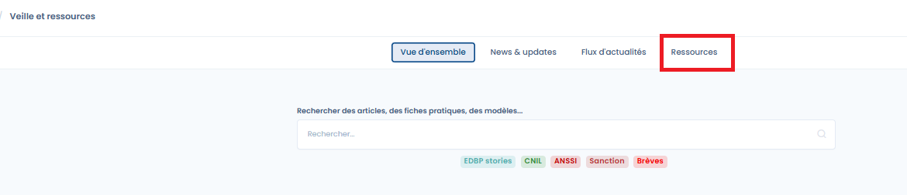
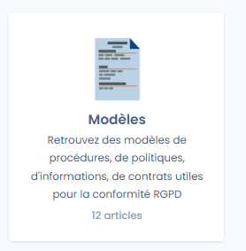
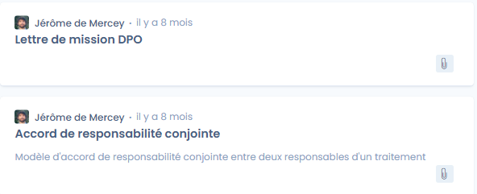

# Modèles de documents

Vous cherchez des modèles de documents ? C'est par ici ! :thumbsup:

Pour accéder aux ressources documentaires, il faut se rendre dans le module "Veille et ressources" et cliquer sur "Ressources"

<figure><figcaption>
Accès aux ressources
</figcaption></figure>

Vous n'avez plus qu'à sélectionner les modèles

<figure><figcaption></figcaption></figure>

Les modèles sont disponibles en téléchargement au format Word.&#x20;

<figure><figcaption>
Exemples de modèles de documents
</figcaption></figure>
