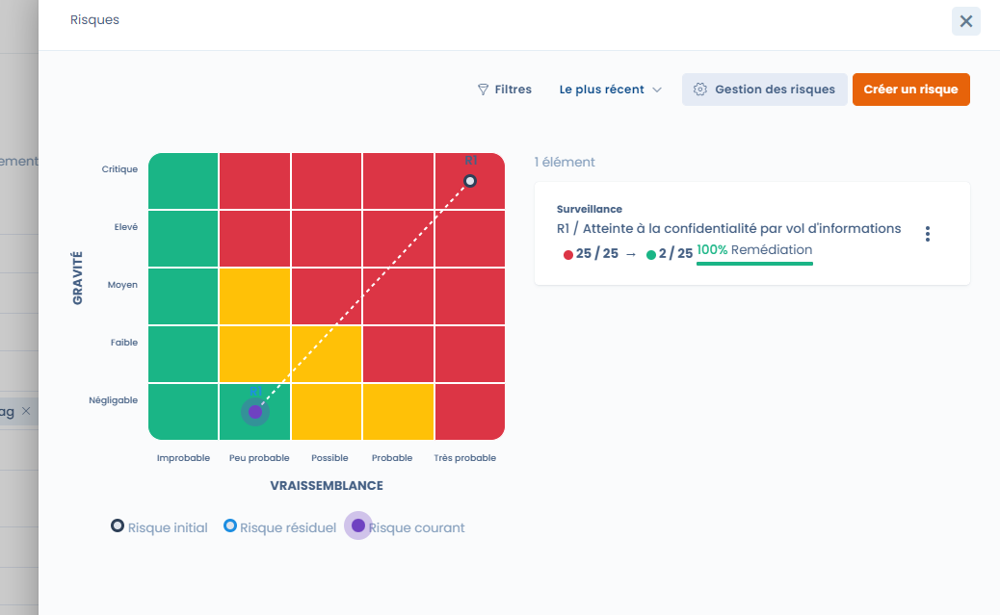

# 1. Identifier

Lors de la création d'un nouveau risque, vous êtes invités à renseigner les éléments d'identification.

Positionnez votre risque dans une unité organisationnelle (par défaut, elle reprendra celle du traitement si le risque est attaché à un traitement).

Définissez un propriétaire pour chaque risque. Il aura la responsabilité de suivre et piloter le risque.

Et choisissez un type de risque.

> Dastra vous permet de constituer un référentiel de type de risque. Ce référentiel vous permet de gagner du temps et de réutiliser les types de risque sur d'autres actifs.

Votre type de risque n'est pas dans le référentiel, pas de problème, ajoutez le directement depuis cette interface.

#### Ajouter un type de risque 

En créant un type de risque, vous avez la possibilité de réutiliser ces informations pour générer ce type de risque sur autant d'actifs que vous le souhaitez. Par exemple, vous souhaitez identifier le même risque sur plusieurs de vous sous-traitants. Il vous suffira de renseigner une seule fois ce type de risque et de le réutiliser pour chaque sous-traitant ou prestataire.

**Identification du type de risque**

Un risque peut se définir comme étant la combinaison entre un évènement redouté et une ou plusieurs menaces de réalisation de cet évènement redouté. Il se mesure en termes de vraisemblance (probabilité d'occurrence) et de gravité (impact).

**Evènement redouté**

Pour ajouter un type de risque, il est nécessaire d'identifier l'évènement redouté et ses impacts.\
L'évènement redouté est la conséquence de l'occurrence d'un risque.

Classiquement, on évoque 3 types d'évènements redoutés en matière de sécurité des systèmes d'information et/ou de vie privée. Le RGPD nous invite d'ailleurs à [garantir la sécurité](https://eur-lex.europa.eu/legal-content/FR/TXT/?uri=CELEX%3A32016R0679#d1e3428-1-1) des données personnelles selon ces trois axes.

* L'atteinte à la **confidentialité**
* L'atteinte à la **disponibilité**
* L'atteinte à l'**intégrité**

Avec Dastra, les possibilités de créer des évènements redoutés sont illimitées. Vous pouvez donc créer vos propres catégories d'évènements redoutés. On peut imaginer également un accident industriel, iun acte de corruption etc.\
Dans notre approche, nous nous concentrerons sur les risques sur les systèmes d'information dans un premier temps.

Pour chaque évènement redouté, vous êtes invités à **préciser les impacts** que celui-ci va engendrer sur la situation.\
\
&#xNAN;_&#x44;ans la description de l'évenement redouté, précisez les impacts_.

Les impacts peuvent varier selon le contexte et l'objet dont on traite le risque. Pour les risques liés aux données personnelles, les impacts vont consister en des préjudices sur les personnes (usurpation d'identité, accusation à tort, disparition de l'Etat civil...).

**Menaces**

Pour chaque évènement redouté, il convient d'identifier la ou les menaces qui vont permettre sa réalisation.

Un scénario doit être imaginé. Vous pouvez vous aider des évènements passés ou de votre l'imagination pour anticiper ce qui pourrait arriver.

> Dastra propose des modèles de référentiels en particulier pour les menaces génériques. Pour les importer, il faut chercher les menaces génériques dans la bibliothèque en choisissant la source "modèles".

**Sources**

Les sources de risques sont les éléments qui vont permettre la réalisation de l'évènement redouté (qui ou quoi pourrait être à l’origine de l'évènement redouté ?)

Pour cela il faut prendre en compte les sources humaines : par exemple un administrateur informatique, un cyberattaquant, un Etat étranger... et non humaines : par exemple l'eau, un séisme, un virus informatique non ciblé.

**Points de contrôle**

Pour chaque risque, il convient de déterminer les mesures existantes ou prévues qui vont permettre de traiter le risque. Ces points de contrôle peuvent être de plusieurs types : des mesures de sécurité, des mesures techniques, des mesures organisationnelles ou encore des mesures juridiques ou fonctionnelles.

Dans les risques liés à la sécurité des systèmes d'information, des points de contrôle standards sont identifiés dans la norme ISO 27001. Le guide sécurité des données de la CNIL propose également un certain nombre de points de contrôles dans le domaine de la protection des données personnelles.

**Préévaluation**

Dans un type de risque, vous pouvez inclure une évaluation du risque. Cette évaluation sera reprise dans le risque final.\
Préévaluez vous permet de gagner du temps sur les risques futurs que vous aurez sur cette base.

L'évaluation se fait en termes de probabilité et d'impact selon l'échelle que vous aurez paramétré.

Vous pouvez identifier le risque initial : c’est le risque théorique lié à l’activité. On peut aussi le définir comme le risque initial, avant toute mesure de maîtrise (contrôle interne).

Vous pouvez également identifier le risque résiduel : c’est le risque subsistant après la mise en œuvre de dispositifs de maîtrise (les points de contrôles notamment).

<figure><figcaption>
La matrice de risques permet de visualiser probabilité et impact
</figcaption></figure>

 

