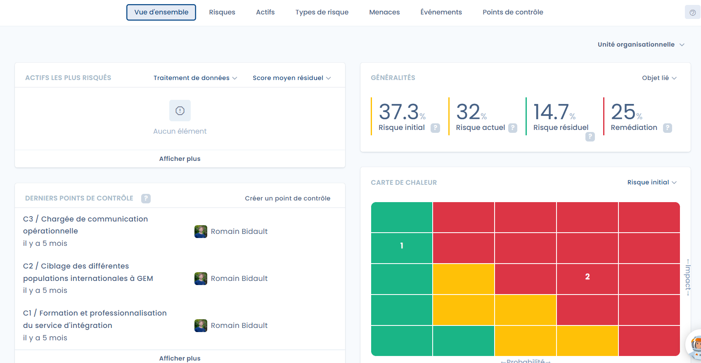

# 4. Contrôler

Une fois le risque traité, il est nécessaire de s'assurer de son suivi dans le temps et, en particulier, si des évolutions apparaissent dans le temps.

<figure><figcaption>
Le tableau de bord des risques permet de suivre l'évolution dans le temps
</figcaption></figure>
