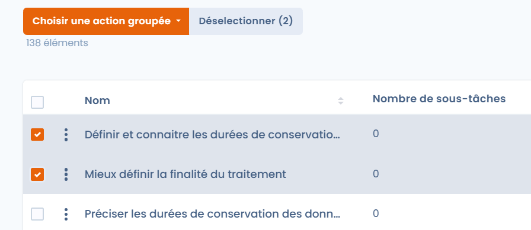
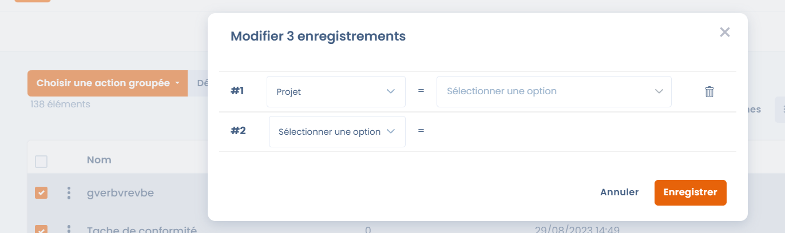
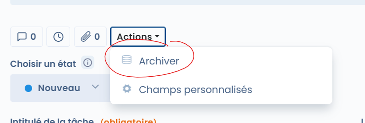
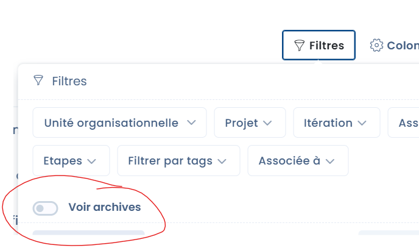
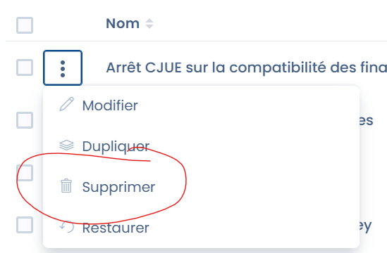
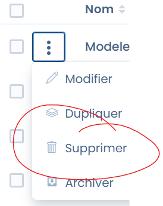
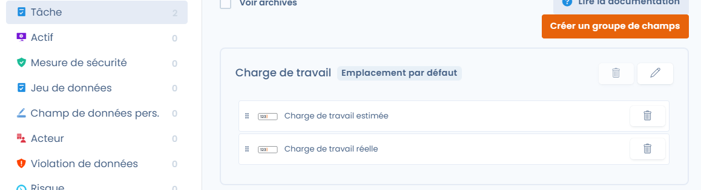
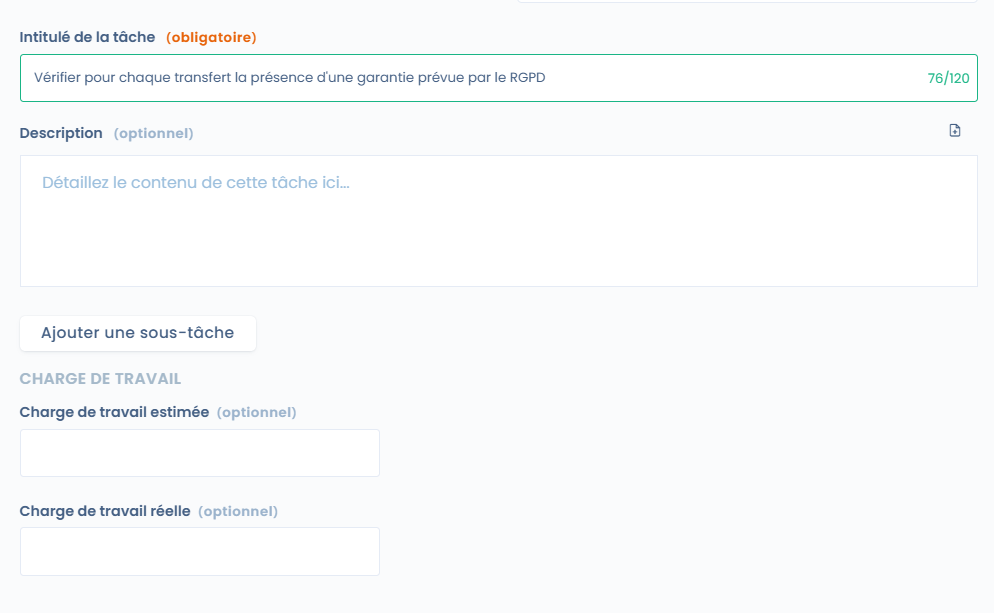

# Questions fréquentes

## Attacher plusieurs tâches à un projet

Pour attacher plusieurs à un projet en une seule action, vous devez passer par les actions groupées et la modification des champs.

Commencez par sélectionner les tâches que vous voulez attacher à un projet.

<figure><figcaption></figcaption></figure>

Cliquez sur "Actions groupées"

Cliquez sur "Modifier les champs"

Sélectionnez "Projet" et le projet souhaité.&#x20;

<figure><figcaption></figcaption></figure>

Validez les changements en enregistrant.

## Comment supprimer une tache ?&#x20;

Pour supprimer une tache, vous devez d'abord l'archiver puis la supprimer des archives.&#x20;

<figure><figcaption>
Bouton Archiver
</figcaption></figure>

Ensuite, afficher les archives des tâches

<figure><figcaption></figcaption></figure>

Et supprimer les tâches

<figure><figcaption></figcaption></figure>

Vous pouvez également supprimer la tache directement depuis la vue tableau

<figure><figcaption></figcaption></figure>

## Indiquer la charge de travail sur la tâche

Vous pouvez indiquer la charge de travail estimée et réalisée sur Dastra. Cela peut être utile pour identifier dans votre bilan le temps passé à la réalisation des tâches.&#x20;

Pour ajouter la charge de travail, vous devrez ajouter des champs personnalisés sur les tâches.&#x20;

&#x20;

<figure><figcaption></figcaption></figure>

Vous pourrez ensuite exporter ces valeurs dans un classeur ou les retrouver via vos filtres de tâches.

<figure><figcaption>
Exemple de champs de charge de travail
</figcaption></figure>

## Comment relancer une tache ?

Vous pouvez renvoyer une notification de tache à un utilisateur en le mentionnant dans une discussion.&#x20;

