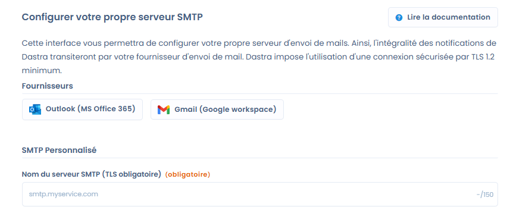
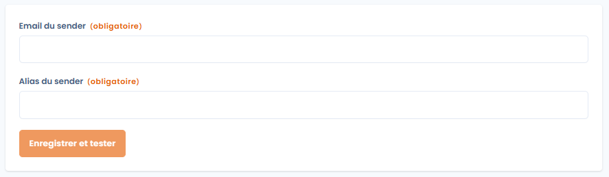
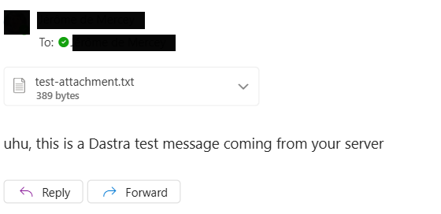

# Intégration des fournisseurs externes (Office 365 / Gmail)

### 📌 Objectif

Par défaut, toutes les notifications envoyées par Dastra proviennent de l’adresse **`no-reply@dastra.eu`**.\
Grâce à l’intégration avec vos fournisseurs de messagerie externes (Office 365 ou Gmail), vous pouvez configurer l’envoi via **vos propres adresses email**, ce qui vous permet de :

* Renforcer la confiance auprès de vos destinataires (mails envoyés avec votre domaine).
* Centraliser vos journaux d’envoi et de délivrabilité directement dans votre infrastructure de messagerie.
* Gérer vos propres règles de sécurité, conformité et archivage.

***

### 📩 Périmètre des mails concernés

Cette configuration concerne **tous les emails de notification envoyés par Dastra dans votre organisation**, par exemple :

* Notifications de nouvelles tâches ou demandes.
* Invitations et rappels.
* Alertes de conformité.
* Suivi des demandes d'exercice des droits, incidents, workflows, etc.

👉 En d’autres termes, **tous les mails sortants remplaceront `no-reply@dastra.eu` par l’adresse configurée**.

> ⚠️ **Attention** : cela concerne tous les mails adressés depuis l'organisation. **Tous les espaces de travail seront concernés.**

***

### ⚙️ Configuration de l’intégration

#### Étape 1 : Accéder à l’intégration fournisseur et autoriser la connexion

* Rendez-vous dans **Paramètres de l'espace de travail > Intégrations**.
* Cliquez sur **Ajouter une configuration** pour Office 365 ou Gmail.

Vous pouvez également accéder à la configuration depuis cette URL : [https://app.dastra.eu/general-settings/smtp](https://app.dastra.eu/general-settings/smtp)

<figure><figcaption></figcaption></figure>

* Choisissez le fournisseur que vous souhaitez utiliser :
  * **Microsoft 365 (Office 365)**
  * **Google (Gmail / Google Workspace)**
* Lors du premier ajout, Dastra vous demandera d’**autoriser la connexion** :
  * Une fenêtre s’ouvre pour vous authentifier via **OAuth** auprès de Microsoft ou Google.
  * Vous devez utiliser un compte disposant des droits suffisants (ex. compte avec rôle administrateur ou autorisation d’envoyer au nom du domaine).
* Une fois l’authentification réussie, Dastra confirmera la connexion et affichera l’écran de configuration du sender.

⚠️ **Attention** : cette étape est indispensable pour que Dastra ait l’autorisation d’envoyer des emails via votre fournisseur. Sans cela, la configuration du sender ne sera pas effective.

#### Étape 2 : Renseigner les informations demandées

<figure><figcaption></figcaption></figure>

Deux champs obligatoires doivent être renseignés :

1. **Email du sender**
   * L’adresse email qui sera utilisée comme expéditeur des notifications (exemple : `notifications@votredomaine.com`).
2. **Alias du sender**
   * Le nom affiché comme expéditeur (exemple : `Equipe Conformité - Votre société`).

Une fois complété, cliquez sur **Enregistrer et tester** pour valider la configuration.

#### Étape 3 : Vérification et tests

* Dastra effectuera un test d’envoi pour confirmer la validité de l’adresse configurée.
* Vérifiez dans votre boîte de réception et vos journaux Office 365 / Gmail que le message test a bien été délivré.

Le message ressemble à celui-ci :&#x20;

<figure><figcaption></figcaption></figure>

***

### ✅ Points importants à retenir

1. **Responsabilité des logs**
   * En utilisant votre propre fournisseur (Office 365 ou Gmail), **vous êtes maître de vos journaux d’envoi**.
   * Les informations liées aux délivrances, refus ou blocages d’emails ne sont plus visibles par les équipes de Dastra.
2. **Gestion de la réputation IP / domaine**
   * C’est votre infrastructure (Office 365 ou Gmail) qui porte la responsabilité de la bonne délivrabilité.
   * Assurez-vous que :
     * Vos enregistrements SPF / DKIM / DMARC sont correctement configurés.
     * Votre réputation d’expéditeur est bonne.
     * Votre domaine et votre IP ne sont pas listés en spam.
3. **Impact sur vos destinataires**
   * Les notifications apparaîtront comme envoyées directement par votre organisation.
   * Cela facilite la reconnaissance et réduit le risque de confusion avec des adresses génériques.

***

### 🔒 Bonnes pratiques de sécurité

* Limitez les adresses utilisées pour l’expédition (ex. `no-reply@votredomaine.com` ou `notifications@votredomaine.com`).
* Activez l’authentification multi-facteurs sur les comptes utilisés pour l’intégration.
* Surveillez régulièrement vos journaux d’envoi dans Office 365 / Gmail pour identifier toute anomalie.

***

👉 Une fois l’intégration activée, **Dastra n’utilisera plus `no-reply@dastra.eu`** : tous vos mails de notifications transiteront par votre fournisseur configuré.

***

### 🔧 Questions techniques pour les administrateurs IT

Cette section répond aux questions fréquentes posées par les équipes IT et sécurité lors de la mise en place de l’intégration Office 365.

#### Quel modèle d’authentification est utilisé ?

L’intégration Office 365 utilise un consentement de type **application** (consentement administrateur global), et non un consentement délégué au nom d’un utilisateur. Aucune licence Exchange active par utilisateur n’est requise pour le fonctionnement de l’intégration.

#### Quels sont les scopes Microsoft Graph demandés ?

Dastra demande les permissions suivantes lors du consentement OAuth :

| Permission           | Usage                                                              |
| -------------------- | ------------------------------------------------------------------ |
| `Mail.Send`          | Envoi d’emails depuis la boîte configurée                          |
| `Mail.Send.Shared`   | Envoi depuis une boîte aux lettres partagée (BAL partagée)         |

#### Les boîtes aux lettres partagées sont-elles supportées ?

Oui. Pour utiliser une BAL partagée (ex. `privacy@votreentreprise.com`) :

1. Connectez-vous avec votre **compte personnel** disposant des droits d’envoi sur la boîte partagée.
2. Dans le champ **Email du sender**, saisissez l’adresse de la boîte partagée.

Aucune modification de politique Exchange (ApplicationAccessPolicy) n’est requise pour ce mode de fonctionnement.


Assurez-vous que votre compte personnel dispose bien du droit **"Envoyer en tant que"** ou **"Envoyer de la part de"** sur la boîte partagée dans Active Directory / Exchange.


#### Faut-il filtrer les IP sources de Dastra ?

Dastra utilise **Microsoft Graph API** pour l’envoi des emails, et non un serveur SMTP classique. Les appels transitent par l’infrastructure Azure de Microsoft, dont les plages d’IP sont nombreuses (~100 plages) et susceptibles d’évoluer dans le temps.

**La restriction par IP n’est pas recommandée** pour cette intégration : elle serait difficile à maintenir et pourrait provoquer des interruptions de service lors des mises à jour des plages Azure. La sécurité est assurée par le protocole OAuth 2.0 et le consentement administrateur.


Si votre politique de sécurité exige une restriction par IP, vous pouvez consulter les plages IP publiées par Microsoft pour les services Azure : [https://www.microsoft.com/en-us/download/details.aspx?id=56519](https://www.microsoft.com/en-us/download/details.aspx?id=56519). Notez que cette liste est mise à jour régulièrement.

