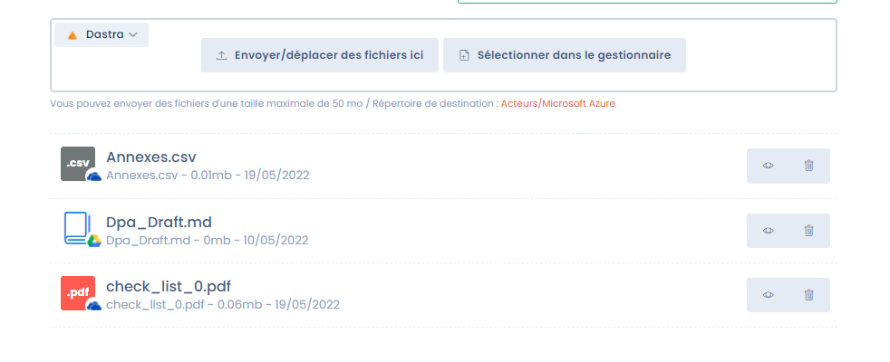

# Intégrations OneDrive / Google Drive

## Pourquoi utiliser un stockage cloud personnalisé ?

Par défaut, la [GED de Dastra](../gestion-de-documents-ged/) repose sur Azure Blob Storage : fichiers chiffrés, analysés par antivirus, et redondés sur un second serveur. Pour en savoir plus, consultez [la documentation sécurité](../../security/general.md).

Dans certaines organisations, ce stockage fait doublon avec un système de fichiers cloud déjà en place (SharePoint/OneDrive, Google Drive). Dastra s'intègre nativement avec ces deux fournisseurs afin d'éviter cette duplication.

<figure><figcaption>
Les fichiers peuvent être stockés dans Dastra, OneDrive ou Google Drive
</figcaption></figure>

## Type de connexion : OAuth utilisateur


Cette intégration repose sur une **authentification OAuth avec les credentials d'un compte utilisateur**. Ce n'est pas une connexion applicative via l'API Microsoft Graph ou l'API Google.

Cela signifie concrètement :

* La connexion est établie **au nom de l'utilisateur** qui configure l'intégration
* L'accès aux fichiers dépend des **permissions de ce compte**
* Si ce compte est désactivé ou ses tokens révoqués, l'intégration cesse de fonctionner jusqu'à reconnexion
* Il est recommandé d'utiliser un **compte de service dédié** (non personnel) pour configurer cette intégration


## Configurer l'intégration

Rendez-vous dans **Paramètres de l'espace de travail > Intégrations**, puis cliquez sur **OneDrive** ou **Google Drive**.

<figure><figcaption>
Cliquez sur « Ajouter une intégration » pour démarrer la connexion
</figcaption></figure>

Cliquez sur **Ajouter une intégration**. Vous êtes redirigé vers la page de connexion du fournisseur, qui vous demandera d'autoriser l'accès à votre stockage.

### Choisir le drive racine (OneDrive uniquement)

Après authentification, Dastra vous demande de choisir le disque à utiliser comme racine :

<figure><figcaption>
Choisissez entre le site SharePoint ou votre drive personnel
</figcaption></figure>

| Option | Description | Recommandation |
|---|---|---|
| **Root site / Dastra** | Site SharePoint de l'organisation | ✅ Recommandé en entreprise — espace partagé, non lié au compte personnel |
| **Your personal drive** | OneDrive personnel du compte connecté | ⚠️ À éviter en production — donne accès à l'ensemble du drive personnel |


Si vous optez pour le drive personnel, il est fortement recommandé d'utiliser un compte de service dédié ne contenant pas de fichiers personnels. Vous pouvez aussi créer un [site SharePoint dédié](https://learn.microsoft.com/fr-fr/sharepoint/create-site-collection) pour isoler les fichiers Dastra.


Dastra crée automatiquement un répertoire **Applications\DastraOneDrive** sur le drive choisi, qu'il utilise comme racine pour tous les fichiers.

## Attacher des fichiers cloud à une entité Dastra

Depuis n'importe quelle entité (traitement, tâche, acteur…), vous pouvez attacher des fichiers stockés dans votre cloud :

1. Ouvrez le panneau de fichiers de l'entité
2. Sélectionnez la **source de données** en haut à gauche du panneau

3. Naviguez dans votre drive via le gestionnaire de fichiers
4. Cliquez sur **Sélectionner dans le gestionnaire** pour attacher le fichier

Vous pouvez également envoyer de nouveaux fichiers directement depuis Dastra vers votre Drive.

## Limitations

### OneDrive

* La connexion repose sur OAuth utilisateur — pas sur Microsoft Graph API. Si le compte ayant configuré l'intégration est désactivé, la connexion est interrompue.
* Dastra n'a accès qu'au répertoire **Applications\DastraOneDrive** sur le drive choisi
* Pour les environnements entreprise, préférez le site SharePoint ("Root site / Dastra") plutôt que le drive personnel

### Google Drive

* Seuls les fichiers **créés depuis Dastra** peuvent être ajoutés ou modifiés dans Google Drive. Dastra n'a pas les droits d'accès aux fichiers existants créés directement dans Drive — c'est une limitation du connecteur OAuth.
* Les fichiers créés dans Dastra peuvent être partagés sans restriction avec d'autres collaborateurs.
