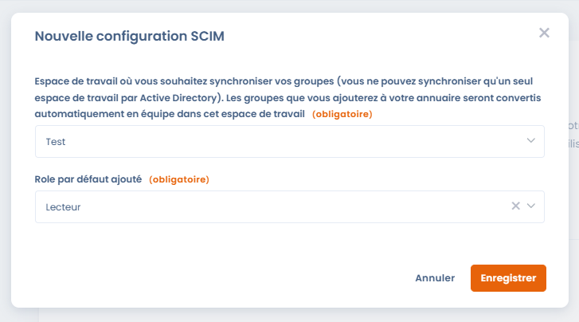
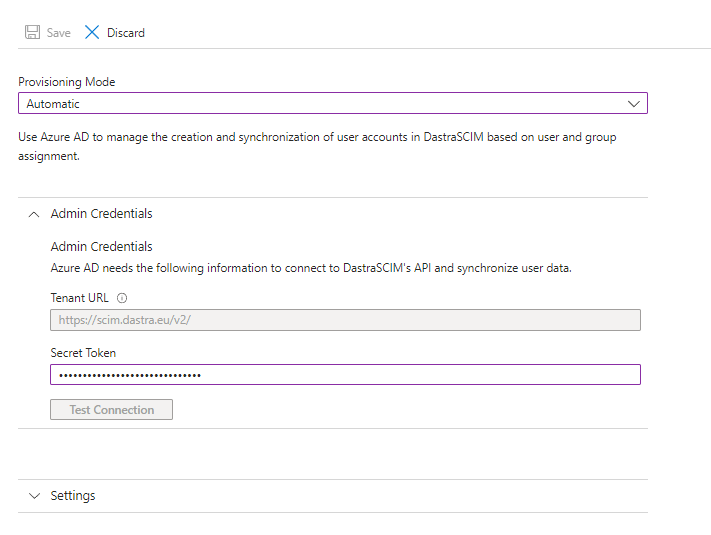
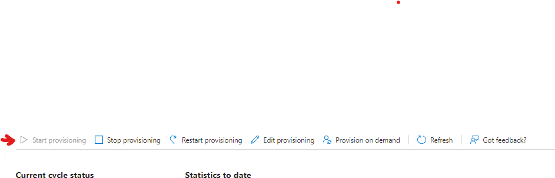
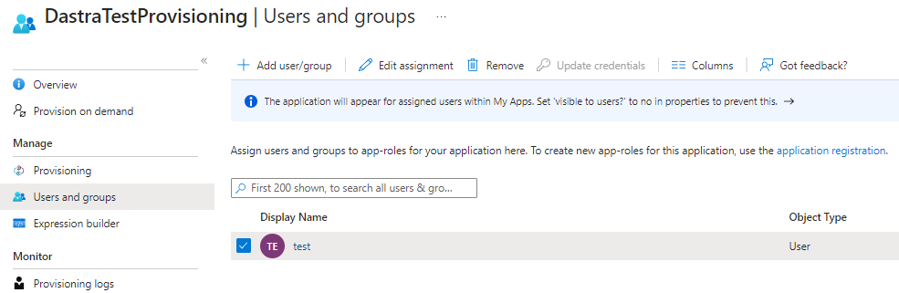

# SCIM

### Principe de fonctionnement

[Le SCIM](http://www.simplecloud.info/), acronyme anglais de System for Cross-domain Identity Management (comprenez « Système de gestion des identités interdomaines ») est une norme ouverte prenant en charge l'automatisation du provisioning des utilisateurs. Le protocole SCIM est un intermédiaire, il collecte les données relatives à l'identité des utilisateurs auprès des fournisseurs d'identité (Microsoft Entra ID, Google Workspace, Okta...) et les communique aux prestataires de service ayant besoin de ces informations d'identification (comme Dastra).


La fonctionnalité de SCIM est réservée aux clients avec un **plan Entreprise.**

[Consultez notre page tarif](https://www.dastra.eu/pricing)



Nous vous recommandons fortement d'effectuer préalablement [la mise en place du SSO ](single-sign-on-sso/)**avec l'option "Forcer pour tous les utilisateurs" activée**.&#x20;


### Comment configurer SCIM avec Microsoft Entra ID ?

Les utilisateurs de Dastra peuvent être ajoutés, supprimés et modifiés à l'aide de SCIM 2.0. Vous définissez des groupes dans Entra ID et Dastra synchronise ces utilisateurs automatiquement — sans intervention manuelle.

#### 1. Connectez-vous au portail Microsoft Entra

Rendez-vous sur [https://entra.microsoft.com](https://entra.microsoft.com) et connectez-vous avec un compte administrateur.

#### 2. Accédez à "Enterprise applications"

Dans le menu de gauche, cliquez sur **Entra ID** > **Enterprise applications** > **All applications**.

#### 3. Cliquez sur "New application"

En haut de la liste des applications, cliquez sur **New application**.

#### 4. Créez votre propre application

Sur la page "Browse Microsoft Entra App Gallery", cliquez sur **+ Create your own application**.

<figure><figcaption>
Cliquez sur « Create your own application » en haut de la galerie
</figcaption></figure>

#### 5. Nommez et configurez votre application

Dans le panneau qui s'ouvre :

1. Entrez un nom pour votre application (ex. : **Dastra SCIM**)
2. Sélectionnez l'option **"Integrate any other application you don't find in the gallery (Non-gallery)"**
3. Cliquez sur **Create**

<figure><figcaption>
Sélectionnez « Non-gallery » et donnez un nom à votre application
</figcaption></figure>

#### 6. Accédez à la configuration du provisioning

Dans la page **Overview** de l'application nouvellement créée, cliquez sur **"3. Provision User Accounts"** ou sur **Provisioning** dans le menu de navigation gauche.

<figure><figcaption>
Cliquez sur « Provision User Accounts » ou sur « Provisioning » dans le menu gauche
</figcaption></figure>

#### 7. Récupérez l'URL SCIM et le jeton depuis Dastra

Avant de configurer Entra, récupérez vos credentials SCIM dans Dastra.

**Connectez-vous à Dastra** en tant qu'administrateur. Allez dans **Paramètres de l'organisation** > **Sécurité** > **SCIM**

Cliquez sur le bouton **Configurer** pour créer une nouvelle configuration SCIM.

<figure><figcaption>
Sélectionnez l'espace de travail cible et le rôle par défaut
</figcaption></figure>

Sélectionnez l'**espace de travail** à synchroniser (équipes et utilisateurs y seront automatiquement provisionnés) et le **rôle par défaut** attribué aux nouveaux utilisateurs. Les rôles restent modifiables localement par les administrateurs Dastra.

Cliquez sur **Enregistrer**, puis **copiez l'URL SCIM et le jeton d'authentification** affichés.


Dastra permet de synchroniser **un seul espace de travail par organisation** via SCIM.


<figure><figcaption>
Copiez l'URL SCIM et le jeton secret — vous en aurez besoin à l'étape suivante
</figcaption></figure>

#### 8. Configurez le provisioning automatique dans Entra

De retour dans Entra, sur la page de provisioning de votre application :

1. Réglez le **Provisioning Mode** sur **Automatic**
2. Dans la section **Admin Credentials**, renseignez :
   * **Tenant URL** : l'URL SCIM copiée depuis Dastra
   * **Secret Token** : le jeton d'authentification copié depuis Dastra
3. Cliquez sur **Test Connection** pour vérifier la connexion
4. Cliquez sur **Save**

Si vous rencontrez une erreur lors du test de connexion, vérifiez que la fonctionnalité SCIM est bien activée sur votre souscription. [Contactez le support si besoin](../../getting-started/le-support/faire-une-demande-de-support.md)

#### 9. Activez le provisioning

Une fois la configuration sauvegardée, activez le provisioning en réglant le statut sur **On** et en cliquant sur **Save**.

<figure><figcaption>
Activez le provisioning en passant le statut sur « On »
</figcaption></figure>

#### 10. Ajoutez des utilisateurs et/ou des groupes

Dans le menu de navigation de l'application, cliquez sur **Users and groups**, puis assignez les utilisateurs ou groupes Entra que vous souhaitez synchroniser avec Dastra.

<figure><figcaption>
Assignez les utilisateurs et groupes à synchroniser avec Dastra
</figcaption></figure>

### Laissez vos utilisateurs se connecter

Vous devriez voir les comptes utilisateurs de votre annuaire Entra se synchroniser automatiquement dans Dastra. Si le SSO n'est pas configuré et forcé, les utilisateurs devront effectuer une réinitialisation de mot de passe pour leur première connexion. Si le SSO est actif et forcé pour tous les utilisateurs, ils seront automatiquement redirigés vers le formulaire de connexion de votre fournisseur d'identité (Microsoft Entra ID, Google Workspace, Okta…)

### Comportements et limitations de la synchronisation SCIM

#### Gestion du cycle de vie des utilisateurs

**Désactivation dans Entra ID**

Lorsqu’un utilisateur est désactivé dans Entra ID :

* Son profil est **anonymisé dans Dastra**
* S’il est réactivé par la suite :
  * **Un nouveau compte utilisateur est créé**
  * L’ancien compte anonymisé n’est pas restauré

***

**Suppression complète dans Entra ID**

Lorsqu’un utilisateur est supprimé définitivement dans Entra ID :

* Son profil est **entièrement anonymisé dans Dastra**
* Toutes les actions réalisées sont **conservées**
* L’utilisateur apparaît comme **"deleted user"**

**Impact sur les données associées :**

* Les objets liés (ex : traitements, risques, demandes, etc.) **ne sont pas supprimés**
* Les relations (ex : propriétaire, assignation) **sont conservées**
* Seule l’identité de l’utilisateur est anonymisée

***

#### Gestion des groupes (teams)

**Suppression d’un groupe dans Entra ID**

Si un groupe est supprimé dans Entra ID :

* L'équipe **correspondante est supprimée dans Dastra**
* Les **utilisateurs ne sont pas supprimés**
* Aucun impact sur leurs comptes individuels

***

#### Mapping et périmètre de synchronisation

**Groupes et workspaces**

* SCIM permet de synchroniser **plusieurs groupes**
* Limitation actuelle :
  * Synchronisation possible vers **un seul workspace par organisation**
  * Le multi-workspace n’est **pas supporté**

***

**Attributs synchronisés**

Actuellement, Dastra synchronise :

* Le **nom des groupes (`displayName`)**

Non supporté à ce jour :

* Mapping vers des **unités organisationnelles**
* Synchronisation d’attributs comme :
  * organisation
  * pays

> Une évolution est possible via l’ajout d’un attribut spécifique contenant un identifiant exploitable côté Dastra.

***

#### Gestion locale après synchronisation

Après synchronisation SCIM :

* Les administrateurs peuvent toujours :
  * **modifier les rôles**
  * **ajuster les permissions**
* La gestion fine des accès reste **possible localement dans Dastra**

***

#### Impact sur la licence

* La synchronisation SCIM est limitée par :
  * le **nombre d’utilisateurs inclus dans votre abonnement**
* Si le quota est dépassé :
  * Le serveur SCIM retourne une **erreur**
  * Les utilisateurs supplémentaires ne sont **pas provisionnés**

***

## Foire aux questions

### Quel est le rôle du SCIM dans Dastra ?

SCIM est le canal de **provisioning automatisé** entre votre annuaire d’entreprise (Entra ID, Okta, Google Workspace…) et Dastra. Son rôle est complémentaire — et distinct — de celui du SSO :

| | SSO | SCIM |
|---|---|---|
| **Rôle** | Authentification (connexion) | Gestion du cycle de vie des comptes |
| **Déclencheur** | Connexion de l’utilisateur | Action dans l’IdP (ajout, modification, suppression) |
| **Ce qu’il fait** | Vérifie l’identité | Crée, met à jour, désactive les comptes |
| **Protocole** | SAML 2 / OpenID Connect | SCIM 2.0 (HTTP REST + JSON) |

Grâce au SCIM, vous n’avez pas à créer manuellement les comptes dans Dastra ni à les révoquer en cas de départ : votre annuaire reste la **source de vérité** pour la gestion des identités.


Le SCIM gère **qui existe** dans Dastra. Le SSO gère **comment ces personnes se connectent**. Les deux sont indépendants mais se combinent idéalement : provisionnez via SCIM, authentifiez via SSO.


***

### Quel est le fonctionnement global du provisioning et déprovisioning ?

#### Provisioning (création de compte)

Lorsqu’un utilisateur ou un groupe est assigné à l’application Dastra dans votre IdP :

1. L’IdP envoie une requête **`POST /scim/v2/Users`** à l’endpoint Dastra
2. Dastra crée le compte avec le rôle par défaut configuré dans la configuration SCIM
3. L’utilisateur est rattaché à l’espace de travail cible
4. Si le SSO est activé et forcé, l’utilisateur peut se connecter immédiatement sans mot de passe

#### Mise à jour

Toute modification du profil dans l’IdP (nom, email, groupes) déclenche une requête **`PATCH /scim/v2/Users/{id}`** qui met à jour le compte correspondant dans Dastra.

#### Déprovisioning (désactivation / suppression)

| Action dans l’IdP | Requête SCIM | Effet dans Dastra |
|---|---|---|
| Désactivation de l’utilisateur | `PATCH` (`active: false`) | Profil **anonymisé** |
| Suppression définitive | `DELETE /scim/v2/Users/{id}` | Profil **entièrement anonymisé**, données conservées |
| Suppression d’un groupe | `DELETE /scim/v2/Groups/{id}` | Équipe supprimée, utilisateurs inchangés |


La réactivation d’un utilisateur précédemment anonymisé crée un **nouveau compte** — l’historique de l’ancien compte n’est pas restauré.


***

### Quels attributs et claims sont pris en charge ?

#### Attributs SCIM synchronisés (provisioning)

Lors de la synchronisation, Dastra lit les attributs SCIM 2.0 suivants :

| Attribut SCIM | Champ dans Dastra | Obligatoire |
|---|---|---|
| `userName` | Email (identifiant unique) | ✅ Oui |
| `name.givenName` | Prénom | Recommandé |
| `name.familyName` | Nom | Recommandé |
| `displayName` | Nom d’affichage | Recommandé |
| `emails[0].value` | Adresse email | ✅ Oui |
| `active` | Statut actif / inactif | ✅ Oui |
| `externalId` | Identifiant IdP | Recommandé |
| `groups[].display` | Nom de l’équipe (team) | Pour la synchro des groupes |

#### Claims SSO exploités lors de la connexion

Lors de la connexion, Dastra identifie l’utilisateur via le claim email transmis par l’IdP. Les deux protocoles SSO supportés utilisent la même propriété :

| Protocole | Claim email utilisé | Scope requis |
|---|---|---|
| SAML 2 | `http://schemas.xmlsoap.org/ws/2005/05/identity/claims/emailaddress` | — |
| OpenID Connect | `http://schemas.xmlsoap.org/ws/2005/05/identity/claims/emailaddress` | `openid profile email` |


L’email est le **point de jonction** entre SCIM et SSO : le `userName` provisionné via SCIM doit être **identique** au claim email renvoyé lors de la connexion SSO. Toute divergence empêchera le rapprochement de compte.


Pour la configuration complète des claims SSO, consultez la page [Single Sign On (SSO)](single-sign-on-sso/).
